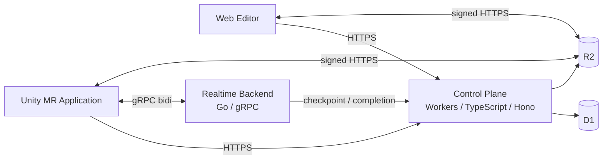

# Unframe アーキテクチャ

このドキュメントは Unframe モノレポの目標構成を示す一次資料です。Backend の詳細は [`app/server/ARCHITECTURE.md`](./app/server/ARCHITECTURE.md)、開発フローは [`CONTRIBUTING.md`](./CONTRIBUTING.md)、個別の判断背景は [`docs/decisions/`](./docs/decisions/) を参照してください。

## 全体像

Unframe は、MR プレゼンテーションを Web で編集し、Unity クライアントで表示するプロダクトです。Backend は durable state を扱う Control Plane と、低遅延の session state を扱う Realtime Backend に分離します。



## ディレクトリ構成

```text
unframe/
├── app/
│   ├── web/                      # React 19 Web Editor
│   ├── server/
│   │   ├── control-plane/        # Workers / TypeScript / Hono / D1 / R2
│   │   ├── realtime/             # Go / gRPC / container
│   │   └── integration/          # Backend component 間 E2E
│   └── unity/                    # Unity MR Application
├── lp/                           # SvelteKit Landing Page
├── packages/
│   ├── contracts/                # 将来の API / protocol contract 境界
│   ├── api-client-csharp/        # C# client 成果物の配置予定地
│   └── config/                   # 共有 TypeScript / Git hook 設定
├── scripts/                      # 開発・CI・ドキュメント同期の実処理
└── docs/                         # ADR・計画・同期ドキュメント
```

## 各コンポーネントの責務

### `app/server/control-plane`

- Cloudflare Workers / TypeScript / Hono を使用する。
- 認証・認可、durable resource、D1/R2、asset lifecycle、session bootstrap の authority を持つ。
- HTTP handler から D1/R2 binding を直接操作せず、application service と adapter を分離する。

### `app/server/realtime`

- Go / gRPC の独立した container application とする。
- Unity との bidirectional stream、session 中の canonical state、fan-out、backpressure を担当する。
- hot path は Control Plane、D1、R2 に依存せず、checkpoint と completion のみを Control Plane へ永続化する。

### `app/web`

- React 19 SPA としてプレゼンテーションの編集を担当する。
- Backend 契約が定義されるまでは fixture と browser adapter を使用する。

### `app/unity`

- Unity / C# で MR 表示と realtime session 参加を担当する。
- 生成 C# client は未接続であり、契約と generator は Backend 実装と同時に定義する。

### `lp`

- SvelteKit + `adapter-static` による静的 Landing Page とする。
- Web Editor とは deployment と依存関係を分離する。

## 契約生成パイプライン

旧 Go/Huma HTTP API の OpenAPI、生成 TypeScript client、sqlc 生成物は削除済みです。`packages/contracts/` は次の Control Plane OpenAPI と Realtime Protocol Buffers の共有境界として残します。

新しい契約を導入する変更では、同時に次を定義します。

1. source of truth と versioning
2. TypeScript / Go / C# の生成先
3. 手書き adapter との境界
4. consumer の更新手順
5. CI の生成 drift 検査

生成物は手編集せず、実装コードは Backend component 間で共有しません。

## ツールチェインとタスク実行

ツールチェインは Nix flake で固定し、JavaScript workspace は pnpm で管理します。現在の repository-wide entrypoint は次のとおりです。

| 用途 | コマンド |
| --- | --- |
| 開発環境 | `nix develop` |
| 依存関係と Git hook のセットアップ | `nix run .#setup` |
| 全体品質ゲート | `nix run .#check` |
| Web の検査・修正 | `nix run .#web` / `nix run .#web -- fix` |
| LP の検査・修正 | `nix run .#lp` / `nix run .#lp -- fix` |
| Notion 同期 | `nix run .#notion-sync` |
| flake の評価と formatter 検証 | `nix flake check` |

Backend 固有の check、development、migration、deployment entrypoint は、各 component の実装とともに追加します。

### GitHub Actions

- `ci.yml`: 変更領域の検出と必須チェックの集約
- `web.yml`: Web の check / test / build
- `lp.yml`: LP の test / check / build
- `unity.yml`: Unity の静的検査
- `autofix.yml`: Web / LP の format と lint fix
- `sync-notion.yml`: Notion 同期

## 移行状況

- [x] 旧 Go/Huma/Turso/R2 HTTP Backend を削除
- [x] 旧 OpenAPI、生成 TypeScript client、sqlc、旧 API ドキュメントを削除
- [x] 旧 Backend 専用の CI・生成・migration・dev entrypoint を削除
- [x] `packages/contracts/` を次の contract を定義するための境界として保持
- [ ] Control Plane を `app/server/control-plane/` に実装
- [ ] Realtime Backend を `app/server/realtime/` に実装
- [ ] component 間 E2E を `app/server/integration/` に実装
