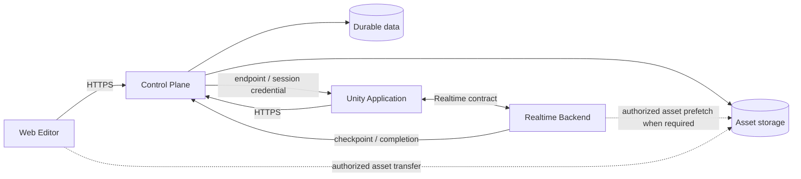

# Unframe Backend アーキテクチャ

## 1. 文書の位置づけ

この文書は、`app/server/` に置く二つの backend component の**関係と共有境界**を定義する。Control Plane または Realtime Backend の内部設計はここに重複して記載しない。

- Control Plane の内部設計: [`control-plane/ARCHITECTURE.md`](./control-plane/ARCHITECTURE.md)
- Realtime Backend / Venue Edge の内部設計: [`realtime/ARCHITECTURE.md`](./realtime/ARCHITECTURE.md)
- 現行 Realtime 実装の起動・制約: [`realtime/README.md`](./realtime/README.md)
- 外部 contract と生成経路: [`../../packages/contracts/README.md`](../../packages/contracts/README.md)
- Presentation domain model: [`../../docs/decisions/0005-spatial-presentation-domain-model.md`](../../docs/decisions/0005-spatial-presentation-domain-model.md)

本書が所有するのは、component 間の authority handoff、通信方向、data ownership、end-to-end lifecycle、整合性規則、統合状況である。Component 固有の technology、module 構成、protocol field、queue、storage schema、deployment 手順、運用 parameter は各 component の文書が所有する。

## 2. System boundary

Unframe は、Web Editor で Presentation を編集し、Unity application で MR Presentation を実行する。Backend は durable state を扱う Control Plane と、active session state を扱う Realtime Backend に分離する。



Realtime の hot path は Control Plane、D1、R2 への同期問い合わせを行わない。Asset binary は Control Plane や realtime stream で proxy せず、Control Plane が認可した別の transfer path で配信する。Web、Unity、Venue Edge のどこが R2 と通信するかは、それぞれの application / Realtime architecture が定義する。

現在の Realtime client は Unity だけであり、Web Editor は Realtime Backend へ接続しない。将来 browser collaboration を導入する場合は、Unity 用 contract の暗黙な流用ではなく、browser transport と authority を別途設計する。

### 2.1 Goals

- Durable authority と active runtime authority を分離し、それぞれの責任範囲を一意にする
- Realtime hot path を永続 storage と deployment provider の同期応答から独立させる
- OpenAPI / Protocol Buffers を介して Web、Unity、TypeScript、Go の境界を検証可能にする
- Component ごとに dependency、release、deployment、failure domain を分離する
- Bootstrap、runtime execution、checkpoint、completion の失敗を別々に観測・回復できるようにする

### 2.2 Non-goals

- 高頻度 runtime state を D1 へ逐次保存すること
- Asset binary を Control Plane や realtime stream で中継すること
- TypeScript と Go の application implementation を直接共有すること
- Unity 用 Realtime contract を Web browser collaboration へ暗黙に流用すること
- Fencing のない複数 runtime writer、初期段階からの複雑な distributed consensus
- 旧 Go HTTP API や Turso data との compatibility layer を維持すること

## 3. Authority map

### 3.1 Ownership

| Concern | Authority | Component 間の規則 |
| --- | --- | --- |
| User identity と application session | Control Plane | Realtime は client が送る identity field を信用せず、Control Plane が発行した credential を検証する |
| Presentation Definition と membership | Control Plane | Realtime は session 用 projection を入力として受け取り、durable Definition を独自更新しない |
| Asset metadata と access policy | Control Plane | Binary は R2 に置き、Realtime stream に埋め込まない |
| Durable Session directory と participant role | Control Plane | Bootstrap 時に active runtime へ必要な identity / role を拘束する |
| Active session の canonical runtime state | Realtime Backend | 高頻度 state を request ごとに Control Plane へ照会・保存しない |
| Checkpoint と completion の durable record | Control Plane | Realtime から idempotent callback として受け取る |
| Rendering、local tracking、calibration | Web / Unity client | Backend の共有 state と client-local state を混同しない |

同じ概念が両 component に現れる場合も、authority と projection を区別する。たとえば durable Session membership は Control Plane が所有し、接続中 participant の runtime state は Realtime Backend が所有する。

### 3.2 State classification

State は保存期間だけでなく、authority、delivery semantics、failure behavior で分類する。

| Class | 例 | Authority / persistence rule |
| --- | --- | --- |
| Durable | Identity、Presentation Definition revision、Asset metadata、Session directory、participant membership、accepted checkpoint / completion | Control Plane が authority。D1 / R2 に永続化する |
| Runtime reliable | Group / Step / Cue lifecycle、離散 command / event、sequence、runtime termination | Realtime Backend が authority。順序・重複・gapを管理し、必要な結果だけをcheckpointする |
| Runtime ephemeral | Presenter tracking、Pose、pointer、補間途中のElement State | Realtime Backendのmemoryで扱う。latest-wins / coalescing / stale dropを許容し、D1へ逐次保存しない |
| Client-local | Viewer tracking、render interpolation、device cache、participantごとのcalibration | Web / Unity clientが所有し、共有server stateとして扱わない |

Reliable / ephemeral の具体的なmessage、snapshot、replay規則はRealtime contractが所有する。Control Planeはそれらのwire typeをschemaへ複製しない。

## 4. Component contracts

### 4.1 Control Plane HTTP boundary

Web、Unity、Realtime Backend は Control Plane の HTTPS API を利用する。Product-owned API の source of truth は Control Plane の実行 route から生成する OpenAPI である。TypeScript consumer は同じ route tree から導出した Hono RPC client を利用できる。

Control Plane HTTP boundary は認証、durable resource、session directory、bootstrap、Asset access、persistence callback を扱う。Realtime message semantics を HTTP API に複製しない。

### 4.2 Realtime boundary

Unity と Realtime Backend の wire contract は Protocol Buffers を source of truth とする。Realtime の stream 構成、message ordering、snapshot、replay、backpressure、runtime state は [`realtime/ARCHITECTURE.md`](./realtime/ARCHITECTURE.md) が所有する。

Control Plane は Realtime wire type に依存しない。Realtime core も Control Plane の TypeScript implementation や D1 binding に依存しない。

### 4.3 Bootstrap boundary

Bootstrap は durable authority から active runtime への handoff である。

1. Control Plane が user、Session membership、role、Session state を検証する。
2. Control Plane が接続先と session-bound credential を client に返す。
3. Client が接続先へ credential を提示する。
4. Realtime Backend が署名、issuer / audience、期限、protocol version、Session、participant、role を検証する。
5. Realtime Backend は検証済み identity を connection context に固定し、message payload による identity 上書きを許さない。

Current の Control Plane は、active Venue Edge assignment の endpoint / certificate fingerprint と、lease / epoch / Presentation revision に拘束した JWT / JWKS を発行する。Realtime process は同じ JWT contract を検証し、local assignment guard で接続、command、reliable delivery を fencing する。Current process は単一 assignment を環境変数から読み込むため、Control Plane から assignment / Manifest を同期する Cloud Agent、Cloud Runtime、`RuntimeAssignment` への一般化は未接続である。

Current の Control Plane は `Ended` Session の join / bootstrap を拒否し、Session end と accepted completion で active assignment を解放する。一方、既に起動した Realtime process へ `Ended` または assignment release を即時通知する control channel はなく、発行済み credential と local lease が有効な間は `Ended` だけで新規接続や既存接続を停止できない。Connection resume 自体も未実装である。Target では Cloud Agent または同等の channel で失効を伝え、新規接続、既存接続、resume を停止する。これを message ごとの Control Plane 問い合わせで実装しない。

### 4.4 Persistence boundary

Realtime Backend は高頻度 message を D1 へ逐次保存せず、checkpoint と completion を Control Plane へ送る。

- Callback は service identity で user API から分離する
- Retry で同じ結果になるよう idempotency key と monotonic version を使う
- Control Plane は unknown Session を拒否する。Completion は active Edge ID / assignment epoch / lease で fencing し、Checkpoint の assignment fencing は Target とする
- Completion の永続化と runtime の停止は別 component の処理であり、片方の成功をもう片方の成功として扱わない

Current の Control Plane は冪等な callback 受付を実装し、accepted completion と同じ D1 batch で Session を `Ended` にして active assignment を解放する。Realtime Backend からの送信 / retry と Checkpoint の assignment fencing は未接続である。

### 4.5 Asset boundary

Control Plane は Asset metadata、参照整合性、signed access を所有し、R2 は binary を保持する。Realtime transport は Asset binary を運ばない。

Web の直接 upload / download、Unity の delivery、Venue Edge の prefetch は同じ durable Asset を利用するが、consumer ごとの delivery path は別に設計する。Access URL や storage credential を Presentation Definition や realtime message の永続 field にしない。

## 5. End-to-end lifecycle

### 5.1 Authoring と publishable input

1. Web Editor が Control Plane へ Presentation Definition を保存する。
2. Asset は Control Plane で metadata を作成し、認可された transfer path で R2 へ upload する。
3. Control Plane が binary と metadata を検証し、Definition から参照可能な状態にする。
4. Realtime Backend は durable authoring data を直接編集せず、Session に必要な immutable revision または projection を受け取る。

Draft / Release の product lifecycle はまだ cross-component contract として確定していない。暗黙に「最新 Definition = active Session input」とせず、導入時に revision pinning と delivery projection を定義する。

### 5.2 Session bootstrap と execution

1. Unity が Control Plane で Session を作成または参加する。
2. Control Plane が durable membership と role を確定する。
3. Control Plane が Presentation revision、Asset delivery 情報、Realtime 接続情報を bootstrap projection として返す。
4. Unity が Realtime Backend へ接続する。
5. Realtime Backend が active session state、ordering、fan-out を所有する。
6. Realtime Backend が checkpoint を非同期に Control Plane へ送る。
7. Session 終了時に Realtime Backend が completion を送り、Control Plane が durable record を確定する。

Current では手順1と2、および active Venue Edge assignment に基づく接続 endpoint / credential の発行が Control Plane に実装されている。Realtime component では同じ credential の検証、assignment fencing、初期 fan-out を実装済みである。Presentation / Asset delivery projection、Unity consumer、Control Plane から Realtime process への assignment 同期、checkpoint / completion sender、repository-level end-to-end 接続は未実装である。

## 6. Cross-component invariants

1. Durable truth と active runtime truth を同じ database row や in-memory object として共有しない。
2. Realtime hot path で Control Plane や D1 へ message ごとの認証・認可問い合わせをしない。
3. Realtime Backend は Control Plane の private signing key、D1 binding、R2 master credential を受け取らない。
4. Control Plane は Realtime の participant queue、sequence、snapshot、Pose、Element State を所有しない。
5. Credential は Session、participant、role、protocol version、有効期間に拘束し、payload 内の自己申告 identity を authority にしない。
6. Better Auth session、Realtime JWT、persistence callback の service identity は用途を固定し、相互に認証 credential として流用しない。
7. Checkpoint と completion は retry-safe にし、重複 callback で state を二重適用しない。
8. Runtime の移動や failover では assignment epoch または同等の fencing を使い、二つの runtime を同時に authority にしない。
9. Asset binary と realtime state は別 transport とし、どちらの障害も他方の credential scope を拡張しない。
10. Contract を先に変更し、producer、generated artifact、adapter、consumer、drift check を同じ変更単位で同期する。
11. Target では durable Session の `Ended` を Realtime runtime の `Terminating` へ伝播して不可逆にし、同じ Session を再開しない。再度発表する場合は新しい Session を作成する。

## 7. Failure と consistency boundary

### Control Plane unavailable

新しい login、join、bootstrap、Asset access、checkpoint persistence は失敗し得る。既に確立した active session の hot path は、発行済み credential と割り当ての有効範囲内で Control Plane の同期応答に依存しない。継続時間と offline policy は Realtime architecture で定義する。

### Realtime Backend unavailable

Control Plane の durable resource と Asset は保持される。Control Plane は runtime state を推測して成功扱いにせず、再接続、resume、再割り当て、Session 終了の policy に従う。

### Persistence callback unavailable

Realtime Backend は bounded retry と local recovery data を使い、idempotency key を維持する。Control Plane が callback を受理するまで durable completion を確定済みと扱わない。

### Conflicting runtime authority

Runtime の再起動や別 node への割り当てでは、古い runtime からの command と callback を識別できなければならない。Current の Venue Edge は lease と assignment epoch で接続、command、completion を fencing する。Cloud Runtime への一般化、Checkpoint fencing、強制切替の詳細は Realtime architecture と Control Plane contract を同時に確定する。

## 8. Cross-component observability

Control Plane の bootstrap、Realtime connection、checkpoint / completion を一つの処理系列として追跡できるようにする。ただし、component ごとの log と metrics の所有権は分離する。

- Session ID、connection ID、incident ID、assignment epoch を correlation に使用する
- User ID は必要な範囲で pseudonymous identifier とし、Presentation content を correlation field にしない
- Better Auth cookie / Bearer token、Realtime JWT、service secret、signed URL を log や trace attribute に記録しない
- Expected disconnect、validation rejection、server failure、persistence retry を区別する
- Control Plane と Realtime の成功を別々に記録し、片方の成功から end-to-end success を推測しない

## 9. Repository と deployment unit

```text
app/server/
├── ARCHITECTURE.md               # component 間 architecture
├── README.md                     # 開発入口と現行概要
├── control-plane/
│   ├── ARCHITECTURE.md           # Control Plane 内部 architecture
│   └── ...                       # pnpm / Workers deployment unit
├── realtime/
│   ├── ARCHITECTURE.md           # Realtime / Venue Edge architecture
│   └── ...                       # Go / container deployment unit
└── integration/                  # planned: component 間 E2E

packages/contracts/
├── openapi/                      # Control Plane generated contract
├── src/                          # generated language-independent path types
└── proto/                        # Realtime Protocol Buffers source
```

Control Plane と Realtime Backend は runtime、language、dependency、release、deployment を独立させる。TypeScript と Go の implementation code は共有せず、OpenAPI、Protocol Buffers、stable identifier だけを共有する。

`integration/` は component 間 E2E の配置予定地であり、現時点では存在しない。各 component の unit / component test を cross-component integration test の代わりにしない。

### 9.1 Legacy boundary

旧 Go / Huma / Chi / Turso HTTP Backend、そのmigration、生成client、API contractは現行componentへ復元しない。旧 Turso data のmigration、旧HTTP API compatibility layer、旧backendへのdata rollbackも提供しない。

Control PlaneはD1上の現行migrationとcontractをdurable authorityとし、Realtime Backendは必要なvalidation ruleやtest caseだけを現行contractへ合わせて再実装する。Legacy codeのdirectory移動やmechanical reuseをcomponent間共有の代わりにしない。

## 10. Current integration status

| Boundary | Status | Evidence / limitation |
| --- | --- | --- |
| Control Plane product API と generated OpenAPI / Hono RPC | Current | Component 内 drift check あり |
| Realtime Protocol Buffers と Go generated code | Current | Component 内 drift check あり |
| Control Plane の Session directory と Venue Edge bootstrap | Current | Active assignmentのendpoint、fingerprint、lease-bound JWTを発行 |
| Realtime の初期 gRPC process と in-memory fan-out | Partial | JWT / assignment fencingはCurrent。full runtime stateとrecoveryは未実装 |
| Control Plane-issued credential → authenticated Realtime connection | Partial | Producer / verifier contractは一致。Unity consumerとrepository-level E2Eは未実装 |
| Realtime → Control Plane persistence callback | Partial | Control Plane受付とcompletion fencingはCurrent。sender / retryは未実装 |
| Web / Unity → Control Plane resource flow | Partial | Device Authorization UI の一部以外は未接続 |
| Presentation / Asset → Session delivery projection | Not implemented | Contract 未定義 |
| Venue Edge provisioning / registration / assignment | Current | Control PlaneのD1 / route / OpenAPIに実装済み |
| Realtime assignment同期 / Session終了伝播 | Not integrated | Current processは環境変数を使用し、Cloud Agentは未実装 |
| Unity / C# generated HTTP・gRPC clients | Not implemented | 配置予定地と手書きmodelはあるが生成・consumer接続は未導入 |
| Repository-level backend E2E | Not implemented | `app/server/integration/` は未作成 |

実装状況は各 component の code と README で再確認する。本表は integration boundary の snapshot であり、component 内機能の完全な matrix ではない。

## 11. Cross-component validation

Component をまたぐ変更では、最低限次を同じ変更で検証する。

- OpenAPI / Protocol Buffers の生成 drift
- Unity / C# HTTP・gRPC client生成とconsumer adapterのcompatibility
- Control Plane producer と Web / Unity / Realtime adapter の互換性
- Bootstrap credential の署名・検証と claim binding
- Session join → bootstrap → Realtime connect の認証経路
- Checkpoint / completion の retry と idempotency
- Asset access が realtime stream から独立していること
- Control Plane 一時障害、Realtime 再起動、credential expiry、Session 終了後の再接続拒否
- 複数 client の synchronization と capacity / network impairment

各 component の品質ゲートに加え、統合 test が存在する場合は `app/server/integration/` から実行する。存在しない test を passing と報告しない。

## 12. Cross-component open decisions

Product 上の Session と durable Session は同一 resource とし、active Runtime は `RuntimeAssignment` で関連付ける。

- Edge 固有の `EdgeSessionAssignment` / `edgeId` を、Cloud Runtime と共有できる `RuntimeAssignment` / `runtimeId` / `runtimeKind` へ一般化する境界
- Cloud Agent が assignment、lease、Manifest、Session 終了を同期する control channel と失効時の停止規則
- Session が利用する Presentation revision をいつ固定し、どの delivery projection で渡すか
- Unity が Asset を R2 から直接取得する経路と Venue Edge cache 経路の適用条件
- Internet / Control Plane 障害時に active session を継続できる上限と、lease expiry 後の停止規則
- Presenter disconnect 後に残存 participant が終了を要求できる条件と、runtime を不可逆に終了する timeout
- Runtime 再割り当て時の fencing、resume、checkpoint ownership
- Component 間 E2E をどの environment と credential fixture で実行するか

これらは一方の component だけで暗黙に決めない。決定時に本書の handoff、Control Plane contract、Realtime contract、consumer behavior を同時に更新する。
