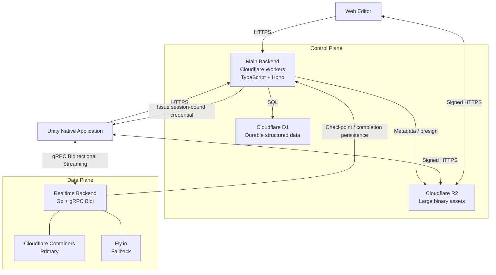
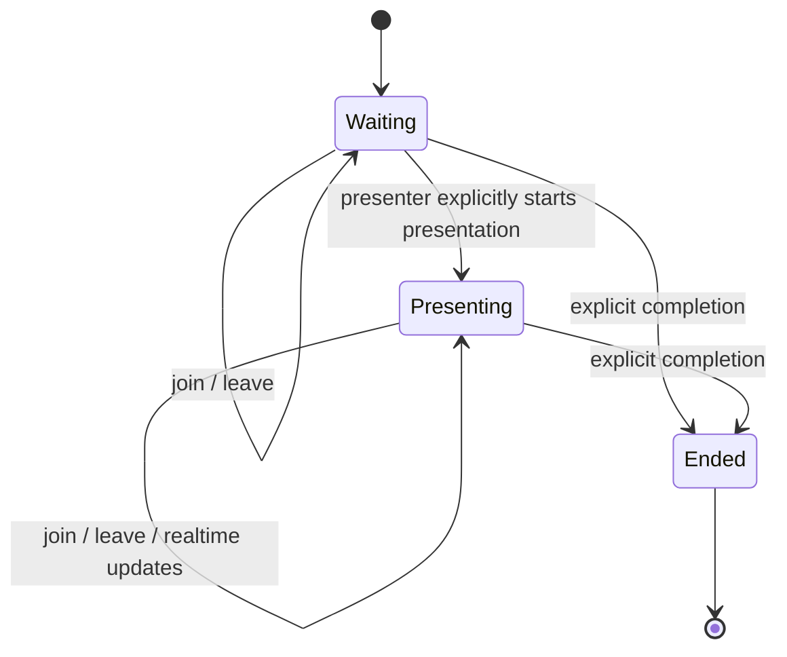
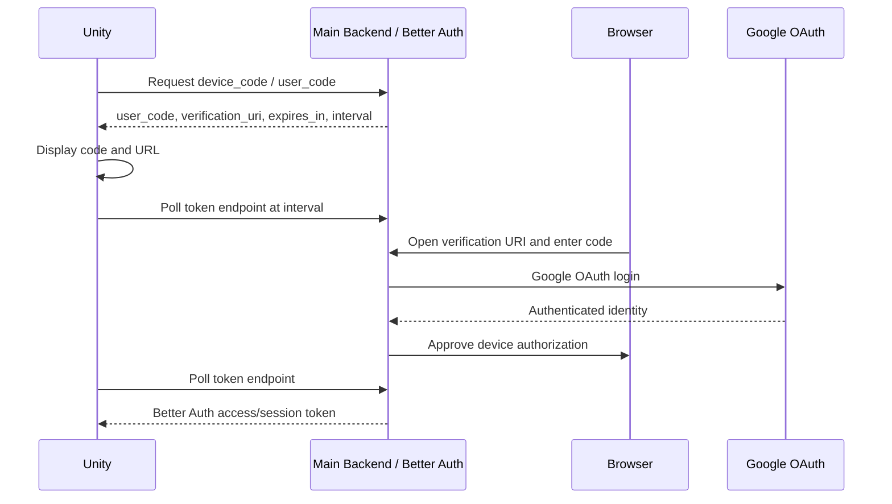
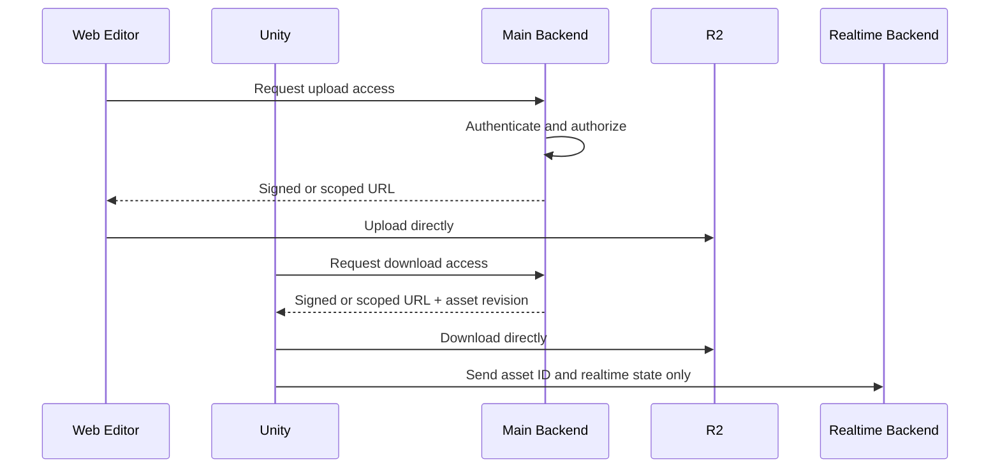

# Unframe Backend アーキテクチャ

## 1. 文書の位置づけ

この文書は、Unframe の backend を大幅に更新する際の**目標アーキテクチャ**を定義する。対象は、Mixed Reality プレゼンテーションを提供する Main Backend と Realtime Backend の全体である。

本書では記述の状態を次の2種類に分ける。

- **目標**: 今後の backend 更新で実現する正規の設計
- **未決定**: 実装前に追加の設計判断が必要な事項

特に断りがない限り、2章から22章までは**目標アーキテクチャ**を記述する。23章以降で実装状況と移行方針を整理する。

旧 Go + Huma/Chi + Turso/libSQL HTTP API は削除済みである。目標構成では次の2 backend に責務を分割する。

- Main Backend: Cloudflare Workers / TypeScript / Hono / D1 / R2
- Realtime Backend: Go / gRPC Bidirectional Streaming / Container

この文書は目標設計を現行機能として見せない。実装状況を判断する際は、23章の現行実装、24章の移行マトリクス、実際のコードを確認すること。

## 2. システム概要

Unframe は、Web Editor でプレゼンテーションを編集し、Unity ベースのネイティブアプリケーションで Mixed Reality プレゼンテーションを実行するシステムである。

クライアント通信を用途ごとに分離する。

- HTTPS: Web Editor と Unity が、認証、認可、CRUD、セッション作成、永続データ、アセット管理に使用する
- gRPC Bidirectional Streaming: Unity だけが、セッション中の低遅延な状態同期に使用する
- R2 直接通信: Web Editor と Unity が、3D model、texture、image、video などの大容量データに使用する

Main Backend は Control Plane、Realtime Backend は Data Plane として扱う。Realtime の hot path は Main Backend や D1 を経由しない。

### 2.1 確定事項

| 領域 | 決定 |
| --- | --- |
| Web Editor | account操作、asset登録、presentation CRUDを行う。session中の操作は行わない |
| Unity | login/logout、presentation CRUD/read、session作成・参加・終了、Realtime接続を行う |
| Authentication | Better Auth Device Authorization Flow。browser側のidentity providerはGoogle OAuth |
| Device authorization | polling intervalは3秒、device/user codeの有効期限はBetter Auth標準値の30分 |
| Roles | global `admin`、presentation単位`editor`、session単位`presenter/viewer` |
| Organization | organization / team modelは導入しない |
| Presentation | 複数件、slide/contentは個別resource。同時編集、version、draft/public分離は導入しない |
| Session | RoomとSessionは同一。Unityから作成し、`xxxx-xxxx`形式の参加コードでjoinする |
| Session capacity | 最大50 participant |
| Presenter | session creatorを固定presenterとし、途中交代しない |
| Realtime authority | 共有状態、sequence、duplicate/gap判定はserver authoritative |
| Realtime credential | session-boundの署名JWT。有効期間は1週間。`EdDSA` / Ed25519で署名 |
| Asset lifecycle | finalize、存在確認、checksum、MIME検査、削除、孤児回収を実装する |
| Migration | 旧 Turso data と HTTP API の互換性は維持せず、target architecture で置換する |

## 3. Goals

- Unity クライアントとの低遅延なリアルタイム通信
- プレゼンテーション状態の安定した同期
- Control Plane と Data Plane の明確な責務分離
- 永続状態とセッション中の一時状態の分離
- Cloudflare のマネージドサービスの活用
- Realtime Backend のデプロイ先に依存しない実装
- Cloudflare Containers と Fly.io の切り替え可能性
- 将来的な複数 instance と session routing への対応
- 型付き contract による Unity / TypeScript / Go 間の整合性
- 初期実装と運用の複雑性を必要以上に高めないこと

## 4. Non-Goals

初期段階では以下を対象外とする。

- UDP ベースの独自 realtime protocol
- QUIC Datagram 等の unreliable transport
- ゲーム用途を想定した極端な低遅延通信
- Realtime Backend を経由する大容量アセット配信
- D1 への高頻度 realtime state 書き込み
- realtime message ごとの Main Backend / D1 認可問い合わせ
- 初期段階からの複雑な分散 consensus
- 特定の container runtime にコアロジックを依存させること
- 実測前の過度な sharding、routing、transport 最適化

## 5. Architecture Principles

1. Main Backend と Realtime Backend の責務を分離する。
2. Realtime hot path から永続ストレージアクセスを排除する。
3. 大容量データと realtime state を同じ通信経路で扱わない。
4. 認証・認可の authority は Main Backend に集約する。
5. Reliable Event と latest-wins な Ephemeral State を区別する。
6. Realtime Backend の core logic を Cloudflare / Fly.io 固有 API から独立させる。
7. Client rendering rate と network update rate を分離する。
8. Durable state への反映は checkpoint / batch / session completion を基本とする。
9. Contract を先に定義し、各言語の実装を contract へ追従させる。
10. UDP / QUIC は gRPC/TCP の実測で必要性が証明された場合だけ検討する。

## 6. High-Level Architecture



### 6.1 通信経路

| 経路 | 用途 | 扱わないもの |
| --- | --- | --- |
| Web Editor → Main Backend / HTTPS | account、presentation CRUD、asset管理 | session/realtime state |
| Unity → Main Backend / HTTPS | 認証、CRUD、権限、session 発行 | 高頻度 realtime update |
| Unity ↔ Realtime Backend / gRPC | event、presence、transform、pointer | 大容量 asset binary |
| Web Editor ↔ R2 / signed HTTPS | asset upload、preview/download | session state |
| Unity ↔ R2 / signed HTTPS | upload、download | session state |
| Realtime → Main Backend / HTTPS | checkpoint、完了時永続化 | message ごとの同期認可 |

Web Editor は Realtime Backend へ接続しない。gRPC contract と realtime session state は Unity 専用である。

## 7. Client Architecture

### 7.1 Client Roles

Main BackendはWeb EditorとUnityの共通Control Plane APIである。両clientは同じidentity、ownership、permission、presentation、asset modelに従う。session APIはUnityだけが利用する。

Realtime client は Unity native application のみである。Web Editor は Realtime Backend や gRPC stream を使用しない。ブラウザ互換性を realtime transport の制約とせず、Unity では native gRPC を使用する。

### 7.2 Web Editor の責務

- Google OAuth / Better Authを使うbrowser login、logout、account関連操作
- presentation / slide / content の作成・編集・保存
- asset upload の初期化、R2 への直接 upload、finalize
- asset preview/download
- Main Backend の HTTP/OpenAPI contract への追従

Web Editor はsessionの作成、参加、開始、終了、発表中のslide切り替えを行わず、pointer、pose、transform、presence等のrealtime stateも送受信しない。将来Web Editorにrealtime collaborationが必要になった場合も、本書のUnity用gRPCへ暗黙に接続せず、browser transportを別途設計する。

### 7.3 Unity の責務

- Better Auth Device Authorization Flowを使うlogin、logout
- user codeとverification URLの表示、規定intervalでのtoken polling
- Main Backendでのpresentation作成・取得・更新・削除
- Main Backendからmanifest、asset metadataを取得
- sessionの作成、参加コードによる参加、明示的な終了
- 1週間有効なsession-bound realtime credentialの取得
- gRPC stream の接続、切断検知、自動再接続
- reliable event の sequence 管理
- snapshot と event の適用
- ephemeral state の interpolation / smoothing
- R2 からの asset download と local cache
- rendering rate と network update rate の分離

### 7.4 Unity が保持する Realtime 接続状態

再接続に備え、少なくとも次の情報を扱える構造にする。具体的な保存期間と永続化場所は未決定である。

- session identifier
- participant identifier
- credential expiry
- last applied reliable sequence
- last known snapshot version
- reconnect token または resume credential
- connection state

## 8. Main Backend

### 8.1 Technology

- Cloudflare Workers
- TypeScript
- Hono
- Cloudflare D1
- Cloudflare R2

### 8.2 Role

Main Backend は Web Editor と Unity が共有するシステムの Control Plane であり、durable data と access policy の authority である。

### 8.3 Responsibilities

- ユーザー認証
- Better AuthによるGoogle認証、Device Authorization Grant、application session管理
- resource と session の認可
- user / presentation / asset / session の CRUD
- durable metadata の D1 永続化
- R2 upload/download 用の制限付きアクセス情報発行
- realtime session の作成と lifecycle 管理
- Realtime Backend の接続先決定
- 1週間有効なsession-bound realtime JWTの発行
- Realtime Backend からの checkpoint / completion 受付
- audit に必要な control-plane event の記録

### 8.4 Non-Responsibilities

- realtime message の fan-out
- pointer / pose / transform の高頻度処理
- 長時間の client connection 維持
- frame 単位の状態更新
- asset binary の proxy 配信
- Realtime Backend 内部の queue / backpressure 管理

### 8.5 Logical Layers

物理 directory は移行計画で決定するが、Main Backend は少なくとも次の論理境界を持つ。

```text
HTTP / Hono routes
  ├─ authentication boundary
  ├─ authorization policy
  ├─ request validation / response mapping
  └─ application services
       ├─ presentation service
       ├─ asset service
       ├─ session service
       └─ realtime credential service
            ├─ D1 repositories
            ├─ R2 adapter
            └─ Realtime routing adapter
```

HTTP handler から D1 binding や R2 binding を直接操作し続けず、application service と adapter の境界を保つ。

### 8.6 Main Backend API Categories

具体的な endpoint、request/response schema、status code は OpenAPI の設計時に確定する。目標 API は少なくとも次の category を持つ。

| Category | 主な利用者 | 目的 |
| --- | --- | --- |
| Authentication | Web Editor | Google OAuth browser login、Better Auth cookie session、logout |
| Device Authorization | Unity | device/user code発行、browser承認、token polling、Bearer session |
| Users | Web Editor / Unity | user profile と account data |
| Presentations | Web Editor / Unity | presentation と slide/content の durable CRUD / read |
| Assets | Web Editor / Unity | metadata、upload init/finalize、download access |
| Sessions | Unity | session作成、参加コードによる参加、終了、状態照会 |
| Realtime Bootstrap | Unity | endpoint、credential、expiry、resume 情報 |
| Persistence Callback | Realtime Backend | checkpoint、session completion、durable event |

既存の Go HTTP API contract をそのまま目標 contract とみなさない。移行時に resource model、ownership、session lifecycle を含めて再設計する。

### 8.7 Physical Directory Layout

Main BackendとRealtime Backendはruntime、言語、dependency、deployment単位が異なるため、`app/server/`配下で明確に分離する。物理directory名は、Main Backendをその役割に合わせて`control-plane/`、Realtime Backendを`realtime/`とする。

```text
app/server/
├── ARCHITECTURE.md
├── README.md
├── control-plane/                # Main Backend: Cloudflare Workers / TypeScript / Hono
│   ├── package.json
│   ├── tsconfig.json
│   ├── wrangler.jsonc
│   ├── migrations/              # D1 migrations
│   ├── src/
│   │   ├── index.ts             # Worker entrypoint
│   │   ├── app.ts               # Hono application composition root
│   │   ├── worker-configuration.d.ts # Wrangler-generated binding types
│   │   ├── http/                # middleware and HTTP error mapping
│   │   ├── modules/             # use cases, models, and ports by feature
│   │   │   ├── auth/
│   │   │   ├── users/
│   │   │   ├── presentations/
│   │   │   ├── assets/
│   │   │   ├── sessions/
│   │   │   ├── realtime-bootstrap/
│   │   │   └── persistence-callback/
│   │   ├── adapters/            # Better Auth, D1, R2, routing, and signing
│   │   ├── jobs/                # orphan collection and scheduled work
│   │   └── observability/
│   └── test/
│       ├── integration/
│       └── support/
├── realtime/                     # Go / gRPC / container
│   ├── go.mod
│   ├── go.sum
│   ├── Dockerfile
│   ├── cmd/server/               # process entrypoint
│   └── internal/
│       ├── gen/realtime/v1/     # generated Go protobuf code
│       ├── transport/grpc/       # handwritten gRPC adapter
│       ├── auth/                 # JWT verification / service identity
│       ├── session/              # coordinator and state
│       ├── protocol/             # message validation / mapping
│       ├── persistence/http/     # Main Backend client
│       └── observability/
└── integration/                  # Control Plane + Realtime end-to-end tests
    ├── fixtures/
    └── tests/

packages/contracts/
├── openapi/                       # Control Plane HTTP contract source
└── proto/unframe/realtime/v1/     # Realtime source contract
    └── realtime.proto
```

`control-plane/src/modules/`は機能ごとのuse case、model、port interfaceを所有し、Cloudflare bindingや外部serviceの実装は`adapters/`へ置く。Hono handlerからD1やR2を直接操作せず、`index.ts`と`app.ts`はdependencyの組み立てとHTTP applicationの構築に限定する。

`realtime/internal/session/`はgRPC、generated Protobuf type、Cloudflare Containers、Fly.io固有APIへ依存させない。generated typeは`transport/grpc/`と`protocol/`の境界でcore typeへ変換する。deployment環境固有packageは具体的なintegrationが必要になった時点で追加し、空の抽象化directoryは作成しない。

TypeScriptとGoの実装codeを直接共有しない。共有境界はOpenAPI、Protocol Buffers、stable identifiersとする。旧 Go HTTP codeは新layoutへ移動せず、必要な validation、domain rule、test caseだけをtarget contractに合わせて再実装する。

## 9. Realtime Backend

### 9.1 Technology

- Go
- gRPC
- Protocol Buffers
- Bidirectional Streaming
- Containerized deployment

### 9.2 Role

Realtime Backend は Data Plane であり、session 中の長時間接続と一時状態を管理する。

### 9.3 Responsibilities

- client との gRPC stream 管理
- 接続時 credential 検証
- session / room への参加・退出
- participant / presence 管理
- reliable event の受付、順序付け、fan-out
- ephemeral state の latest-wins 更新と fan-out
- session snapshot の構築
- reconnect / resume 処理
- client ごとの送信 queue と backpressure 制御
- stale state の破棄
- checkpoint / session completion の Main Backend への通知
- connection / message / latency metrics の出力

### 9.4 Non-Responsibilities

- user password や長期 credential の管理
- resource ownership policy の決定
- message ごとの D1 問い合わせ
- asset binary の upload/download proxy
- durable presentation CRUD の authority
- Cloudflare / Fly.io 固有 routing の core logic への埋め込み

### 9.5 Logical Components

```text
gRPC transport
  ├─ connection authentication
  ├─ protocol validation
  └─ stream lifecycle
       └─ session coordinator
            ├─ participant registry
            ├─ reliable event log (in-memory bounded)
            ├─ ephemeral state store
            ├─ snapshot builder
            ├─ fan-out dispatcher
            ├─ backpressure policy
            └─ persistence port
                 └─ Main Backend client
```

session coordinator は infrastructure-independent な interface を中心に構成する。Cloudflare Containers の ingress や Fly Proxy の詳細は transport/entrypoint より外側へ置く。

## 10. Realtime Protocol

### 10.1 Transport

Realtime transport は gRPC Bidirectional Streaming を使用する。

採用理由:

- Unity native client から利用可能
- client/server 双方が継続的に message を送信可能
- Protocol Buffers により Go と C# の型を共有可能
- reliable / ordered な HTTP/2 stream
- RPC と message contract を明示できる
- Go server との親和性

### 10.2 Protocol Envelope

具体的な `.proto` は別途定義する。すべての message が一律に同じ field を持つ必要はないが、protocol 全体では次を表現できなければならない。

- protocol version
- session identifier
- participant identifier
- message kind
- reliable sequence または snapshot version
- client/server timestamp
- correlation identifier
- payload

token や secret を通常 message payload として繰り返し送信しない。credential は接続確立時の metadata または明示的な handshake で検証する。

### 10.3 Reliable Events

順序と欠落検知が必要な操作を扱う。

例:

- slide / presentation 遷移
- object の表示・非表示
- participant の join / leave
- animation 開始
- 明示的な user command

特性:

- session 内で単調増加する sequence を付与する
- client は最後に適用した sequence を保持する
- gap 検知時は replay または snapshot 再取得へ移行する
- server は無制限に event を保持しない
- replay 保持範囲を超えた client には snapshot を送る

exactly-once delivery は前提にしない。再送されても安全に処理できる識別子と idempotency 方針を contract で定義する。

### 10.4 Ephemeral State

古い update より最新値が重要な状態を扱う。

例:

- pointer
- position / rotation / transform
- presenter pose
- transient cursor / focus

特性:

- entity/channel ごとに latest-wins とする
- queue に古い update を蓄積しない
- sequence または timestamp で stale update を識別する
- client が遅い場合は中間状態を破棄する
- client は interpolation / smoothing を行う
- durable event log へ全 update を書き込まない

### 10.5 Reliable と Ephemeral の分離

同じ bounded queue へ無条件に混在させない。Reliable Event が Ephemeral State の大量更新によって追い出されず、Ephemeral State が古い値を保持し続けない構造にする。

想定する優先関係:

1. connection control / authentication error
2. reliable event
3. snapshot / resync control
4. ephemeral state

具体的な queue 数、容量、drop policy は負荷試験で決定する。

### 10.6 Authority Model

共有されるsession stateとevent順序はRealtime Backendをauthorityとする。clientが送信する値はcommandまたはstate proposalであり、serverがrole、session状態、sequenceを検証してからcanonical stateへ反映する。

| 操作・状態 | Authority | 実行可能者 | 同期 |
| --- | --- | --- | --- |
| current presentation/page | Server | presenter | 全participant |
| active content / visible objects | Server | presenter | 全participant |
| shared object final transform | Server | presenter | 全participant |
| presentation-specific session settings | Server | presenter | 全participant |
| reliable sequence / duplicate / gap | Server | Serverが採番・判定 | 全participant |
| participant join/leave/presence | Server | Server | 全participant |
| pointer/head/controller sampling | Client | 各participant | 必要な場合のみephemeral配信 |
| interpolation / prediction | Client | 各participant | local-only |
| camera、UI、selection、preview | Client | 各participant | local-only |
| annotation | Client | 各participant | local-only |
| downloaded asset cache | Client | 各participant | local-only |

client authoritativeが適切なのは、他participantのcanonical stateやdurable stateへ影響しない処理である。具体的にはinput sampling、rendering補間、予測、local UI、local annotation、asset cacheが該当する。

全員へ同期される操作は固定presenterだけが送信できる。viewerから共有操作が送られた場合はserverが拒否する。local-only操作は全roleが実行できる。

## 11. Update Model

Unity の rendering rate と network update rate は独立させる。

- Unity rendering: 60 Hz 以上を想定
- realtime network update: 約20〜60 Hz を初期検証範囲とする
- client: interpolation / extrapolation / smoothing
- server: update 合流、latest-wins、fan-out

60 Hz を常時保証することを初期 contract にしない。message size、参加人数、device、network condition を含めて実測し、session type ごとの上限を決定する。

## 12. Session Lifecycle

session自体とpresentation進行状態を分けず、1つのsession state machineで表現する。独立したwaiting room resourceは作らない。



### 12.1 Session Creation

1. authenticated Unity clientがMain Backendにsession作成を要求する。
2. Main Backendが対象presentationへのaccessを検証する。sessionは認証済みuserであれば作成できる。
3. 作成者をそのsessionの固定`presenter`として割り当てる。
4. 8文字の参加コードを生成し、`xxxx-xxxx`形式で表示する。D1には検証に必要なhash等を保存する。
5. D1にsession durable metadataを`Waiting`状態で保存し、session開始時刻を記録する。
6. routing policyによりRealtime Backend endpointを選択する。
7. session / participant / role / expiry / audienceを拘束した署名JWTを発行する。
8. Unity clientにsession ID、参加コード、endpoint、credentialを返す。

RoomとSessionは同一概念とする。参加コードはsessionが`Waiting`または`Presenting`の間だけ有効で、`Ended`遷移時に即時無効化する。code検証endpointにはIP、device/account、code単位のrate limitを適用する。active sessionの最大参加人数はpresenterを含め50人とし、51人目のjoinをMain BackendまたはRealtime Backendで拒否する。

### 12.2 Start

session作成直後からparticipantは同じsessionへjoinできるが、presentationは`Waiting`状態にある。session creatorはUnityからpresentation開始を明示的に要求する。Main BackendまたはRealtime Backendはrequesterが固定presenterであり、sessionが`Waiting`であることを検証して`Presenting`へ遷移させる。Web Editorからは開始できず、一度`Presenting`または`Ended`へ進んだsessionを`Waiting`へ戻さない。

### 12.3 Join

1. Unity clientがMain Backendへ参加コードを送る。
2. Main Backendがコード、session状態（`Waiting`または`Presenting`）、定員、presentation accessを検証する。
3. Main Backendが参加者を`viewer`として登録し、session-bound JWTとendpointを返す。
4. Unity clientがgRPC streamを開始する。
5. Realtime Backendが署名、期限、audience、session、participant、roleを検証する。
6. session coordinatorがparticipantを登録する。
7. current snapshotと基準sequenceを返す。
8. 通常のevent/state streamへ移行する。

### 12.4 Completion

1. session creatorがUnityから明示的に終了する。creatorが連続15分以上disconnectしている場合に限り、残存participantも終了を要求できる。
2. Realtime Backendがserver-side presenceを基準に終了権限を検証する。
3. Realtime Backendが新規eventの受付を停止する。
4. 最終checkpointとcompletion summaryを組み立てる。
5. Main Backendにidempotency key付きで永続化を要求する。
6. Main Backendが開始時刻、終了時刻、最大または確定参加人数、参加者一覧をD1へ保存する。
7. participantへ終了を通知し、一定猶予後にconnectionとmemory stateを解放する。

終了済みsessionは再開しない。同じpresentationで再度発表する場合は新しいsessionを作成する。presenterの途中交代も行わない。

Main Backend への永続化失敗時の retry 上限と local buffer の扱いは未決定である。

## 13. Authentication and Authorization

### 13.1 Authority

Main Backendを認証・認可のauthorityとする。user authenticationはGoogleをupstream identity providerとし、Better Authでlogin、application session、logoutを管理する。organization / team modelは導入しない。

roleは次の4種類に固定する。

| Role | 主な権限 |
| --- | --- |
| `admin` | global role。全account/resourceの管理操作 |
| `editor` | presentation単位。割り当てられたpresentation・assetの編集 |
| `presenter` | session単位。Unity session creatorとして共有操作を送信 |
| `viewer` | session単位。Unity session参加とlocal-only操作 |

presentationに対する`editor` accessはsession開始前に決定し、active session中にrole追加・変更を行わない。session creatorはそのsessionの`presenter`、参加コードでjoinするuserは`viewer`となる。Realtime BackendはMain Backendが発行したJWTを検証し、そのclaimの範囲で動作する。

### 13.2 Unity Device Authorization Flow

UnityのloginにはBetter Auth Device Authorization pluginによるOAuth 2.0 Device Authorization Grantを使用する。Googleはbrowser側のupstream loginに使用し、UnityがGoogleのID tokenを直接取得・保持する方式は採用しない。



要件:

- Unityは`authorization_pending`中だけpollを継続する
- polling intervalは3秒とし、Unityは3秒未満の間隔でpollしない
- `slow_down`を受けた場合は3秒へ固定せず、serverの指示に従ってpolling間隔を増やす
- device codeとuser codeの有効期限はBetter Auth標準値の30分とする
- user/device codeの期限切れ、deny、invalid grantを明示的に処理する
- verification pageでGoogle loginが未完了ならlogin後に同じ承認flowへ戻す
- Unityが受け取るのはBetter Authのapplication credentialであり、Google access/refresh/ID tokenではない
- Main Backend APIではBearer plugin等を使い、Unity credentialをbrowser cookieと分離して検証する
- device authorization codeとpresentation session参加コードは別namespace・別table・別rate limitで管理する

### 13.3 Realtime Credential

Realtime credentialは署名JWTとし、有効期間は発行から1週間とする。JWTは`alg=EdDSA`、鍵種別Ed25519で署名する。少なくとも次をclaimとして拘束する。

- `iss`: Main Backendのissuer
- `aud`: Realtime Backend
- `sub`: participant identity
- `session_id`: presentation session
- `role`: `presenter`または`viewer`
- `iat`, `nbf`, `exp`: 発行・利用開始・失効時刻
- `jti`: token identifier
- protocol versionまたはcompatible scope

Main BackendだけがEd25519 private keyを保持し、Realtime BackendはMain BackendのJWKS endpointから取得・cacheしたpublic keyで署名を検証する。JWT headerに`kid`を付け、key rotationと複数public keyの並行検証を可能にする。JWTが期限内でも、対象sessionが終了済みなら新規接続・resumeを拒否する。JWTをlogへ出力しない。

Realtime credentialと、Realtime BackendからMain Backendへcheckpoint/completionを書き込むservice identityは分離する。service identityにはuser/session JWTを流用しない。

### 13.4 Validation Frequency

- stream 接続時に credential を検証する
- resume 時に再検証する
- active session中の権限追加・取消は行わず、即時反映機構は実装しない
- session終了状態はJWTの残存有効期間より優先する
- message ごとに Main Backend/D1へ問い合わせない

### 13.5 Trust Boundaries

- Main Backend は user identity と durable resource access を信頼判断する
- Realtime Backend は署名済み claim と session 内 role を信頼判断する
- client から送られた participant ID、role、sequence を無条件に信頼しない
- Realtime Backend から Main Backend への永続化要求も service-to-service 認証する

## 14. Data Storage

### 14.1 D1

D1 は構造化された durable data の authority とする。

対象例:

- users
- Better Auth sessions/accountsとDevice Authorization code
- presentations
- slides / contents（presentation配下の個別resource）
- assets metadata
- ownership / permissions
- sessions metadata
- presentation session参加コード（Device Authorization codeとは分離）
- session participants または invitation
- session completion summary
- checkpoint metadata
- audit に必要な control-plane record

pointer、pose、transform などの高頻度な一時状態を update ごとに D1 へ保存しない。

複数presentationを扱い、global singleton制約は設けない。slide/contentはpresentation document内の匿名JSONだけに閉じず、個別に識別・CRUDできるresourceとする。同時編集、revision history、version管理、draft/public状態は導入しない。

具体的なtable、index、migrationはMain Backend contractの確定後に設計する。現行SQLite schemaをD1 target schemaとして再利用しない。

### 14.2 R2

R2 は大容量または binary content を保存する。

- 3D model
- texture
- image
- video
- presentation asset
- 必要に応じた大きな snapshot artifact

Main Backend は metadata とアクセス権を管理する。client は署名または制限付き URL を使って R2 と直接通信する。

### 14.3 Realtime Memory State

Realtime Backend は session ごとに次の一時状態を memory 上に保持する。

- participant registry
- current presentation/slide state
- object state
- pointer / presenter state
- reliable sequence
- bounded replay buffer
- latest ephemeral values
- pending outbound state
- snapshot material

instance 再起動時にこの memory state が失われることを前提とし、必要な復旧範囲を checkpoint と client resume 情報で補う。

## 15. Persistence Strategy

### 15.1 State Classification

| 種別 | 例 | 保存方針 |
| --- | --- | --- |
| Durable Configuration | presentation、slide、asset metadata | Main Backend → D1/R2 |
| Durable Session Metadata | session owner、開始/終了、permission | Main Backend → D1 |
| Reliable Session Event | slide change、visibility、final transform | memory log、必要分をbatch/checkpoint |
| Ephemeral State | pointer、pose、transform | memory latest-wins、原則非永続 |
| Completion State | 最終状態、summary | session completion 時に Main Backendへ |

checkpointには次を含める。

- current presentation/page
- active content / visible objects
- object final transforms
- presenter / participant roles
- presentation-specific settings
- revision / reliable sequence

次はcheckpointに含めない。

- pointer position @ 30 Hz
- head pose @ 60 Hz
- controller pose @ 60 Hz
- interpolation state
- ping/pong
- presence heartbeat
- local annotation

annotationはclient内で完結し、共有・checkpoint対象にしない。全員へ共有すべき内容はsession中のannotationではなく、事前にpresentation resourceへ保存されていることを前提とする。

### 15.2 Persistence Triggers

- explicit checkpoint
- bounded interval checkpoint
- 重要な reliable event の batch
- session completion
- graceful instance drain

すべての realtime update を永続化しない。何を durable state とするかは product recovery requirement から決める。

### 15.3 Idempotency

Realtime Backend から Main Backend への書き込みは retry を前提とする。

- session ID
- checkpoint version
- last included reliable sequence
- idempotency key

を使い、同一 checkpoint/completion の重複適用を防止する。具体的な conditional write 方針は D1 schema 設計時に確定する。

## 16. Large Data Transfer

Realtime gRPC stream では大容量 data を扱わない。



### 16.1 Upload Lifecycle

目標の asset upload は少なくとも次を区別する。

1. metadata / upload intent 作成
2. 制限付き upload URL 発行
3. client から R2 へ upload
4. finalize APIを呼び出す
5. Main BackendがR2 objectの存在、size、checksum、実MIMEを検査する
6. metadataとobjectが一致する場合だけasset statusを`ready`へ遷移する
7. 不一致または欠落時は`failed`として利用を拒否する

FBX等のasset conversionは実施しない。uploadされた形式をそのまま配信する。

### 16.2 Delete and Orphan Collection

- asset削除は参照中presentationを確認し、参照中なら拒否または明示的なdetachを要求する
- metadata削除とR2 object削除の途中失敗をretry可能にする
- upload intentの期限切れ、finalizeされないobject、metadataのないobjectを孤児候補とする
- 孤児候補にはgrace periodを設け、定期jobで再確認してから削除する
- 削除操作とgarbage collection結果をaudit可能にする

### 16.3 Unity Cache and Update Detection

Main Backendはasset IDに加えてchecksumまたはimmutable revisionを返す。Unityは`asset ID + revision/checksum`をcache keyとして使用する。

- 同じrevisionがlocalにあればdownloadを省略する
- revisionが変われば新しいsigned URLから再取得する
- checksum検証に成功してからcacheを利用可能にする
- presentation取得時に参照assetのrevisionを比較し、更新を検知する
- 削除済み・参照されなくなったcache entryはlocal policyに従って回収する

旧実装は upload URL 発行と metadata insert までだった。target component では finalize、verification、status、delete、orphan collection、cache revision contract を設計・実装する。

## 17. Backpressure and Flow Control

各 client connection の処理速度が異なることを前提とする。

### 17.1 Inbound

- message size limit
- message rate limit
- invalid message count limit
- session/role ごとの許可 message kind
- ephemeral update coalescing

### 17.2 Outbound

- connection ごとに bounded queue を持つ
- reliable event は順序を保持する
- ephemeral state は entity/key ごとに最新値へ置換する
- queue overflow 時に古い ephemeral state を破棄する
- reliable queue を維持できない client は resync または disconnect する

### 17.3 Slow Client

slow client を無制限に保持して session 全体へ影響させない。警告、snapshot への切り替え、disconnect の threshold は負荷試験で決定する。

## 18. Failure and Reconnection

Realtime connection は切断されることを通常状態として設計する。

### 18.1 Client Reconnection

1. client が disconnect を検知する。
2. exponential backoff と jitter を使って再接続する。
3. credential が有効なら resume、失効していれば Main Backend から再取得する。
4. last sequence / snapshot version を Realtime Backend に提示する。
5. replay 可能なら event replay、範囲外なら full snapshot を受け取る。
6. live stream へ復帰する。

### 18.2 Realtime Instance Failure

初期実装は memory state を持つため、instance failure で session state の一部を失う可能性がある。復旧目標に応じて次を組み合わせる。

- periodic checkpoint
- client が保持する last known state
- bounded reliable event persistence
- routing layer による replacement instance 選択
- snapshot reconstruction

どの failure まで lossless recovery を保証するかは未決定である。

### 18.3 Main Backend Failure

active realtime session の hot path は継続できる設計とする。ただし、新規 session、credential refresh、durable checkpoint は影響を受ける。Realtime Backend は永続化 request を bounded retry し、無制限な memory accumulation を避ける。

## 19. Deployment Strategy

### 19.1 Realtime Backend Package

Realtime Backend は単一の Go application と container image として管理する。business/session logic は deployment environment によって分岐させない。

### 19.2 Primary: Cloudflare Containers

想定経路:

```text
Unity Client
  ↓
Cloudflare Edge / Spectrum
  ↓
Worker TCP ingress / routing
  ↓
Cloudflare Container
  ↓
Go gRPC Server
```

Cloudflare Containers の提供条件、gRPC ingress、connection duration、routing、cold start は導入前に検証する。

### 19.3 Fallback: Fly.io

想定経路:

```text
Unity Client
  ↓
Fly Proxy
  ↓
Fly Machine
  ↓
Go gRPC Server
```

### 19.4 Infrastructure Independence

環境固有処理は次へ限定する。

- ingress
- service discovery / endpoint publication
- health/readiness integration
- instance metadata
- deployment manifest
- secret injection
- metrics exporter configuration

session coordinator、protocol handler、message validation、fan-out、backpressure policy は Cloudflare/Fly 固有 package に依存させない。

## 20. Scaling and Routing

### 20.1 Initial Stage

- 単一または少数 Realtime Backend instance
- session ごとに1 owner instance
- session state は owner instance の memory
- Main Backend が connection endpoint を返す
- 不必要な cross-instance state synchronization は行わない

### 20.2 Scale-Out

実測後に次を検討する。

- session / room affinity
- deterministic sharding
- session directory
- instance capacity aware routing
- connection distribution
- graceful drain と session migration
- hot session の隔離

同一 session を複数 active writer instance が同時所有する設計は、必要性と consistency model が確定するまで採用しない。

## 21. Observability and Performance

### 21.1 Main Backend Metrics

- request count
- API latency / percentile
- status / error rate
- authentication / authorization failure
- device authorization pending/approved/denied/expired/slow_down
- session join code failure / rate-limit activation
- D1 query latency / failure
- R2 access issuance / failure
- session create/join/complete count
- checkpoint persistence latency / failure

### 21.2 Realtime Backend Metrics

- active connections
- active sessions
- participants per session
- inbound/outbound messages per second
- bandwidth
- CPU / memory
- connect / disconnect / reconnect rate
- authentication failure
- JWT validation failure / unknown `kid` / JWKS refresh failure
- RTT / end-to-end latency percentile
- queue depth
- backpressure activation
- dropped stale state count
- reliable sequence gap / resync count
- snapshot size / build time
- checkpoint success / failure / retry

### 21.3 Logs and Traces

- secret、credential、signed URL、presentation private data を記録しない
- session ID、connection ID、participant pseudonymous ID を correlation に使用する
- Main Backend の session bootstrap と Realtime Backend connection を追跡可能にする
- structured log を使用する
- expected disconnect と server error を区別する

### 21.4 Performance Validation

gRPC/TCP を基準として次を検証する。

- 20 / 30 / 60 Hz update
- Wi-Fi / mobile network
- packet loss
- RTT / jitter
- reconnect / resume
- 複数 client / 複数 session
- 長時間 connection
- message burst
- slow client / backpressure
- snapshot size と復旧時間
- Cloudflare Container の起動・再起動特性
- Fly.io との latency / stability 比較

UDP / QUIC は gRPC/TCP が実際の user experience 上の bottleneck であると確認された場合だけ追加検討する。

## 22. Security Requirements

- Main Backend で全 durable resource access を認証・認可する
- Unity loginはBetter Auth Device Authorization Grantを使用し、device/user codeを短命・一回限りにする
- realtime credentialは1週間有効、session-bound、audience-boundとし、session終了状態を期限より優先する
- Realtime Backend は claim と message role を検証する
- service-to-service persistence endpoint を認証する
- gRPC と HTTPS は transport encryption を必須とする
- R2 URL は object、operation、content constraints、expiry を拘束する
- upload size、MIME、content validation を trust boundary で行う
- message size / rate / queue を制限する
- replay、token theft、stale resume を考慮する
- Realtime JWTはEd25519で署名し、`alg`, `kid`, `iss`, `aud`, `exp`, `session_id`を検証する
- secret、credential、signed URL を log しない
- user/session/presentation ownership を D1 schema と policy の両方に反映する

## 23. 現行実装

旧 Go/Huma/Turso/R2 HTTP backend、migration、生成、専用 CI は削除済みである。Control Plane と Realtime Backend は、それぞれ独立した runtime・dependency・deployment 単位として追加する。

### 23.1 実装状況

- Control Plane: Workers / Hono の HTTP 境界と `GET /health` を実装済み
- Realtime Backend: 未実装
- 旧 HTTP OpenAPI contract と generated TypeScript client: 削除済み

### 23.2 移行上の注意

- 旧 Turso data の移行と旧 HTTP API compatibility layer は作らない。
- `packages/contracts/` は次の Control Plane OpenAPI と Realtime Protocol Buffers の共有境界として残す。
- contract の source of truth と生成手順は、対応する component 実装と同時に定義する。

## 24. Target / Implementation Matrix

| Area | Target | 現在の状態 | 次の作業 |
| --- | --- | --- | --- |
| Main runtime | Workers | 基盤実装済み | D1/R2 binding と運用設定を追加 |
| Main language | TypeScript | 基盤実装済み | resource module を追加 |
| Main framework | Hono | `/health` と HTTP error boundary | target contract に沿う route を追加 |
| Durable DB | D1 | 未実装 | 新規 schema を設計 |
| Object storage | R2 | 未実装 | adapter / 権限を設計 |
| Authentication | Better Auth Device Authorization + Google OAuth | なし | 新規実装 |
| Authorization | `admin/editor/presenter/viewer` | なし | 新規実装 |
| Presentation model | 複数件、slide/contentは個別resource | 未実装 | 新規設計 |
| Asset lifecycle | init/upload/finalize/verify/ready/delete/GC | 未実装 | target lifecycle を実装 |
| Session management | Main Backend | なし | 新規設計・実装 |
| Realtime credential | session-bound EdDSA/Ed25519 JWT、1週間 | なし | 新規実装 |
| Realtime server | Go gRPC container | なし | 新規 component |
| Protocol | Protobuf gRPC bidi | なし | `.proto` 設計・生成 |
| Realtime state | in-memory session state | なし | 新規実装 |
| Persistence bridge | checkpoint/completion | なし | 双方に新規実装 |
| Deployment | CF Containers / Fly.io | 未実装 | component ごとに定義 |
| Observability | logs/metrics/traces | 未実装 | 新規基盤 |

## 25. Migration Strategy

旧 Go HTTP API は削除済みである。Turso data の移行と旧 API compatibility layer は作らない。target component は契約とテストを先に定義し、それぞれ独立して実装する。

### Phase 1: Domain and Contract Definition

- `admin/editor/presenter/viewer`のauthorization matrixをcontract化する
- 複数presentationと個別slide/content resourceのtarget modelを定義する
- `xxxx-xxxx` join code、Waiting/Presenting、固定presenter、50人制限、終了規則をAPI contract化する
- Main Backend OpenAPIのtarget contractを定義する
- Realtime `.proto`、authority model、message semanticsを定義する
- 新規D1 schemaとmigrationを設計する
- finalize/verification/delete/GCを含むR2 asset lifecycleを定義する

完了条件:

- Web EditorとUnityのtarget API利用範囲が明示されている
- durable / reliable / ephemeral state の分類が確定している
- unresolved security boundary が列挙されている

### Phase 2: Main Backend Foundation

- Workers / TypeScript / Hono project を構築する
- D1 migration と repository を実装する
- Better Auth、Google OAuth、Device Authorization、Bearer、authorization boundaryを実装する
- presentation / asset durable API を実装する
- R2 upload finalize と asset status を実装する
- target OpenAPI と TypeScript client を生成する

完了条件:

- Main Backend の unit/integration test が通る
- D1/R2 binding を使う local/integration test がある
- 空のD1 databaseからtarget schemaを構築できる

### Phase 3: Realtime Backend Foundation

- Go gRPC server と generated Protobuf code を構築する
- EdDSA/Ed25519 realtime JWT verificationとJWKS cacheを実装する
- single-instance session coordinator を実装する
- reliable event / ephemeral state / snapshot を実装する
- bounded queue と backpressure を実装する
- Unity test client で接続・再接続を検証する

完了条件:

- single session / multiple clients で状態同期できる
- sequence gap と snapshot resync をテストできる
- slow client が session 全体を停止させない

### Phase 4: Integration and Persistence

- Main Backend から session/credential を発行する
- routing endpoint を client へ返す
- Realtime Backend から checkpoint/completion を永続化する
- idempotency と retry を検証する
- Web Editor の認証、presentation CRUD、asset upload flow を統合する
- Unity の bootstrap / gRPC / asset flow を統合する

完了条件:

- authentication から session completion まで end-to-end で動作する
- Main Backend 停止、Realtime 再起動、client 切断の failure test がある
- secret/signed URL が log に出ない

### Phase 5: Validation and Cutover

- load / soak / reconnect test を実施する
- observability dashboard と alert を準備する
- Web EditorとUnityをtarget APIへ切り替える
- 旧 endpoint の利用を解消する
- 空の D1 を authority として運用開始する

完了条件:

- target SLO と capacity を満たす
- application rollback手順がある。Turso dataへのrollbackは行わない
- 旧 endpoint の利用が解消されている

## 26. Contract and Code Generation

目標構成では contract を component 間 interface として明示的に管理する。

### 26.1 Main Backend

- Hono route と schema validation の source of truth を決める
- OpenAPI を決定的に生成する
- Web Editor 用 TypeScript client を生成する
- Unity が使用する Main Backend HTTP client/model の生成方法を確立する

### 26.2 Realtime Backend

- `.proto` を realtime contract の source of truth とする
- Go server code を生成する
- Unity/C# client code を生成する
- protocol version と backward compatibility policy を定義する
- generated code を手編集しない

現行 repository では C# HTTP client 生成が未接続で、Unity manifest model も手書きである。backend 更新では HTTP と gRPC の両方について C# generation を実際の build/test pipeline へ接続する必要がある。

## 27. Testing Strategy

### 27.1 Main Backend

- Hono route / schema validation test
- Better Auth Google login / Device Authorization approval flow
- device tokenの3秒polling、30分expiry、deny、slow_down
- global admin / presentation editor authorization policy
- D1 repository / migration test
- R2 adapter / upload lifecycle test
- session and credential issuance test
- OpenAPI drift test

### 27.2 Realtime Backend

- protocol encode/decode compatibility
- EdDSA/Ed25519 JWT、JWKS cache/rotation、claim validation
- session lifecycle
- reliable ordering / duplicate / gap
- ephemeral coalescing / stale drop
- fan-out
- queue overflow / slow client
- snapshot / replay / resume
- checkpoint idempotency / retry
- race detector

### 27.3 Integration

- Web Editor / TypeScript generated client と Main Backend の互換性
- Web Editor の presentation CRUD と R2 upload/finalize
- Unity/C# generated client compatibility
- Unity device code login → Google browser approval → session bootstrap → gRPC join
- `xxxx-xxxx` join codeのexpiry、rate limit、Waiting/Presenting join
- multiple client synchronization
- R2 asset download independent of gRPC
- Web Editor が Realtime Backend に依存しないこと
- Main Backend temporary failure
- Realtime instance restart
- credential expiryとsession終了後の再接続拒否
- load / soak / network impairment

## 28. Open Questions

主要なproduct boundaryは確定した。残る未決定事項は、実装contractまたは運用parameterとして次のとおりである。

### 28.1 Authentication Details

- account linkingとGoogle email変更時の扱い
- Ed25519 key rotationの周期とold public key保持期間
- service identityのcredential形式とrotation

### 28.2 Join Code

- code alphabetとentropyの最終値
- 大文字小文字の扱い
- 誤入力とbrute-forceへの具体的なrate limit値
- session終了後のcode再利用禁止期間

### 28.3 Realtime Protocol Parameters

- stream RPCの分割単位
- reliable sequenceのscope
- message IDとidempotency
- snapshot schemaと最大size
- replay window
- update frequencyの初期値
- clock skewの扱い
- protocol versioning

authorityの原則は確定済みであり、ここで決めるのは具体的なwire contractと上限値である。

### 28.4 Session Failure Rules

- creatorのdisconnect開始を判定するheartbeat timeout
- 15分経過後に複数participantが同時に終了要求した場合のidempotency
- participantの一時切断を参加人数・参加者一覧へどう集計するか
- session completionをMain Backendへ保存できない場合のretry上限と保持期間
- Realtime Backend再起動時にsessionを復旧するか強制終了するか

### 28.5 Checkpoint Parameters

- checkpoint interval
- checkpointを発火する重要event
- reliable event replay bufferの保持件数・時間
- checkpoint/snapshot最大size
- D1 conditional writeとidempotencyの実装

checkpoint対象と非対象のstate分類自体は15章で確定済みである。

### 28.6 Asset Parameters

- checksum algorithm
- MIME sniffingの実装方式と許可MIME一覧
- asset size上限
- upload intentとsigned URLの有効期限
- orphan collectionのgrace periodと実行間隔
- Unity cacheの容量、LRU/TTL、disk pressure時の削除規則

conversionは行わないため、converter runtimeは設計対象外である。

### 28.7 Client and Operations

- Unity各target platformのgRPC runtime
- generated C# codeのUnity package統合
- background/resume behavior
- interpolation / smoothing parameter
- SLO / SLA
- monitoring / logging / tracing platform
- 50人sessionを基準とするcapacity/load test scenario
- participant listの保持期間とprivacy boundary

Cloudflare Containers / Fly.ioの詳細比較、ingress、affinity、cold startは今回のarchitecture詳細化の対象外とする。

これらの未決定事項は実装上の暗黙仕様にせず、ADR、OpenAPI、Protocol Buffers、migration、運用設定のいずれか適切な一次資料で確定する。
