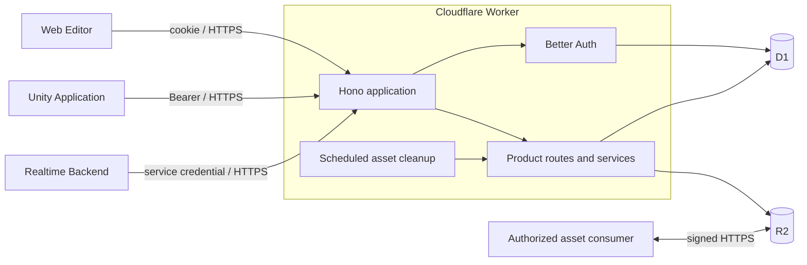
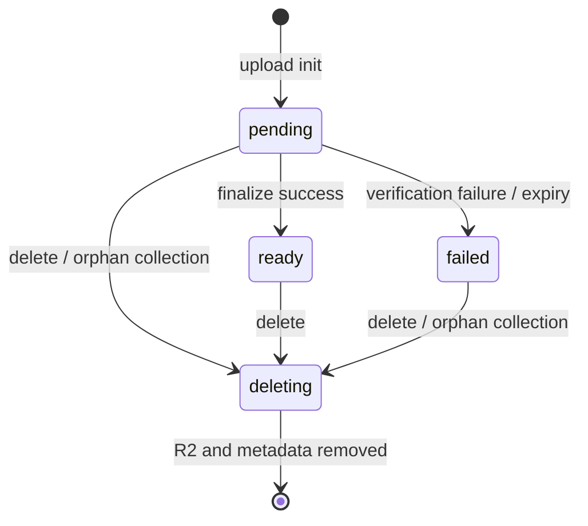
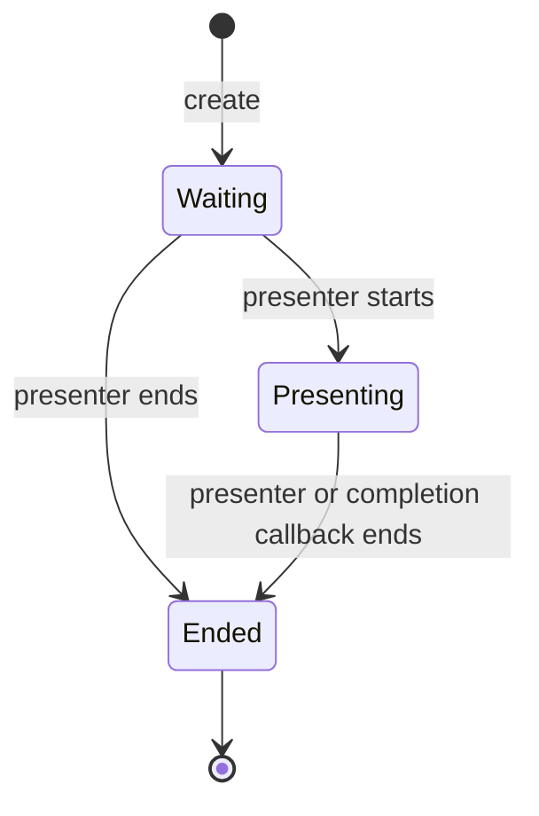

# Unframe Control Plane アーキテクチャ

## 1. 文書の位置づけ

この文書は、`app/server/control-plane/` が所有する Cloud Control Plane のアーキテクチャを定義する。対象は Cloudflare Worker 内の HTTP application、認証・認可、durable resource、D1 / R2、session bootstrap、Realtime Backend から受け取る永続化 callback である。

Backend 全体における Control Plane と Realtime Backend の関係は [`../ARCHITECTURE.md`](../ARCHITECTURE.md)、Realtime Backend の内部設計は [`../realtime/ARCHITECTURE.md`](../realtime/ARCHITECTURE.md) を正本とする。本書では Realtime protocol、active session runtime、fan-out、Venue Edge の内部構成を定義しない。

記述の状態は次の3種類に分ける。

- **Current**: repository に実装が存在し、component の品質ゲートで検証している
- **Target**: Control Plane の正規の設計だが、実装または consumer 接続が完了していない
- **Open**: 実装前に追加の判断が必要である

## 2. Role と境界

Control Plane は、Unframe の durable state と access policy の authority である。Web Editor、Unity、Realtime Backend に対して HTTPS API を提供し、長時間接続や高頻度 state synchronization は扱わない。

### 2.1 Responsibilities

- Better Auth による user authentication と application session
- user、presentation、asset、session に対する authorization
- Presentation Definition、Asset metadata、Session directory の D1 永続化
- R2 object lifecycle と、制約付きの直接 upload / download access の発行
- session の作成、参加、開始、終了と participant membership の管理
- Realtime endpoint と session-bound credential の発行
- Realtime Backend からの checkpoint / completion の冪等な受付
- Control Plane が所有する contract、migration、audit boundary の管理

### 2.2 Non-responsibilities

- gRPC stream の維持
- active session 中の canonical runtime state
- Pose、Element State、pointer、transform 等の高頻度処理
- realtime fan-out、queue、backpressure、snapshot、replay
- Asset binary の proxy 配信
- Unity の rendering、local cache、calibration
- Venue Edge Runtime の内部処理と配置方式

## 3. Runtime topology



Worker は一つの deployment unit である。D1 は durable structured data、R2 は大容量 Asset binary を所有する。認可された consumer は signed URL を使って R2 と通信し、Worker は metadata、authorization、署名、finalize、削除を調整する。Web、Unity、Venue Edge のどれが consumer になるかは利用 flow ごとの architecture が定義する。

## 4. HTTP application composition

`src/index.ts` は Worker entrypoint と scheduled handler を構築し、`src/app.ts` は Hono application の composition root を担う。

```text
fetch request
  ├─ runtime configuration validation
  ├─ unsafe cookie request の Origin 検証
  ├─ browser CORS
  ├─ Better Auth routes
  └─ product routes
       ├─ authentication / service identity boundary
       ├─ Zod request validation
       ├─ route response mapping
       └─ application service
            └─ repository / external adapter
```

HTTP handler は request / response mapping に限定する。Domain rule と状態遷移は service、D1 / R2 操作は repository または adapter に置く。`createProductApi` は型付き sub-application を chain し、同じ route tree から実行、OpenAPI、Hono RPC の型を導出する。

Product route の validation error は安定した JSON error に変換する。予期しない例外は incident ID を返し、route pattern と例外名だけを構造化 log に記録する。

### 4.1 API ownership

| Boundary | Consumer | Status | Ownership |
| --- | --- | --- | --- |
| Better Auth API | Web / Unity | Current | Better Authのversioned endpoint。Product OpenAPIへ複製しない |
| Presentation API | Web / Unity | Current | Definition aggregate、membership、revision conflict |
| Asset API | Web / Unity / authorized delivery consumer | Current | Metadata、signed access、finalize、download、delete |
| Session API | Unity | Current | Durable lifecycle、join、participant、bootstrap |
| JWKS / Realtime credential | Realtime consumer | Current | Control Planeが署名・公開し、Realtime側が検証する |
| Persistence callback | Realtime Backend | Current | Service-authenticated checkpoint / completion |
| Presentation delivery projection | Web / Session bootstrap | Target | Definitionと参照Asset accessの一貫したprojection |

Endpoint、request / response、status codeのsource of truthは生成OpenAPIとBetter Authのversioned contractであり、本表はroute contractを置き換えない。

## 5. Identity と authorization

### 5.1 User authentication

Current の user authentication は Better Auth が所有する。

- Web: Google OAuth または email / password、cookie session
- Unity: Device Authorization Grant、Bearer session
- email / password: email verification と TOTP または backup code による MFA
- Google OAuth: provider authenticationをassuranceとし、追加のTOTPを要求しない
- password reset: 既存 session と未消費の authorization grant を失効
- Device Authorization: 30分 expiry、3秒 polling interval、固定 client ID

Better Auth endpoint は product-owned OpenAPI へ複製しない。TypeScript consumer は固定した Better Auth version に対応する client を使用する。

Device Authorization が Unity に返す Bearer credential は Better Auth の opaque application session token であり、Realtime 接続用の Ed25519 JWT ではない。Device code / user code と Presentation Session の join code も別 namespace、別 table、別 rate-limit boundary とする。

Device Authorization consumerは`authorization_pending`中だけpollを継続し、`slow_down`ではserverの指示に従ってintervalを増やす。Expiry、deny、invalid grantはterminal resultとして扱う。Verification pageでbrowser loginが必要になった場合は、認証後に元のapproval flowへ戻れるようにする。

### 5.2 Authorization model

Control Plane は次の role を区別する。

| Scope | Role | Authority |
| --- | --- | --- |
| Global | `admin` | 全 Presentation の管理、Session の管理操作 |
| Global | `user` | membership に基づく通常操作 |
| Presentation | `owner` | read / update / delete、Asset、Session 作成 |
| Presentation | `editor` | read / update、Asset、Session 作成 |
| Session | `presenter` | 固定 creator。start / end を実行 |
| Session | `viewer` | join 済み participant として参照・bootstrap |

Resource ID の推測困難性を authorization の代わりにしない。Presentation と Asset の read / write は D1 上の membership、Session 操作は participant と presenter identity を照合する。

Current / Target のauthorization modelにはorganization / team resourceを導入しない。必要になった場合は既存roleへの暗黙な追加ではなく、identity、membership、resource ownership、migrationを含む別のarchitecture decisionとして扱う。

### 5.3 Service identity と発行 credential

Realtime Backend の checkpoint / completion callback は user credential と分離した service Bearer credential で認証する。Current は `SERVICE_IDENTITY_SECRET` を使用する。

Realtime bootstrap では Control Plane が Ed25519 で JWT を署名し、公開 JWKS を提供する。credential は `iss`、`aud=unframe-realtime`、`sub`、`session_id`、`role`、`iat`、`nbf`、`exp`、`jti`、`protocol_version` を拘束し、Current の有効期間は1週間である。検証処理と active runtime での利用規則は Realtime Backend の責務である。

Realtime JWT は Control Plane API の認証 credential として受け付けず、Better Auth の cookie / Bearer session も Realtime 接続 credential として流用しない。Callback 用 service identity もこれら二つから分離する。

Venue Edge の登録と割り当てを実装する際は、全 Edge で共有する service secret を配布せず、Edge と assignment に scope された credential を別途導入する。

## 6. Durable resource model

### 6.1 Presentation

Presentation は `Group → Step → Cue` を含む Definition aggregate を所有する。Definition 全体を一つの revision で原子的に置換し、client は `expectedRevision` を送る。revision が一致しない更新は conflict とする。

CurrentのControl Planeは同時編集coordination、履歴version、Draft / Release resourceを持たず、一つのdurable Definitionとrevisionだけを保存する。これらを恒久的なNon-goalとはせず、導入する場合はauthoring state、公開revision、active Session inputの関係を別のarchitecture decisionで確定する。

Definition 内の Asset 参照は、同じ Presentation に属する `ready` Asset だけを許可する。Presentation の削除は owner または global admin に限定し、Asset metadata が残る間は拒否する。

### 6.2 Asset

Asset lifecycle は次の状態を持つ。



Upload initialization では size、MIME、SHA-256 を metadata として保存し、それらを拘束した10分間の signed `PUT` access を返す。Asset size は最大50 MiB、API の checksum は小文字 SHA-256 hex、R2 S3 checksum header は base64 とする。許可 MIME は `image/png`、`image/jpeg`、`image/webp`、`video/mp4`、`audio/mpeg`、`model/gltf-binary` である。Finalize は R2 object の存在、size、MIME、checksum、magic bytes を検証してから `ready` にする。Upload された形式の conversion は行わない。

Download access は、read 権限があり、Definition から参照されている `ready` Asset にだけ発行する。削除は D1 上で claim してから R2 object と metadata を除去し、参照中の Asset は拒否する。Scheduled handler は upload intent の expiry から24時間を経過した `pending` / `failed` Asset と、24時間以上 metadata を持たない orphan object を毎日03:00 UTCに回収する。

### 6.3 Session directory

Control Plane の Session は durable directory と access lifecycle を表し、active runtime state そのものではない。



- creator を固定 `presenter` とし、途中交代しない
- participant 上限は presenter を含め50人
- join code は紛らわしい文字を除いた `xxxx-xxxx` 形式とし、D1 には SHA-256 hash を保存する
- join attempt は code / user / IP と5分 windowで rate limitする
- `Ended` の Session は join と bootstrap を拒否する
- bootstrap は join 済み participant にだけ endpoint と session-bound credential を返す

Current の endpoint は `REALTIME_ENDPOINT` という静的設定である。Venue Edge registry、capacity、lease、assignment generation に基づく動的 routing は Target であり、本書の Current と混同しない。

### 6.4 Realtime persistence callback

Checkpoint と completion は Realtime Backend から受け取る Control Plane 側の永続化 interface である。

- checkpoint は `(session_id, version)` と idempotency key で重複適用を防ぐ
- completion は session ごとに一度だけ保存し、同時に durable Session を `Ended` へ遷移させる
- unknown session は受け付けない
- high-frequency update や message ごとの authorization query はこの interface に流さない

Callback の retry、snapshot の作成、runtime recovery は Realtime Backend 側の設計に従う。

### 6.5 Presentation delivery

Current は Presentation Resource の取得と、参照済み Asset 単体に対する期限付き download access を提供する。Web と Unity はまだこの flow へ接続していない。

Presentation Definition と参照 Asset の配信情報を一括で返す `GET /presentations/{presentationId}/delivery` は Target である。直接 delivery API は Presentation の read policy を適用し、global admin または対象 Presentation の owner / editor にだけ許可する。Session participant は Realtime JWT でこの API を呼ばず、Control Plane が membership と role を検証した Session bootstrap response から同じ projection を受け取る。

目標 response は次の形とする。Definition に URL や object key は保存しない。

```ts
type PresentationDelivery = {
  presentation: PresentationResource;
  assetBindings: Record<
    string,
    {
      mediaType: AssetMediaType;
      sizeBytes: number;
      sha256Hex: string;
      url: string;
      expiresAt: string;
    }
  >;
};
```

`assetBindings` は response の `presentation.definition.assets` から導出する。Presentation revision、Asset の所属、`ready` 状態は単一 D1 statement または同等の一貫した snapshot から読み、一件でも解決できない場合は部分 response を返さず全体を失敗させる。Signed URL は永続化しない。

Session bootstrap へ組み込む場合も、durable Definition と Asset access の生成は Control Plane が所有し、Realtime Backend に R2 credential や D1 access を渡さない。

## 7. Data storage と consistency

### 7.1 D1

D1 は Better Auth の schema に加え、次の product state を保持する。

- Presentation と membership
- Asset metadata と Presentation からの参照
- Session directory、participant、join attempt
- Realtime checkpoint と completion

通常の CRUD、一覧、lookup は Drizzle ORM を使う。Migration DDL、Better Auth の D1 adapter、revision / status の conditional update、JSON1 や `NOT EXISTS` を含む競合安全な statement は直接 SQL を使用する。

複数 request が同じ resource を操作しても、revision、status、unique constraint、conditional write により二重適用や参照破壊を防ぐ。D1 migration は `migrations/` に追記し、既存 migration を書き換えない。

### 7.2 R2

R2 は Asset binary だけを保持し、ownership や lifecycle の authority にはしない。Object key は外部 resource ID と分離し、API response へ公開しない。D1 metadata と R2 object の不整合は finalize、delete claim、scheduled orphan collection で収束させる。

## 8. Contract ownership

### 8.1 Product API

`src/openapi.ts` の Zod / `createRoute` 定義と、それを実 handler に登録する `OpenAPIHono` application が source of truth である。

- `packages/contracts/openapi/control-plane.openapi.json`: 言語非依存 OpenAPI artifact
- `packages/contracts/src/control-plane.openapi.ts`: 生成 TypeScript path types
- `packages/api-client-typescript`: `AppType` を使う Hono RPC client

生成物は手編集しない。Route、shared schema、response を変更した場合は contract と client の drift check を同じ変更で通す。

### 8.2 Better Auth API

Better Auth の endpoint は library が所有する versioned boundary である。Authentication client は固定した Better Auth version へ追従し、product API の OpenAPI に不完全な複製を作らない。

### 8.3 Realtime boundary

Control Plane は bootstrap response、JWT / JWKS、persistence callback HTTP contract を所有する。gRPC wire contract と runtime message semantics は Realtime Backend が所有する。両 component は contract と stable identifier だけを共有し、TypeScript / Go の実装 code を共有しない。

## 9. Configuration と deployment boundary

Control Plane は `wrangler.toml`、D1 migration、R2 CORS、Worker binding 型を component 内で所有する。

- Public configuration は Wrangler vars に置く
- Secret は local では `.dev.vars`、remote では Workers secrets に置く
- D1 は `DB` binding、R2 は `ASSETS` binding を使う
- signed URL 発行に必要な R2 S3 credential は secret とする
- Custom Domain と DNS は sibling `infra` repository の Terraform が所有する

Runtime configuration は request boundary と scheduled boundary で検証する。Module evaluation 時に binding を検証して Worker 自体の読み込みを失敗させない。Validation error は field name だけを報告し、secret value は出さない。

`pnpm deploy` は Worker を変更し、remote migration と R2 CORS command はそれぞれ D1 / R2 の外部状態を変更する。実行手順と必要な設定は [`README.md`](./README.md) に置き、本書では責務境界だけを定義する。

## 10. Observability と security

- Product route の未処理例外は UUID incident ID、method、route pattern、例外名を記録する
- Exception message、credential、signed URL、presentation data を log に出さない
- Response には一般化した error と `x-unframe-incident-id` だけを返す
- Cookie を伴う unsafe method は `WEB_ORIGIN` と一致する Origin だけを許可する
- CORS は設定済み Web origin に限定する
- Asset delete / orphan collection は機密情報を含まない audit event を記録する
- Worker logs / traces の収集設定と privacy boundary は `wrangler.toml` と運用設定で一致させる

Targetの主要metricsは次を含む。Currentで全項目が収集済みであることを意味しない。

- request count、latency percentile、status / error rate
- authentication / authorization failureとDevice Authorizationのoutcome
- Session create / join / start / end、join code failure、rate-limit activation
- D1 queryとR2 signed access / finalize / deleteのlatency・failure
- checkpoint / completionの受付、duplicate、failure、persistence latency
- scheduled orphan collectionの削除件数、skip件数、failure

## 11. Directory boundary

```text
app/server/control-plane/
├── ARCHITECTURE.md
├── README.md
├── migrations/                  # append-only D1 migrations
├── src/
│   ├── index.ts                 # Worker / scheduled entrypoint
│   ├── app.ts                   # Hono composition root
│   ├── config.ts                # trust-boundary configuration validation
│   ├── openapi.ts               # product route contract
│   ├── rpc.ts                   # Hono RPC AppType export
│   ├── auth/                    # Better Auth and identity mapping
│   ├── presentation/            # Presentation routes / service / repository / schema
│   ├── modules/
│   │   ├── assets/              # Asset use cases and ports
│   │   ├── sessions/            # durable Session lifecycle
│   │   ├── realtime-bootstrap/  # JWT / JWKS
│   │   └── persistence-callback/# service-authenticated persistence API
│   └── adapters/
│       ├── d1/                  # shared D1 setup and schema
│       └── assets/              # D1 / R2 / signed access adapters
└── test/                        # Workers runtime and module tests
```

Application-specific code をこの component の外へ移して共有しない。共有が必要なものは contract artifact と生成手順として `packages/` に置く。

## 12. Validation strategy

Component gate は次を検証する。

- Wrangler binding 型の drift
- TypeScript typecheck と lint
- Service / repository / route unit tests
- Miniflare の D1 / R2 binding を使う Workers runtime tests
- Migration 適用と D1 consistency
- OpenAPI と TypeScript client の生成 drift
- Wrangler deploy dry-run

正規の entrypoint は repository root から実行する `nix run .#control-plane` である。実 R2 S3 endpoint、browser CORS、remote D1 / R2、email delivery は local runtime と同一ではないため、環境を変更した場合は staging smoke test を別途行う。

## 13. Implementation status

| Area | Status | Boundary |
| --- | --- | --- |
| Better Auth、cookie / Bearer session、MFA、Device Authorization | Current | Consumer UI 接続は各 application の責務 |
| Presentation CRUD、membership、revision conflict | Current | Web / Unity consumer 接続は未完了 |
| Asset init / finalize / download / delete / orphan collection | Current | Remote R2 smoke test は環境ごとに必要 |
| Session create / join / start / end / bootstrap | Current | Endpoint は静的設定 |
| Ed25519 JWT と JWKS | Current | Realtime 側の検証統合は別 component |
| Checkpoint / completion callback | Current | Realtime 側の送信・retry 統合は別 component |
| Presentation delivery projection | Target | OpenAPI と consumer を同時に設計する |
| Venue Edge registry / assignment / lease / fencing | Target | Realtime architecture の bootstrap 要件と整合させる |
| Key rotation と Edge-scoped service identity | Target / Open | Rotation と失効 policy を決定する |
| Durable audit storage と運用 SLO | Open | Privacy と retention を先に定義する |

## 14. Open decisions

- Ed25519 key rotation の周期と旧 public key の保持期間
- Venue Edge provisioning、credential rotation、assignment lease の Control Plane contract
- Presentation delivery projection と Session bootstrap の分割
- Account linking と identity lifecycle の詳細
- Join code の再利用禁止期間と production rate-limit parameter
- Checkpoint retention、最大 payload、cleanup policy
- Audit event の保存先、retention、access policy

決定後は、route contract、migration、configuration、ADR のいずれか適切な一次資料へ反映し、本章から削除する。
