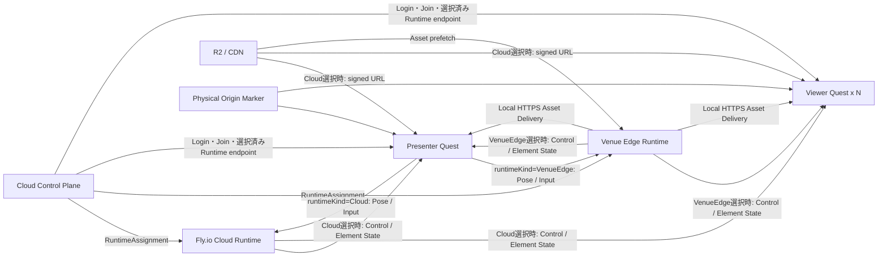
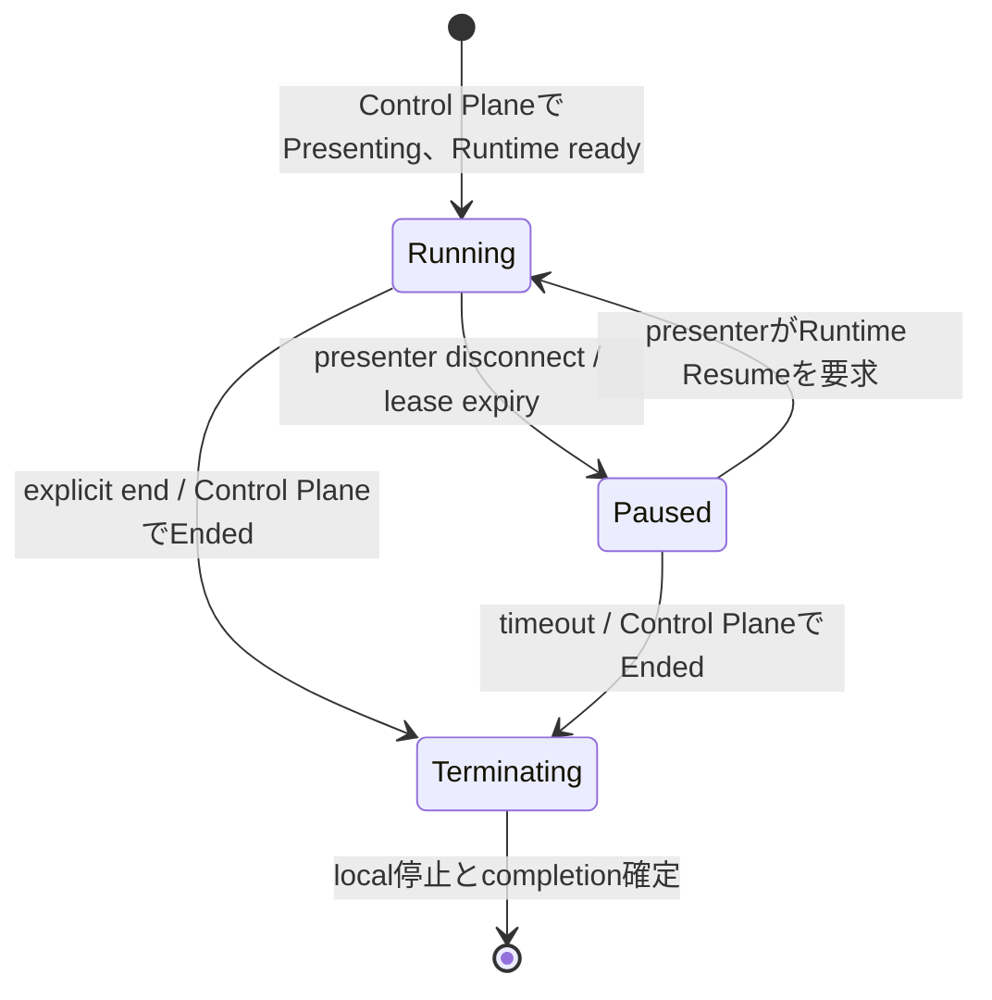

# Quest 向け Cloud / Venue Edge Realtime Runtime アーキテクチャ

## 文書の位置付け

- Status: Proposed
- 対象: Meta Quest 3 を利用する MR プレゼンテーション
- 目的: 同じ Realtime Runtime Core を Fly.io と会場内 Venue Edge のどちらにも配置できる通信・割り当て方式を定義する

本書は、会話や過去の検討経緯を参照しなくても、対象要件、採用する構成、各 component の責務、通信方式、障害時挙動、実装・検証項目を理解できることを目的とする。

現在の実装基盤では、Control Plane の Venue Edge provisioning / registration / assignment、Quest bootstrap、JWT / JWKS / scope 検証、Realtime 接続と command の assignment lease / epoch fencing を実装済みである。Manifest 検証、content-addressed Asset cache、Range 配信、runtime pause / resume、Element State field-merge mailbox は transport-independent な domain primitive まで実装済みである。

Target Architecture では、この Edge 固有の割り当てを Cloud Runtime にも使える `RuntimeAssignment` へ一般化する。まず Fly.io 上の Cloud Realtime と Quest だけで成立する MVP を実装し、実機で latency、jitter、最大 50 台への fan-out を測定する。その後、同じ Runtime Core を Venue Edge 用バイナリとして起動し、session 開始前に配置先を選択できるようにする。Venue Edge の Cloud Agent、実際の local HTTPS listener、Unity の Control / State 接続、Presenter Pose、Step / Cue 実行、snapshot / replay、Asset cache の容量・退避方針は後続の設計・実装対象である。

## 実装状況

この表は、この文書の更新時点における source code の状態を示す。以降の章は、明示的に「現在の実装」と書かれている箇所以外は Target Architecture の仕様として読む。実装変更時は、関連する設計記述とこの表を同時に更新する。

- **実装済み**: production composition へ接続され、対象テストがある
- **部分実装**: 独立した domain primitive または handler とテストはあるが、end-to-end の runtime へ未接続
- **未実装**: Target Architecture または実装段階にだけ存在する
- **未決定**: contract、運用値、構成方式の決定が残っている

| 領域 | 状態 | 現在の境界・根拠 |
| --- | --- | --- |
| Venue Edge provisioning / credential / registration / assignment | 実装済み | `control-plane/src/modules/venue-edges/`、`migrations/0008_venue_edges.sql`。lease日時をcanonical ISOへ正規化し、Edgeによるrenewは5分以内に制限する |
| Venue Edge bootstrap / JWT claims | 実装済み | `control-plane/src/modules/realtime-bootstrap/` と session bootstrap route。`edgeId`、assignment epoch、Presentation revision を拘束する |
| JWT / JWKS / scope 検証と gRPC assignment fencing | 実装済み | `realtime/internal/auth/`、`realtime/internal/edge/`、gRPC interceptor / service guard。JWKS cacheは5分で失効し、refresh失敗時はstale keyを使用しない |
| Manifest 検証、content-addressed cache、Range 対応 Asset handler | 部分実装 | `realtime/internal/asset/`。domain と `http.Handler` はあるが、実際の local HTTPS listener、証明書、Cloud Agent、runtime composition へ未接続 |
| Runtime pause / resume state | 部分実装 | `realtime/internal/session/runtime.go`。状態遷移 primitive はあるが、Presenter 接続、Step / Cue、Snapshot / checkpoint へ未接続 |
| Element State latest-wins mailbox | 部分実装 | `realtime/internal/state/mailbox.go`。field merge primitive はあるが、State gRPC fan-out へ未接続 |
| `RuntimeAssignment` / `runtimeId` / `runtimeKind` 一般化 | 未実装 | 現在は `EdgeSessionAssignment` と `edgeId` を使用している |
| Fly.io Cloud Runtime | 未実装 | 起動・登録、公開 endpoint、health、checkpoint、deployment profile は Target のみ |
| session 作成時の `Cloud` / `VenueEdge` 選択 | 未実装 | Control Plane API / repository / UI / bootstrap は Edge 固有のまま |
| Unity の Control / State gRPC 接続 | 未実装 | generated client の組み込み、2 connection lifecycle、nonce、再接続、State 適用は未着手 |
| Presenter Tracking / Input protocol | 未実装 | Pose sample、clock、rate、Unity送信、Runtime受信は Target のみ |
| Step / Cue / Action / Transition evaluator | 未実装 | canonical evaluation と Element State 生成は未着手 |
| Snapshot / Replay / Connection Resume | 未実装 | protocol、atomic cut、replay queue、Quest適用、durable / local checkpoint への配線は未着手 |
| Venue Edge Cloud Agent / local HTTPS listener / update | 未実装 | service manager、LAN bind、証明書、fingerprint rotation、health、更新・rollbackは未着手 |
| Cloud 配置の R2 / CDN signed URL 配信 | 未実装 | Manifest認可、signed URL発行、Quest download / readinessはTargetのみ |
| Asset cache容量・eviction | 未決定 | hard limit、low-disk threshold、退避順、active session pin、quotaを実測後に決定する |
| 1 / 10 / 25 / 50 Quest 実機計測 | 未実装 | latency、jitter、fan-out、Asset ready の基準値は未計測 |

## 1. 背景

Unframe は、Web Editor で作成した Presentation を Meta Quest 3 上で Mixed Reality プレゼンテーションとして実行する。発表中は、現実空間にいる presenter を参加者が直接見ながら、presenter が設定した実空間上の中心点を基準に、仮想 Element の表示、移動、回転、animation、video 等を進行させる。

Presentation は `Group -> Step -> Cue` の構造を持つ。

- `Group`: 一つの空間を共有する大きな発表単位
- `Step`: 現在評価可能な Cue の範囲
- `Cue`: 一つの Trigger と複数の Action をまとめた論理的な進行
- `Trigger`: presenter の位置、motion、controller input 等による発火条件
- `Action`: Element の表示、Transform、animation、playback 等の変更
- `Transition`: Action を時間方向に補間する方法

Presenter の Pose や input によって Cue が発火し、Action / Transition の実行結果が複数の Quest へ継続的に配信される。複数 Element を 20–60 Hz で最大 50 台へ配信する可能性があるため、発表中の通信は高トラフィックになり得る。

Presenter の Quest 自身に最大 49 台分の接続、暗号化、fan-out、snapshot / replay を担当させると、MR 描画や tracking と競合する。このため、Quest 同士の full-mesh P2P や presenter-host 方式ではなく、Cloud または Venue Edge 上の専用 Runtime が session の authority と fan-out を担当する。

初期 MVP は Fly.io 上の Cloud Runtime を使用する。これにより Venue Edge 用 PC がなくても Quest だけで利用でき、開発、デモ、自動テストを先行できる。また、Venue Edge 導入前の基準性能を測定でき、小規模会場では Cloud だけで要件を満たす可能性も検証できる。Venue Edge は Cloud Runtime と同じ Core を会場 LAN 内で動かし、低遅延通信と local Asset 配信が必要な構成へ追加する。

## 2. 要件

### 2.1 対象要件

- 参加者は全員同じ物理会場にいる
- presenter と viewer は Meta Quest 3 を使用する
- 1 session は presenter を含め最大 50 participant とする
- presenter は session 作成者で固定し、途中交代を初期要件に含めない
- presenter 本人は現実空間で見えるため、presenter avatar は表示しない
- Presenter HMD / controller / wrist Pose は Trigger と Action の計算に使用する
- viewer の HMD / controller Pose は各端末のローカル描画にのみ使用し、共有しない
- 全 Quest は同じ Presentation Origin を基準に仮想 Element を配置する
- Step / Cue による Action / Transition の実行結果を同期する
- Internet 接続を必須とし、認証、session 作成・参加、Runtime 管理、Cloud Asset 取得に使用する
- session 作成時に `Cloud` または `VenueEdge` の配置先を選択し、開始前に一つの Runtime へ割り当てる
- Cloud Runtime では Realtime 通信を Cloud へ接続し、Asset は Quest が R2 / CDN の signed URL から直接取得する
- Venue Edge Runtime では Realtime 通信と Quest 向け Asset 配信を会場 LAN 内で完結させる
- Runtime Core と環境固有 adapter の責務を分離し、Realtime hot path で D1 や R2 へ同期問い合わせしない

### 2.2 Non-goals

- remote participant の参加
- Web Editor からの発表参加・操作
- presenter / viewer avatar の同期
- viewer 同士の Pose 共有
- Quest 間の full-mesh P2P
- Presenter Quest による 49 台分の直接 fan-out
- 発表中の Asset binary の gRPC streaming
- 高頻度 state の D1 永続化
- 1 room を複数 Runtime へ分割する distributed consensus
- 初期実装での host migration
- 発表中の Cloud / Venue Edge 間の自動 fallback または live migration
- Edge固有鍵、one-time enrollment、client certificate、mTLSによるEdge認証

## 3. 採用する構成



図中の Cloud と Venue Edge は代替経路であり、一つの session が同時に両方へ接続することはない。

### 3.1 基本方針

1. Cloud Control Plane を認証、durable resource、session lifecycle、Runtime 管理と割り当ての authority とする。
2. session に割り当てられた Cloud または Venue Edge Runtime を、active session 中の Group / Step / Cue、Action / Transition、Element State の authority とする。
3. Presenter Quest は Pose と input の source であり、room state や fan-out の authority にはしない。
4. Viewer Quest は受信した Element State を、自端末で校正した Presentation Origin に対して描画する。
5. Cloud 配置では Quest が R2 / CDN から signed URL で Asset を直接取得し、Venue Edge 配置では Edge が一度取得して会場 LAN 内で配信する。
6. Realtime hot path は割り当て済み Runtime 内で完結させ、Control Plane へ Pose frame や Element State frame を中継しない。
7. Realtime Runtime Core は Fly.io container と Venue Edge binary のどちらでも動かせる deployment-independent な構造を維持する。
8. 配置先は session 開始前に確定する。発表中の Runtime 自動移行は行わない。

## 4. Component の責務

### 4.1 Cloud Control Plane

- Better Auth による user login と application session
- Presentation / Asset の durable CRUD
- R2 Asset lifecycle
- session 作成、参加コード、participant、role、終了状態の管理
- session-bound Runtime JWT の発行
- JWKS の公開と key rotation
- Fly.io Cloud Runtime と Venue Edge Runtime の登録、health、capacity、version 管理
- Edge固有Bearer tokenの発行、rotation、失効
- session と Runtime の lease付き割り当て、および割り当て世代による fencing
- Quest への Runtime endpoint と、Venue Edge 配置時の certificate fingerprint の返却
- Cloud 配置時の Quest 用 Asset signed URL の発行
- Venue Edge 用の短命な Asset 取得 URL の発行
- Runtime からの checkpoint / completion / telemetry の受付

Cloud Control Plane は Pose、Transition frame、Element State frame を処理しない。

### 4.2 共通 Runtime Core

Fly.io と Venue Edge は、同じ Runtime Core と Realtime protocol を使用する。環境差は Runtime Core の外側にある deployment adapter と Asset adapter へ閉じ込める。

```text
Runtime Core
├─ Session Runtime
│  ├─ participant registry
│  ├─ Group / Step state
│  ├─ Trigger evaluation
│  ├─ Cue lifecycle
│  ├─ Action / Transition evaluation
│  └─ canonical Element State
├─ Realtime Gateway
│  ├─ JWT / role validation
│  ├─ Control stream
│  ├─ Tracking stream
│  ├─ Element State stream
│  ├─ fan-out
│  └─ backpressure
├─ Recovery
│  ├─ reliable event log
│  ├─ snapshot
│  └─ replay
└─ Runtime Assignment Guard
   ├─ runtimeId / runtimeKind
   ├─ assignmentEpoch / lease
   ├─ presentation revision
   └─ JWT / role / scope validation
```

Target の共通 Core が提供するのは Session Runtime、Cue / Action / Transition 評価、Snapshot / Replay、Control / State gRPC、JWT 検証である。起動・登録方法、公開 endpoint、Asset 配信、health、更新方法は環境固有 adapter の責務とする。

### 4.3 Fly.io Cloud Runtime

- Fly.io の release / Machine として起動する
- 公開 TLS endpoint で Quest の Control / State gRPC を受ける
- Control Plane が発行した Runtime JWT と `RuntimeAssignment` を検証する
- Asset binary は中継せず、Quest が R2 / CDN の signed URL から直接取得する
- Fly.io health check と Runtime application health を公開する
- image version、Machine state、capacity を Control Plane へ報告する
- checkpoint / completion / telemetry を Cloud へ送る

Cloud Runtime は Venue Edge 用 PC がなくても利用できる既定の MVP 配置先とする。開発、デモ、自動テスト、基準性能測定を Cloud Runtime 上で先行する。

### 4.4 Venue Edge Runtime

Venue Edge はノート PC、mini PC、または会場内の専用端末で動作し、専用 Wi-Fi router へ Ethernet で接続する。

```text
Venue Edge Runtime
├─ Runtime Core
├─ Cloud Agent
│  ├─ Edge credential による登録
│  ├─ health / capacity / version reporting
│  ├─ assignment / lease renewal
│  ├─ Manifest / signed URL retrieval
│  └─ checkpoint / telemetry upload
├─ Local Checkpoint Store
└─ Asset Gateway
   ├─ prefetch
   ├─ checksum / MIME / size verification
   ├─ content-addressed cache
   ├─ local HTTPS delivery
   └─ eviction / readiness
```

Venue Edge 固有 Bearer token は Cloud Agent と Control Plane の通信だけに使用し、共通 Runtime Core や Quest へ公開しない。

### 4.5 Presenter Quest

- Cloud login
- Presentation / session の選択と作成
- Presentation Origin の calibration
- HMD、controller、wrist Pose と logical input の取得
- Pose を Presentation Space へ変換
- 割り当て済み Runtime への Tracking Frame 送信
- 割り当て済み Runtime への離散 Input Event 送信
- Control / Element State の受信と描画
- Cloud 配置時は R2 / CDN、Venue Edge 配置時は local HTTPS から Asset を取得
- Asset の local cache

Presenter Quest は viewer ごとの接続・送信 queue・fan-out を持たない。

### 4.6 Viewer Quest

- Cloud login と参加コードによる session join
- Presentation Origin の calibration
- 割り当て済み Runtime からの snapshot / live stream 受信
- Element State の local rendering / interpolation
- 自端末の HMD Pose に基づく視点描画
- Cloud 配置時は R2 / CDN、Venue Edge 配置時は local HTTPS から Asset を取得
- Asset の local cache
- readiness / heartbeat の報告

Viewer Quest の HMD / controller Pose はネットワークへ送信しない。

## 5. Runtime の登録と Session 割り当て

### 5.1 RuntimeAssignment

Presenter は session 作成時に `Cloud` または `VenueEdge` を選択する。Control Plane は指定された種類の healthy な Runtime を一つだけ割り当て、session ごとに単調増加する `assignmentEpoch` と期限付き lease を発行する。

```text
RuntimeAssignment
├─ sessionId
├─ runtimeId
├─ runtimeKind: Cloud | VenueEdge
├─ endpoint
├─ assignmentEpoch
├─ presentationRevision
├─ issuedAt
└─ leaseExpiresAt
```

- `runtimeId` は配置環境をまたいで Runtime instance を識別する。Fly.io Machine の再作成時に同じ ID を引き継ぐかは Runtime identity の永続化方針で決める。
- `certificateFingerprint` は Venue Edge の local endpoint にだけ必要な profile 固有情報とし、共通 Assignment の必須 field にしない。
- Control Plane は同じ session を別 Runtime へ割り当てるたびに `assignmentEpoch` を増やす。
- Control Plane は旧 Runtime から明示的な lease 返却を受けるか、旧 lease の期限が切れるまで新しい active assignment を発行しない。強制切替時も旧 lease の期限まで session を停止し、二つの Runtime を同時に active authority にしない。
- lease renewalの期限はControl Planeのpolicyで制限し、Runtimeのcredentialだけで任意の長期間へ延長できないようにする。現在のEdge固有実装は要求された絶対期限を5分以内に制限し、canonical ISO形式へ正規化する。
- Runtime は接続、command、state 更新、checkpoint の処理前に、local assignment の `runtimeId`、`runtimeKind`、`assignmentEpoch`、Presentation revision、lease 有効期限を検証する。
- Quest 用 JWT と bootstrap response は `runtimeId`、`runtimeKind`、`assignmentEpoch` を拘束する。古い世代または別配置先の credential を受け入れない。
- lease を更新できない場合、既存 connection は `leaseExpiresAt` までだけ継続できる。期限後は Session Runtime を pause し、新規接続、command 受付、state 更新を停止する。
- Control Plane は古い `assignmentEpoch` から届いた checkpoint、completion、telemetry を現行 session state へ適用しない。

現在の実装は `EdgeSessionAssignment` と JWT の `edgeId` を使用している。Cloud Runtime を接続する前に、契約、repository、bootstrap、JWT、Runtime Guard を `RuntimeAssignment` と `runtimeId` へ移行する。Edge 固有 Bearer token と `edgeId` は Venue Edge の provisioning identity としてのみ残す。

### 5.2 割り当てと bootstrap

1. Presenter が Control Plane で session と `runtimeKind` を選択する。
2. Control Plane が利用可能な Runtime を選び、`RuntimeAssignment` を作成する。
3. Runtime が Assignment、Presentation Manifest、Runtime JWT 検証用 JWKS を取得し、lease を更新する。
4. Cloud Runtime は Realtime readiness、Venue Edge は Realtime と Asset の readiness を `assignmentEpoch` とともに報告する。
5. Quest が session へ join すると、Control Plane が endpoint、`runtimeId`、`runtimeKind`、`assignmentEpoch`、session-bound Runtime JWT、Presentation revision を返す。
6. Venue Edge 配置では certificate fingerprint も返し、Quest は local endpoint を pinning する。Cloud 配置では公開 CA による TLS 検証を使用する。
7. Quest は bootstrap と JWT が示す一つの Runtime へ Control / State connection を開く。

配置先は `Waiting` 中だけ変更できる。`Presenting` へ移行した後は同じ Assignment を使い続け、障害時は pause または session 終了とする。発表中の自動 Cloud fallback は、Snapshot 転送、重複実行防止、Quest の再接続、split-brain 対策が揃うまで実装しない。

### 5.3 Venue Edge provisioning identity

1. `admin` が Control Plane の管理 API または CLI で Venue Edge を provisioning する。
2. Control Plane が `edgeId` と 256 bit 以上の random な Edge 固有 Bearer token を生成し、token 本体をこの応答で一度だけ返す。
3. 管理者が `edgeId` と token を Venue Edge の credential store へ配置する。source、image、command line、log へ token を含めない。
4. Venue Edge が HTTPS で Control Plane へ接続し、Edge 固有 Bearer token で認証して runtime version、protocol version、capacity、local endpoint、certificate fingerprint、health を登録する。

```text
VenueEdgeCredential
├─ edgeId
├─ tokenId
├─ tokenHash
├─ status: Active | Revoked
├─ createdAt
├─ expiresAt
└─ lastUsedAt
```

- tokenは高entropyなBearer credentialとし、Control Planeはlookup用の非secretな`tokenId`とtokenのcryptographic hashだけを保存する。
- token比較はtiming差を生まない方法で行う。
- tokenはその`edgeId`のregister、health、lease、割り当て済みsessionのManifest / signed URL取得、checkpoint / completion / telemetryだけに使用できる。任意のsession IDをpayloadで指定して権限を広げられないよう、Control Plane側でactive assignmentを照合する。
- rotation時は新tokenを一度だけ表示し、設定移行のためcurrent / nextをbounded overlap期間だけ受け入れる。overlap終了後は旧tokenを失効する。
- Edge廃棄、紛失、credential漏洩時はその`edgeId`のtokenとactive assignmentを失効する。失効後は認証、lease更新、Manifest取得、checkpoint受付を拒否する。
- 全Edgeで共通の`SERVICE_IDENTITY_SECRET`をVenue Edgeへ配布しない。
- Edge固有鍵、one-time enrollment、mTLSへの移行は本設計の対象に含めず、Edge固有Bearer tokenを継続して使用する。

Venue Edge の local endpoint を Cloud 経由で解決できない場合に備え、session QR code に同じ signed bootstrap 情報を格納できるようにする。signed bootstrap は少なくとも session ID、Runtime ID、runtime kind、assignment epoch、endpoint、certificate fingerprint、有効期限を拘束する。

## 6. Presentation Origin

各 Quest の tracking space は独立しているため、同じ数値の Transform を適用しても同じ実空間位置にはならない。全 Quest は物理 marker または同等の calibration 手段から、Quest Local Space と Presentation Space の変換を取得する。

```text
Quest Local Space
  ↓ calibration transform
Presentation Space
  ↓ received Element State
Unity World Space
```

session 全体で共有する Presentation Origin と、各 Quest がローカルに保持する calibration は別の状態として扱う。

```text
PresentationOrigin
├─ presentationOriginVersion
├─ markerId
├─ position
└─ rotation

ParticipantCalibration
├─ calibrationRevision
├─ markerId
├─ presentationFromQuestLocal
└─ calibrationQuality
```

- `presentationOriginVersion` は session 全体で共有し、使用する marker や Presentation Space 自体を変更した場合だけ割り当て済み Runtime が増やす。
- Presenter Tracking Frame、Reliable Event、Element State Frame、Snapshot は `presentationOriginVersion` を持つ。
- Quest と Runtime は、現在の `presentationOriginVersion` と一致しない frame を適用しない。
- session 共通の Origin 変更は Reliable Event として配信し、全 Quest の再 calibration と新しい Snapshot を要求する。
- `calibrationRevision` と `presentationFromQuestLocal` は participant ごとのローカル状態とする。1台の Quest の再 calibration はその端末の `calibrationRevision` だけを増やし、session 共通の `presentationOriginVersion` や他 participant の状態を変更しない。
- Presenter Quest は最新の `presentationFromQuestLocal` を使って Pose を Presentation Space へ変換してから送信する。Viewer Quest は同じ変換の逆変換を使って Element State を自端末の tracking space へ配置する。
- participant 単独の再 calibration 後は、保持済みの canonical Element State を新しい変換で再描画するため、session 全体の Snapshot を再生成しない。

## 7. Session Runtime と Step / Cue 実行モデル

### 7.1 Runtime state

Control Plane の durable session lifecycle は `Waiting -> Presenting -> Ended` のまま維持する。割り当て済み Runtime Core は、Control Plane 上で `Presenting` の session に対してだけ次の transient runtime state を持つ。



- `Running`: Presenter Trackingを使ったTrigger評価、Cue / Action / Transitionの進行、Element State配信を行う。
- `Paused`: canonical Element Stateと進行位置を保持するが、Trigger評価、Cue発火、Transition / playbackの時間進行、新しいState frame生成を停止する。
- `Terminating`: 不可逆な終了処理中とし、connection resume、runtime resume、command、Tracking Frameを受け入れない。local completionを確定し、Control Planeへの終了通知をidempotentに送る。
- `Paused`と`Terminating`はRuntime内部のruntime substateであり、Control Planeのsession stateへ同名の値を追加しない。

`resume`は次の二つに用語を分ける。

- **Connection Resume**: participantの通信再接続。Snapshot / replayで同じruntimeへ復帰するが、runtime state自体は変更しない。
- **Runtime Resume**: presenterだけが要求できる`Paused -> Running`遷移。有効なpresenter connection、有効なassignment lease、Control Plane上で`Presenting`であることを確認してから適用する。

Runtime Resumeはpresenter再接続だけでは自動実行しない。再接続したpresenterがSnapshotとpause理由を確認し、明示的な`ResumeRuntime` commandを送信する。Runtime Coreは`RuntimePaused`、`RuntimeResumed`、`RuntimeTerminating`をReliable Eventとして全participantへ配信する。

### 7.2 Step / Cue execution

1. Presenter Quest が連続的な Pose を Tracking Stream、離散的な input を Reliable Control へ送信する。
2. Runtime Core はruntimeが`Running`の場合だけ、現在の Step に属する Cue を評価する。
3. Trigger が成立した Cue を idempotent に発火する。
4. Cue に属する複数 Action を開始する。
5. Action に Transition があれば、Runtime tick ごとに状態を計算する。
6. 計算結果から canonical Element State を更新する。
7. 変更された Element State を viewer ごとの送信 frame へまとめる。
8. Transition 完了後、最終状態を Reliable Event と Snapshot へ反映する。
9. Cue の定義に従って次の Step へ遷移する。

同一 Step で複数 Cue が成立した場合の priority、排他、再発火、debounce は runtime contract で明示する。端末ごとに個別評価すると結果が分岐するため、Trigger / Cue / Action / Transition の canonical evaluation は割り当て済み Runtime Core だけが行う。Cloud と Venue Edge の evaluator は同じ入力に対して同じ結果を生成する同一実装を使用する。

## 8. 通信方式

### 8.1 基本 transport

初期実装は Protocol Buffers と gRPC を使用する。高頻度 State が Reliable Control を阻害しないよう、Control と State を別の gRPC channel / HTTP/2 connection に分離する。

```text
Control Connection
└─ reliable / ordered / replayable

State Connection
├─ Presenter Tracking
└─ Element State
   latest-wins / non-replayable
```

二つのconnectionは独立したsessionとして扱わず、Control Connectionを親とする一つのlogical participant connectionへ束ねる。

- Control handshakeの認証後、Runtimeが推測困難な短命`connectionId`を発行する。
- State Connectionを開くたびに、RuntimeはControl Connection上で短命かつ一回使用の`stateConnectionNonce`を発行する。
- State Connectionは同じsession、participant、assignment epochのJWT、`connectionId`、`stateConnectionNonce`を提示する。
- 一つの`connectionId`に対してactiveなState Connectionは一つだけとし、再確立時は古いRPCを終了してから新しい`stateConnectionNonce`を発行する。
- Control Connection終了時は`connectionId`と未使用の`stateConnectionNonce`を無効化する。
- connection間の到着順は仮定せず、Reliable sequenceと`baseReliableSequence`でapplication上の依存関係を解決する。

実測で TCP retransmission、head-of-line blocking、write blocking、jitter が UX 上の問題になる場合のみ、State Connection を UDP / QUIC 系 transport へ置き換える。Control Connection は gRPC のまま維持する。

### 8.2 Reliable Control

対象:

- connection handshake
- Presenter Input Event
- Group / Step 変更
- Cue 発火
- Element active / visible の確定
- Transition 開始・完了
- Presentation Origin 更新
- Runtime Paused / Resumed / Terminating
- session end
- participant join / leave
- snapshot / replay / resync
- State keyframe request
- protocol / authorization error

```text
ReliableEvent
├─ sequence
├─ eventId
├─ occurredAt
├─ presentationOriginVersion
└─ payload
```

- sequence は session 内で単調増加する。
- client は最後に適用した sequence を保持する。
- gap 検知時は replay、保持範囲外なら Snapshot を取得する。
- exactly-once delivery は仮定せず、`eventId` で idempotent に適用する。
- reliable queue を維持できない client は resync または disconnect する。

### 8.3 Presenter Tracking Stream

Presenter Quest から割り当て済み Runtime へ送る。

```text
PresenterTrackingFrame
├─ frameSequence
├─ capturedAt
├─ presentationOriginVersion
├─ calibrationRevision
├─ head
│  ├─ position
│  └─ rotation
├─ leftControllerOrWrist
│  ├─ position
│  └─ rotation
├─ rightControllerOrWrist
│  ├─ position
│  └─ rotation
└─ trackingFlags
```

- 初期検証範囲は 30–60 Hz とする。
- latest-wins とし、古い frame を再送・replay・永続化しない。
- Presenter Questの送信側とRuntimeの受信側は、それぞれ未処理の最新frameを一つだけ保持するsingle-slot mailboxを使う。
- gRPCへ渡す`Send`は一つだけをin-flightとし、その間に生成したframeはmailbox内の最新frameで置き換える。すでにgRPCへ渡したframeを取り消せるとは仮定しない。
- `capturedAt` と `frameSequence` で stale frame を破棄する。
- `Send`のwrite blockが`stateWriteBlockTimeout`を超えた場合はState Connectionだけをcancelし、未送信のTracking Frameを破棄して再確立する。Control ConnectionとReliable Eventの処理は継続する。
- presenter avatar 表示には使用しない。
- button press / release、controller action、明示的な Cue 操作等の離散 input を Tracking Frame から推論しない。

離散 input は Reliable Control 上の idempotent な event として送る。

```text
PresenterInputEvent
├─ eventId
├─ capturedAt
├─ presentationOriginVersion
├─ inputKind
└─ value
```

- Presenter Quest は入力の edge を検出し、`eventId` を付けて送信する。
- Runtime Core は presenter role、session、`presentationOriginVersion` を検証し、同じ `eventId` の再送を一度だけ適用する。
- Runtime が確定した input と、それにより発火した Cue は Reliable Event として採番し、Cue 側から原因となった `eventId` を参照できるようにする。
- Poseの軌跡や閾値通過を使うTriggerは、Trigger定義ごとに必要なsample windowを持つ。Runtimeは評価に必要な直近Poseを時間上限付きでmemoryへ保持するが、replayやSnapshotには含めない。

### 8.4 Element State Stream

割り当て済み Runtime から全 Quest へ送る。

```text
ElementStateFrame
├─ frameSequence
├─ producedAt
├─ oldestChangeAt
├─ presentationOriginVersion
├─ baseReliableSequence
└─ elements[]
   ├─ elementId
   ├─ changedFields
   ├─ position
   ├─ rotation
   ├─ scale
   ├─ active
   ├─ animationState
   └─ playbackPosition
```

- 初期検証範囲は 20–60 Hz とする。
- viewerごとに、gRPCへ渡す前の未送信差分を保持するsingle-slot `StateMailbox`を持つ。
- `StateMailbox`はframeを丸ごと置き換えず、`elementId`とfieldごとに差分をmergeして最新値を残す。これにより、別々のframeで更新されたElementやfieldをcoalesceしても変更を失わない。
- `StateMailbox`は未送信差分の最古時刻を`oldestChangeAt`として保持する。`frameSequence`と`producedAt`はmailboxから送信frameを確定する時点で採番・記録し、coalesceしただけではsequence gapを作らない。
- viewerごとに`Send`を実行するgoroutineを一つに限定し、同時に複数のframeをgRPCへ渡さない。送信中のframeはimmutableとし、その間の更新は次の`StateMailbox`へmergeする。
- latest-winsが保証する範囲はgRPCの`Send`へ渡す前までとする。すでにHTTP/2またはTCP bufferへ渡した古いframeは取り消せない。
- 変更された Element と field だけを送る。
- 複数 Element を一つの frame に batch する。
- `StateMailbox`から取り出す直前に`oldestChangeAt`を検査し、未送信時間が`stateMaxFrameAge`を超えた差分は送らずState Connectionを再確立する。
- `Send`のwrite blockが`stateWriteBlockTimeout`を超えた場合も、該当viewerのState Connectionだけをcancelし、mailboxと送信中frameを破棄する。他viewerとReliable Controlをblockしない。
- runtimeが`Running`の場合、State Connectionの初回確立と再確立では、`StateReady`後に現在の全Element Stateをkeyframeとして一度送ってから差分配信を開始する。cancel時に送達不明となったframeは、このkeyframeで収束させる。
- 送信前のcoalesceは許容するが、受信した`frameSequence`にgapがある場合は送達済み差分の欠落とみなし、State Connectionを再確立してkeyframeを取得する。
- Transition 完了等の確定状態は Reliable Event にも反映する。
- clientの適用済みReliable sequenceより`baseReliableSequence`が大きいframeは、その前提となるReliable Eventを適用するまで、`elementId`とfieldごとの最新値だけをbufferする。
- `baseReliableSequence`がclientの適用済みsequenceより小さいframe、または`presentationOriginVersion`が一致しないframeはstaleとして破棄し、Control Connection上でState keyframeを要求する。
- Reliable Event適用後は、条件を満たしたbufferをfield単位でmergeして適用する。client側bufferの時間または容量上限を超えた場合はState Connectionを再確立し、Reliable Controlやroom全体をblockしない。

### 8.5 Clock synchronization

割り当て済み Runtime の clock を active session の基準とする。Quest は定期的な ping / pong で Runtime との clock offset と RTT を推定する。

- Cue / Transition / playback に Runtime 時刻を付ける。
- Quest は `producedAt` と推定 offset を使って interpolation buffer を制御する。
- RTT や jitter の急増時も古い state を順に再生せず、最新 state へ追従する。

## 9. 高トラフィックへの対応

Runtime instance の概算 egress は次で決まる。

```text
更新頻度 × 更新 Element 数 × 1 Element の payload × viewer 数
```

49 viewer に対する raw payload の例:

| 条件 | 概算 egress |
| --- | ---: |
| 60 Hz × 10 Element × 64 B | 約 15 Mbps |
| 60 Hz × 20 Element × 100 B | 約 47 Mbps |
| 60 Hz × 50 Element × 100 B | 約 118 Mbps |
| 60 Hz × 50 Element × 256 B | 約 301 Mbps |

実際には Protocol Buffers、gRPC、TLS、TCP/IP、Wi-Fi airtime の overhead が加わる。次の最適化を初期設計へ含める。

- static Element を送信しない
- changed Element / field のみ送る
- frame を batch する
- position / rotation / scalar の量子化を検討する
- Element 種別ごとに update rate を変える
- 同じ Element の複数更新を送信前に coalesce する
- deterministic な Action は `CueFired + start time` で local 実行し、必要な correction だけ送る余地を残す
- video / audio は media binary ではなく playback state を同期する
- slow viewer を room 全体の遅延原因にしない

最適化後も、1 / 10 / 50 Quest、20 / 30 / 60 Hz、複数 Element 数と payload size の組み合わせで実測して上限を決定する。

## 10. Snapshot / Replay / Connection Resume

```text
SessionSnapshot
├─ snapshotVersion
├─ currentGroupId
├─ currentStepId
├─ reliableSequence
├─ presentationOriginVersion
├─ runtimeStatus
├─ pauseReason
├─ pausedAt
├─ accumulatedPauseDuration
├─ activeCues
├─ activeTransitions
│  └─ elapsedBeforePause
└─ elementStates
```

late join / Connection Resume:

1. Quest がControl Connectionを開き、JWT、session、participant、role、protocol version、assignment epochを検証する。
2. Runtime Coreはsession lock内で、現在の`reliableSequence = S`をcutとしてSnapshotを作成し、同じ操作内でそのconnectionを`S + 1`以降のReliable Event購読者として登録する。
3. Runtime CoreがSnapshotと`connectionId`を返す。Snapshot作成後に発生したReliable Eventはconnectionのbounded replay queueへ保持される。
4. QuestがSnapshotを適用し、`S + 1`以降のReliable Eventをsequence順に適用する。gapがある場合はState Connectionへ進まずreplayまたは新しいSnapshotを要求する。
5. Questが適用済みReliable sequenceと`presentationOriginVersion`を`StateReady`で通知する。
6. Runtime Coreが`stateConnectionNonce`を返し、Questが`connectionId`とこのnonceを使ってState Connectionを開く。Runtime CoreはControl Connectionと同じidentityへ関連付ける。
7. runtimeが`Running`なら、Runtime Coreは現在の全Element Stateをkeyframeとして送った後、`StateReady`以降の差分配信を開始する。各frameにその生成時点の`baseReliableSequence`を付ける。`Paused`ならState Connectionだけを確立し、frame送信は行わない。

Snapshotのcut取得、Reliable Event購読登録、replay開始位置の決定は同じsession coordinatorのcritical sectionで行う。これによりSnapshot作成とlive購読の間にeventを取りこぼさない。State ConnectionはControl Connectionがcatch upするまで開始しない。

State Connectionだけが切断された場合、Control Connection上のReliable sequenceと`presentationOriginVersion`が引き続き一致していれば、Snapshotを取り直さず新しい`stateConnectionNonce`でState Connectionを再確立できる。runtimeが`Running`なら再確立後のkeyframeを適用してから差分配信へ戻る。`Paused`ならframeを送らず、Runtime Resume時にkeyframeを送ってから差分配信を開始する。Control側にもgapがある場合、または`presentationOriginVersion`が変わった場合は、通常のConnection Resumeとして新しいSnapshotと`connectionId`を取得する。

- runtimeが`Paused`の場合も、leaseが有効なら既存participantのConnection Resumeと新しいviewerのjoinを許可する。Snapshotにpause理由と進行位置を含め、State Connectionは確立するが`RuntimeResumed`まで新しいElement State frameを送らない。
- lease期限切れによる`Paused`では新しいconnectionとjoinを受け入れない。lease更新後も自動的に`Running`へ戻さず、presenterのRuntime Resumeを要求する。
- pause開始時にRuntimeのmonotonic clock上の`pausedAt`、各Transitionの`elapsedBeforePause`、playback位置を固定する。pause中のwall-clock経過をTransitionやplaybackの進行へ加算しない。
- Runtime Resume時は`accumulatedPauseDuration`を更新し、Transitionとplaybackの基準時刻を再計算してから`RuntimeResumed`を配信する。

Pose の履歴は Snapshot へ含めない。Pose の軌跡や閾値通過を使う Trigger が必要とする場合だけ、Trigger contract で定義した短い sample window を Runtime memory に保持し、session recovery や replay の対象にはしない。

## 11. Asset 配信

### 11.1 基本方針

- R2 を Asset の durable source of truth とする。
- Asset binary を Realtime gRPC stream へ載せない。
- 発表開始後に Asset download が発生しないよう preflight する。
- Presentation Manifest と content hash は配置先にかかわらず共通とする。

```text
Cloud Runtime:
Control Plane ── signed URL ──> Quest ──> R2 / CDN

Venue Edge Runtime:
R2 ── signed URL ──> Venue Edge Asset Cache ── local HTTPS ──> Quest
```

Cloud 配置では Control Plane が participant、session、Presentation revision を検証し、要求された `assetId` がその revision の Manifest に含まれる場合だけ短命な signed URL を発行する。Quest は R2 / CDN から直接取得し、Cloud Runtime 自身は Asset binary の proxy や cache を持たない。

Venue Edge 配置では Edge が session 開始前に必要 Asset を一度だけ Cloud から取得し、会場 LAN 内の local HTTPS endpoint から Quest へ配信する。

### 11.2 Manifest

```text
PresentationManifest
├─ presentationId
├─ presentationRevision
├─ definitionChecksum
├─ protocolVersion
└─ assets[]
   ├─ assetId
   ├─ sha256
   ├─ size
   └─ mediaType
```

Quest と Venue Edge は Manifest に含まれる Asset だけを取得し、size、MIME、checksum を検証してから ready とする。signed URL は Manifest の認可境界を広げず、別 session または別 Presentation revision の Asset を取得できないようにする。

### 11.3 Venue Edge Cache

Asset は content hash 単位で immutable に保存する。

```text
cache/
└─ sha256/
   ├─ ab/cd/abcdef...
   └─ 12/34/123456...
```

- 同じ Asset を複数 Presentation / session で再利用する。
- Cloud からの取得には短命 signed URL を使い、Edge へ恒久 R2 credential を置かない。
- cache capacity と eviction policy は実機の disk 容量と preload 計測後に決定する。
- active session が参照する Asset は eviction しない。
- cache の hard limit、low-disk threshold、LRU 等の退避順、partial download の回収、複数 session の quota は未決定事項とする。

### 11.4 Venue Edge の Quest 向け endpoint

例:

```text
GET /sessions/{sessionId}/presentation
GET /sessions/{sessionId}/assets/{assetId}
```

必要な機能:

- HTTPS
- session / participant / Asset authorization
- Content-Length / Content-Type
- Range Requests
- ETag / immutable cache header
- download resume
- concurrency / bandwidth limit
- structured access log

Video と大容量 Asset のため、Range Requests を必須とする。

Venue Edge 配置では、Quest は Realtime と同じ session-bound Runtime JWT を HTTP の `Authorization: Bearer` header で提示する。Asset 専用 token や Quest 向け signed URL は発行しない。

- JWT の audience は Realtime と Venue Edge Asset Gateway に共通の Runtime audience とする。現在の `unframe-venue-edge` から移行する具体的な値は protocol contract で確定する。
- JWTは`realtime:connect`と`assets:read`のscopeを持ち、gRPC接続では前者、Asset Gatewayでは後者を必須とする。
- Asset Gatewayは署名と標準時刻claimに加え、JWTの`runtimeId`、`runtimeKind: VenueEdge`、`sessionId`、`participantId`、`assignmentEpoch`、`presentationId`、`presentationRevision`を検証する。
- URLの`sessionId`はJWTのclaimと一致し、要求された`assetId`はその`presentationRevision`のManifestに掲載されていなければならない。
- 現在のRuntime割当とleaseが無効な場合、または別session、別revision、Manifest未掲載Assetへの要求は拒否する。request parameterでJWTの権限範囲を広げられないようにする。
- JWTをquery parameterへ含めず、access logにも記録しない。
- EdgeがCloudからAssetをprefetchするための短命signed URLはこのQuest認可と別のcredentialであり、Questへ渡さない。

### 11.5 Readiness

Quest は session 開始前に readiness を報告する。

```text
ViewerReadiness
├─ presentationRevision
├─ availableAssetHashes
├─ missingAssetHashes
├─ presentationOriginVersion
├─ calibrationRevision
├─ calibrationReady
├─ controlConnected
└─ stateConnected
```

- Quest cache に存在する hash は再取得しない。
- 大容量 Asset は session 開始より前に preload する。
- Cloud 配置では CDN、Venue Edge 配置では Asset Gateway が 50 台の同時 burst と download concurrency を制御する。
- session 開始条件を「全 participant ready」または明示した policy として定義する。

## 12. Authentication / Security

### 12.1 Quest

1. Quest が Cloud Control Plane へ login する。
2. session 作成または join code 参加を行う。
3. Control Plane が session-bound Runtime JWT を発行する。
4. Quest が bootstrap で選択された Runtime へ JWT を提示する。
5. Runtime Core が cached JWKS または Control Plane の JWKS で署名を検証する。

JWKS cacheはbounded max ageを持ち、期限後は既知の`kid`でもControl Planeへrefreshする。refresh失敗時はstale keyで検証を継続せずfail closedとし、Control Planeから削除された鍵を予測可能な期間内で拒否する。現在の実装はmax ageを5分とし、未知の`kid`はcache期限前でもrefreshする。

JWT は少なくとも次を拘束する。

- issuer
- Runtime 共通 audience
- subject / participant ID
- session ID
- role
- Runtime ID / kind
- assignment epoch
- Presentation ID / revision
- scope: 共通の `realtime:connect`、Venue Edge Asset Gateway 用の `assets:read`
- protocol version
- expiry / not-before

Venue Edge 配置では同じ JWT を gRPC と local HTTPS で共用するが、各入口は自身に必要な scope を独立して検証する。`assets:read`だけでRealtime RPCを呼び出したり、`realtime:connect`だけでAssetを取得したりすることはできない。Cloud 配置の Asset signed URL は Runtime JWT と別に Control Plane が認可・発行する。

### 12.2 Venue Edge

- Edge はuser JWTと別のEdge固有Bearer tokenを持ち、Cloud Control PlaneへのHTTPS requestで提示する。
- Control PlaneはEdge登録、health、capacity報告ではEdge ID、token status、token expiryを検証する。Manifest取得、lease更新、checkpoint / completionではこれらに加えてactive Runtime Assignmentのsession ID、runtime ID、assignment epochと、そのRuntimeが当該Edgeへ属することを検証する。
- Cloud側のserver identityは通常の公開TLS証明書で検証し、client certificateやmTLSは使用しない。
- Edge へ R2 の恒久 secret や Control Plane signing key を置かない。
- local endpoint の certificate fingerprint を Control Plane の認証済み response で Quest へ返す。
- Quest は fingerprint を pinning し、同一 LAN 上の偽 Edge へ接続しない。
- JWT、signed URL、credential、sensitive payload を log しない。

### 12.3 Runtime boundary

- presenter role だけが Trigger input を送信できる。
- viewer からの Element State / Cue command を拒否する。
- message size、rate、invalid message count を制限する。
- payload 内の participant ID / role を信頼せず、認証済み connection identity を使用する。
- Presentation / Asset の revision と session assignment を検証する。
- connection、command、state更新ごとに現在の Runtime ID / kind、assignment epoch、lease が有効であることを検証する。

## 13. Failure / Recovery

### 13.1 Internet 障害

Internet は session の正式な必須要件とする。障害時挙動は配置先で異なる。

Cloud Runtime 配置では Quest と Runtime の経路自体が失われるため、client は同じ endpoint へ再接続し、Runtime は保持済み Snapshot / replay から復帰を試みる。Fly.io Machine 再配置をまたぐ Snapshot の durable 保存先と復元単位は未決定であり、復元不能時は session failure とする。

Venue Edge 配置では短時間の WAN 回線揺らぎで即座に発表を停止しないため、次の grace behavior を持てるようにする。

- 既存 participant の Realtime通信は assignment lease の残存期間だけ継続する。
- 新規 login / join / credential refreshと、EdgeからCloudへのAsset prefetchまたはcache miss取得は失敗する。
- すでにcache済みのAssetは、QuestのJWTとassignment leaseが有効な間だけlocal HTTPSで配信を継続する。
- checkpoint / telemetry を bounded local buffer に保持する。
- Internet 復旧後に idempotent に upload する。
- lease期限超過時はruntimeを`Paused`へ遷移し、新規接続、Connection Resume、command受付、state更新を停止する。warning / `Terminating`へのtimeout policyは別途明示する。

Internet 障害中の継続は best-effort であり、offline 対応を正式要件にはしない。

### 13.2 Presenter切断

- Runtime は現在のElement State、Transition経過時間、playback位置を固定し、`Running`から`Paused`へ遷移する。
- viewerの既存connectionは維持し、`RuntimePaused`を配信する。leaseが有効なら新しいviewerもjoinできるが、Paused Snapshotを受け取った状態で待機する。
- 一定時間presenterのConnection Resumeを待つ。再接続したpresenterへSnapshotとpause理由を返す。
- presenterが明示的な`ResumeRuntime`を送信し、assignment leaseとControl Plane session stateを確認できた場合だけ`Running`へ戻す。
- timeout後は`Terminating`へ遷移する。この遷移後はpresenterが戻ってもRuntime Resumeを拒否し、Control Planeへsession completionを送ってdurable stateを`Ended`にする。
- Internet障害でcompletionを送れない場合もlocalでは終了を確定し、復旧後に同じidempotency keyで再送する。

### 13.3 Viewer切断

- 他 participant へ影響させない。
- participant 固有 queue を破棄する。
- 再接続時は Snapshot / replay から復帰する。

### 13.4 Runtime process 障害

- 共通 Snapshot / replay protocol と、環境固有 checkpoint store を分離する。
- Cloud Runtime は Fly.io の再起動・再配置を使用し、Venue Edge は local process supervisor で自動再起動する。
- Cloud の durable checkpoint store と書き込み頻度、Venue Edge の local checkpoint形式・保存先・破損回復は別途決定する。
- 再起動後に Snapshot を復元する。checkpoint が `Running` でも自動進行せず、安全側の `Paused` として復元して presenter の Runtime Resume を待つ。
- Quest は exponential backoff と jitter で同じ endpoint へ再接続する。
- 復旧不能時は Cloud Control Plane へ session failure を報告する。

### 13.5 Asset取得・cache障害

- Cloud 配置では、Quest が期限切れ signed URL を Control Plane で更新して R2 / CDN から再取得する。checksum mismatch、CDN error、再取得失敗を具体的な Asset ID とともに readiness へ反映する。
- Venue Edge 配置では checksum mismatch の Asset を ready とせず、cache miss または破損時は新しい signed URL で Cloud から再取得する。
- どちらの配置でも部分的な Presentation readiness を返さず、active session に必要な Asset が一件でも欠ける場合は開始を拒否する。
- 再取得しても失敗する場合は、具体的な Asset ID と理由を presenter へ示す。

### 13.6 Runtime 障害時の配置先変更

初期段階では発表中の自動 Cloud fallback と Cloud / Venue Edge 間の live migration を行わない。実行中 Runtime の移動には、最新 Snapshot の転送、Reliable Event の cut、重複実行防止、新しい `assignmentEpoch` による fencing、Quest の endpoint 切替と再認証、旧 Runtime の停止確認が必要になる。

MVP では session 開始前に配置先を選び、実行中に Runtime が復旧できない場合は session failure として明示的に終了する。Cloud Runtime は Venue Edge 障害時に新しい session を開始するための選択肢にはなるが、同じ実行中 session の自動継続先にはしない。

## 14. Network / Deployment

Runtime Core に対する環境差は次の deployment profile で扱う。

| 項目 | Fly.io Cloud Runtime | Venue Edge Runtime |
| --- | --- | --- |
| 起動・登録 | container image の release、Machine 起動、Control Plane への Runtime 登録 | installer / service manager、Edge Bearer credential による登録 |
| endpoint | Internet 上の公開 TLS gRPC endpoint | 会場 LAN 上の gRPC と local HTTPS endpoint |
| TLS trust | 公開 CA を基本とする | bootstrap で配布する fingerprint pinning |
| Asset | Quest が R2 / CDN signed URL から直接取得 | Edge が prefetch、検証、cache して LAN 配信 |
| health | Fly.io health check と application readiness | Cloud Agent による process、disk、LAN、cache readiness |
| 更新 | image release と Machine rollout | signed binary / image の段階更新と rollback |
| recovery | Machine 再起動・再配置と Cloud checkpoint | process supervisor と local checkpoint |

Cloud Runtime を先に実装し、Quest だけで end-to-end MVP を成立させる。Fly.io 上の初期 profile は単一 session を明示的な Runtime instance へ割り当て、公開 TLS endpoint、application health、固定した Runtime identity を提供する。region、複数 room、Machine affinity、autoscaling、durable Snapshot store、rolling update 中の Assignment の扱いは実測後に決定する。

Venue Edge の推奨会場構成:

```text
Venue Edge Laptop / Mini PC
  │ Ethernet
Dedicated Wi-Fi 6 / 6E Router
  ├─ Presenter Quest
  ├─ Viewer Quest
  └─ Viewer Quest x N

Router
  │ WAN
Internet
  ├─ Cloud Control Plane
  └─ R2 / Cloud services
```

会場提供 Wi-Fi を主経路にしない理由:

- client isolation
- multicast / peer traffic 制限
- 接続台数と airtime の競合
- QoS / roaming / packet loss が管理できない
- Venue Edge と Quest 間の local routing を保証できない

Venue Edge の必要 capacity は、同時 room 数、participant 数、Asset cache size、Element update rate、payload size、TLS / fan-out CPU を負荷試験して決定する。初期運用では一つの Venue Edge / Runtime instance が一つの active room を担当する。

Venue Edge の実際の local listener 構成は未決定である。少なくとも Control gRPC、State gRPC、Asset HTTPS を提供する必要があるが、同一 process / port で multiplex するか、port を分離するか、LAN interface への bind、証明書の生成・保存・rotation、fingerprint 形式、firewall と discovery を実装前に確定する。

## 15. Observability

Cloudへ送るもの:

- Runtime ID / kind / health / version / capacity
- active session / participant count
- connection / disconnect reason
- authentication failure count
- Tracking / Element State rate と payload size
- reliable queue depth
- coalesced / dropped State frame 数
- gRPC write blocking time
- `stateWriteBlockTimeout`によるState Connection cancel / 再確立回数
- `stateMaxFrameAge`超過数
- RTT / jitter / clock offset
- Cloud signed URL download、Venue Edge cache hit / miss / download duration
- checkpoint / completion
- Runtime / network error

Cloudへ送らないもの:

- Pose frame 本体
- Element State frame 本体
- credential / signed URL
- participant の sensitive tracking data

Cloud Runtime は集約基盤へ直接 metrics を送り、Venue Edge は短時間の高粒度 metrics を local に保持して Cloud へ集計値を送る。両 profile で同じ metric 名と session / runtime label を使用し、Cloud の基準性能と Venue Edge の改善幅を比較できるようにする。

## 16. 検証計画

### 16.1 Functional

- valid / invalid JWT、audience、scope、role enforcement
- Runtime kind / ID、assignment epoch、lease更新、期限切れ、再割り当て時のfencing
- session 共通の Presentation Origin 更新と participant 単位の calibration revision
- lossy Pose と reliableな離散 Input Event による Trigger 発火
- 同一 Step の Cue priority / debounce / duplicate
- 複数 Action / Transition の同時実行
- snapshot / replay / late join
- Snapshot cutとReliable購読のatomic handoff、およびControl / State逆順到着
- StateMailboxのfield単位merge、single in-flight Send、State再確立後のkeyframe収束
- State Connectionだけを再確立する場合とSnapshotを伴うConnection Resumeの分岐
- Connection ResumeとRuntime Resumeの独立性
- pause中のjoin、Snapshot、Transition / playback clock、timeout、process再起動
- Presenter / viewerのConnection Resume
- Cloud signed URL の認可・checksum・CDN Range Requests
- Venue Edge Asset prefetch / checksum / Range Requests / cache hit
- Asset取得のsession、assignment epoch、Presentation revision、Manifest境界
- Unity client のControl / State 2接続、bootstrap、nonce、再接続、main threadへの適用
- session終了とCloud completion

### 16.2 Load / Network

- 1 / 10 / 25 / 50 Quest
- Tracking 30 / 60 Hz
- Element State 20 / 30 / 60 Hz
- 10 / 20 / 50 active Element
- small / medium / large payload
- message burst
- slow viewer
- gRPC Sendの長時間blockとState Connection単独cancel
- packet loss / RTT / jitter
- Internet断と復旧
- Internet断中のassignment lease期限切れ
- Cloud MachineとVenue Edge processの再起動
- Cloud CDNとVenue Edgeそれぞれの50台同時Asset preload

測定値:

- presenter input から viewer apply までの p50 / p95 / p99
- Trigger / Cue evaluation latency
- State frame age
- dropped / coalesced frame
- reliable gap / resync 件数
- Cloud / Venue Edge Runtime CPU / memory / network / disk
- Quest CPU / memory / thermal / battery
- Wi-Fi throughput / airtime / retransmission
- Asset ready までの時間

最初に Fly.io Cloud Runtime で 1 / 10 / 25 / 50 台を計測し、Quest だけで成立する MVP の基準値を作る。同じ protocol、Presentation、Quest build、負荷条件を Venue Edge でも再実行し、配置差による latency、jitter、fan-out、Asset ready 時間の改善幅を比較する。

### 16.3 Transport decision gate

初期 gRPC State Connection の実測で次が UX 上の問題になる場合、State transport の UDP / QUIC 化を検討する。

- TCP retransmission による古い State の滞留
- Reliable Control への干渉
- p95 / p99 latency と jitter
- gRPC write blocking
- slow viewer による queue 圧迫

Transport変更時も Protocol message と Session Runtime を transport-independent に保つ。

## 17. 実装段階

### Phase 1: Runtime contract の一般化

- `EdgeSessionAssignment`を`RuntimeAssignment`へ一般化
- JWT、bootstrap、repository、Runtime Guardの`edgeId`を`runtimeId` / `runtimeKind`へ移行
- Runtime共通audienceとscope contract
- assignment lease / epoch / fencingをCloud / Venue Edge共通化
- Edge Bearer credentialをVenue Edge profileだけに分離

### Phase 2: Fly.io Cloud Realtime MVP

- Fly.io Runtimeの起動、登録、公開TLS endpoint、health
- Control / State channel分離
- Unity Quest clientのbootstrap、JWT、2接続、再接続
- Presenter Tracking Frameと離散Input Event
- Reliable EventとElement State Frame
- Step / Cue / Action / Transition evaluator
- canonical Element State、Snapshot / Replay
- Quest向けR2 / CDN signed URLとreadiness

この段階でVenue Edge用PCなしに、Presenter QuestとViewer Questだけでend-to-endの発表を成立させる。

### Phase 3: Cloud 基準性能の計測

- 1 / 10 / 25 / 50 Quest実機試験
- presenter inputからviewer applyまでのlatency / jitter
- 50台fan-out、slow viewer、reconnect、Snapshot / Replay
- CDN Asset preloadとsession readiness
- payload quantization / update rate調整
- gRPC State transport継続可否の判断

### Phase 4: Venue Edge profile

- 同じRuntime CoreをVenue Edge用binaryとして起動
- Cloud Agent、Edge登録、health、lease renewal
- local HTTPS listenerとcertificate fingerprint pinning
- Manifest prefetch、content-addressed cache、Range配信
- local checkpoint、process restart recovery、Internet grace behavior
- Cloud基準値と同じ条件でlatency / jitter / fan-outを再計測

### Phase 5: 配置先選択

- session作成時の`Cloud | VenueEdge`選択UI / API
- runtime kindごとのcapacity、readiness、bootstrap
- Assignment release、再割り当て、終了処理
- profile共通のmetrics / logs / alert
- deployment / update / rollback

発表中の自動 fallback はこの段階にも含めない。必要性が実測と運用で確認された場合だけ、別のmigration設計として扱う。

## 18. Open Questions

### 18.1 共通 Runtime Core / Protocol

- Runtime共通JWT audienceの値と、既存`unframe-venue-edge`からの移行方法
- `runtimeId`の寿命、一意性、process / Machine再作成時の扱い
- UnityがControl / Stateの2接続、endpoint、JWT、fingerprint、`connectionId`、nonceを保持するclient lifecycle
- Unityへ生成gRPC clientを組み込むcontract生成元、build手順、version drift check
- Unityのmain threadへStateを適用するqueue、backpressure、app suspend / resume時の再接続
- Presentation Origin marker / calibration方式
- PoseをHMD + controllerに限定するか、wrist / hand jointを追加するか
- Presenter Pose / Input protocol、sample window、clock authority、許容latency
- Action種別ごとのlocal deterministic executionとRuntime streamingの境界
- Cue priority、排他、再発火、debounce
- Transition tick rateとElement種別ごとの配信rate
- position / rotationの量子化精度
- Snapshot schema、Reliable Event保持量、atomic cut、replay上限
- Cloud durable checkpointとVenue Edge local checkpointで同じSnapshotを使う永続化contract
- Presenter再接続timeout
- `stateWriteBlockTimeout`と`stateMaxFrameAge`の初期値
- State transportをgRPCから変更する判断基準となるUX latency budget

### 18.2 Fly.io Cloud Runtime

- region選択、複数room、Machine affinity、autoscaling policy
- Runtime instanceとFly.io Machineのidentity対応
- Control PlaneがRuntimeを事前登録するか、Machineが短命なplatform identityで自己登録するか
- Machine再配置をまたぐSnapshot / Replayのdurable保存先と書き込み頻度
- rolling update中のactive Assignmentとconnection drain
- R2 / CDN signed URLのTTL、Range、50台同時取得時のrate / cost

### 18.3 Venue Edge Runtime

- Venue Edge の標準 hardware と最低要件
- 一つのEdgeで許可するactive room数
- 会場 router を製品構成に含めるか
- local HTTPS listenerのprocess / port構成、LAN bind、証明書保存・rotation、fingerprint形式、firewall / discovery
- Cloud Agentのservice manager、credential store、update / rollback方式
- Internet grace periodとsession停止policy
- assignment lease durationとrenew interval。現在のEdge固有renew APIは安全上の暫定上限を5分とする
- Edge tokenの有効期間、rotation interval、overlap期間
- Asset cacheのhard capacity、low-disk threshold、eviction順、active session pin、partial download回収、session quota

### 18.4 将来の Runtime migration

- 発表中のCloud / Venue Edge fallbackが実測上必要か
- Snapshot転送とReliable Event cutをどのauthorityが調停するか
- 新旧Runtimeの重複実行を防ぐ停止確認とassignment epoch protocol
- Questのendpoint切替、再認証、再接続をどのUXで行うか

## 19. 結論

Target Architecture の Realtime Runtime は Fly.io Cloud と Venue Edge で同じ Core を使用し、session 開始前の `RuntimeAssignment` によって一つの配置先を選ぶ。

Cloud Control Planeは認証、Presentation / Asset、session lifecycle、Runtime管理を担当する。割り当て済みRuntime CoreはPresenter Pose / inputを受け、Step / Cue、Action / Transitionを評価し、計算済みElement Stateを最大50台へfan-outする。Quest間のfull-mesh P2PやPresenter Questによる直接fan-outは採用しない。

Cloud RuntimeではAssetをR2 / CDNのsigned URLからQuestへ直接配信し、Venue EdgeではEdgeが一度取得して検証・cacheし、会場LAN内のHTTPSで配信する。Realtime Controlと高頻度Stateは論理的・物理的に分離し、初期実装はgRPCで開始する。実測でTCP由来の遅延・jitterが問題になる場合だけState transportをUDP / QUIC系へ置き換える。

Fly.io Cloud Runtimeを先に実装してQuestだけのMVPと基準性能を確立し、その後に同じRuntime CoreをVenue Edgeへ配置する。発表中の自動fallbackは行わず、Snapshot転送、fencing、再接続、split-brain対策を別設計として成立させるまでは、配置先をsession開始前に固定する。
