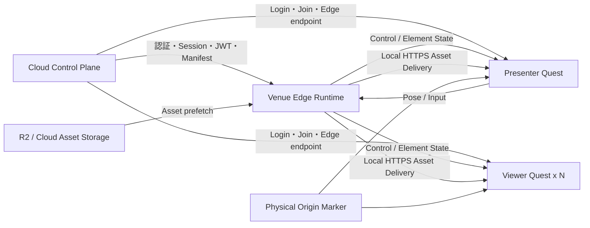
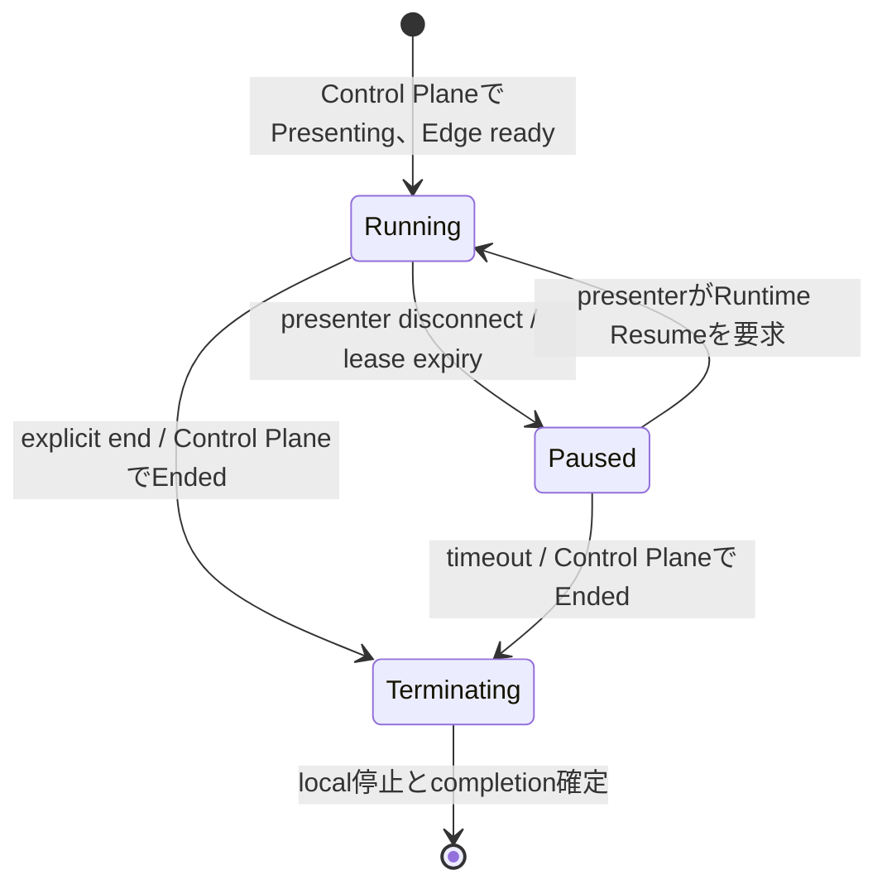

# 会場内 MR プレゼンテーション向け Cloud-managed Venue Edge アーキテクチャ

## 文書の位置付け

- Status: Proposed
- 対象: Meta Quest 3 を利用する会場内 MR プレゼンテーション
- 目的: 発表中の高頻度な状態同期と Asset 配信を、Cloud で管理された会場内 Edge から提供する通信方式を定義する

本書は、会話や過去の検討経緯を参照しなくても、対象要件、採用する構成、各 component の責務、通信方式、障害時挙動、実装・検証項目を理解できることを目的とする。

本書で説明する Venue Edge はまだ実装されていない。現行 Realtime Backend は Go / gRPC の初期 bidirectional stream と page-change の in-memory sequence / fan-out までを実装しているが、Venue Edge 登録、Presenter Pose、Step / Cue 実行、Element State streaming、Asset cache、snapshot / replay 等は今後の実装対象である。

## 1. 背景

Unframe は、Web Editor で作成した Presentation を Meta Quest 3 上で Mixed Reality プレゼンテーションとして実行する。発表中は、現実空間にいる presenter を参加者が直接見ながら、presenter が設定した実空間上の中心点を基準に、仮想 Element の表示、移動、回転、animation、video 等を進行させる。

Presentation は `Group -> Step -> Cue` の構造を持つ。

- `Group`: 一つの空間を共有する大きな発表単位
- `Step`: 現在評価可能な Cue の範囲
- `Cue`: 一つの Trigger と複数の Action をまとめた論理的な進行
- `Trigger`: presenter の位置、motion、controller input 等による発火条件
- `Action`: Element の表示、Transform、animation、playback 等の変更
- `Transition`: Action を時間方向に補間する方法

Presenter の Pose や input によって Cue が発火し、Action / Transition の実行結果が複数の Quest へ継続的に配信される。複数 Element を 20–60 Hz で最大 50 台へ配信する可能性があるため、発表中の通信は高トラフィックになり得る。

Presenter の Quest 自身に最大 49 台分の接続、暗号化、fan-out、snapshot / replay を担当させると、MR 描画や tracking と競合する。このため、Quest 同士の full-mesh P2P や presenter-host 方式ではなく、会場 LAN 内の Venue Edge が Realtime Runtime と Asset 配信を担当する。

## 2. 要件

### 2.1 対象要件

- 参加者は全員同じ物理会場にいる
- presenter と viewer は Meta Quest 3 を使用する
- 1 session は presenter を含め最大 50 participant とする
- presenter は session 作成者で固定し、途中交代を初期要件に含めない
- presenter 本人は現実空間で見えるため、presenter avatar は表示しない
- Presenter HMD / controller / wrist Pose は Trigger と Action の計算に使用する
- viewer の HMD / controller Pose は各端末のローカル描画にのみ使用し、共有しない
- 全 Quest は同じ Presentation Origin を基準に仮想 Element を配置する
- Step / Cue による Action / Transition の実行結果を同期する
- Internet 接続を必須とし、認証、session 作成・参加、Edge 管理、Cloud Asset 取得に使用する
- 発表中の高頻度通信と Quest 向け Asset 配信は Venue Edge を経由する
- Cloud と Venue Edge の責務を分離し、Realtime hot path で D1 や R2 へ同期問い合わせしない

### 2.2 Non-goals

- remote participant の参加
- Web Editor からの発表参加・操作
- presenter / viewer avatar の同期
- viewer 同士の Pose 共有
- Quest 間の full-mesh P2P
- Presenter Quest による 49 台分の直接 fan-out
- 発表中の Asset binary の gRPC streaming
- 高頻度 state の D1 永続化
- 1 room を複数 Runtime へ分割する distributed consensus
- 初期実装での host migration
- Edge固有鍵、one-time enrollment、client certificate、mTLSによるEdge認証

## 3. 採用する構成



### 3.1 基本方針

1. Cloud Control Plane を認証、durable resource、session lifecycle、Edge 管理の authority とする。
2. Venue Edge Runtime を active session 中の Group / Step / Cue、Action / Transition、Element State の authority とする。
3. Presenter Quest は Pose と input の source であり、room state や fan-out の authority にはしない。
4. Viewer Quest は受信した Element State を、自端末で校正した Presentation Origin に対して描画する。
5. Asset は Cloud から Venue Edge が一度取得し、会場 LAN 内で Quest へ配信する。
6. Pose frame や Element State frame を Cloud へ中継しない。
7. Realtime core は Cloud container と Venue Edge のどちらでも動かせる deployment-independent な構造を維持するが、本書の対象 session では Venue Edge を正規経路とする。

## 4. Component の責務

### 4.1 Cloud Control Plane

- Better Auth による user login と application session
- Presentation / Asset の durable CRUD
- R2 Asset lifecycle
- session 作成、参加コード、participant、role、終了状態の管理
- session-bound Venue Edge JWT の発行
- JWKS の公開と key rotation
- Venue Edge の登録、health、capacity、version 管理
- Edge固有Bearer tokenの発行、rotation、失効
- session と Venue Edge の lease付き割り当て、および割り当て世代による fencing
- Quest への Venue Edge endpoint と certificate fingerprint の返却
- Venue Edge 用の短命な Asset 取得 URL の発行
- Venue Edge からの checkpoint / completion / telemetry の受付

Cloud Control Plane は Pose、Transition frame、Element State frame を処理しない。

### 4.2 Venue Edge Runtime

Venue Edge はノート PC、mini PC、または会場内の専用端末で動作し、専用 Wi-Fi router へ Ethernet で接続する。

```text
Venue Edge Runtime
├─ Cloud Agent
│  ├─ Edge registration
│  ├─ health / capacity / version reporting
│  ├─ session assignment
│  ├─ Manifest / signed URL retrieval
│  └─ checkpoint / telemetry upload
├─ Session Runtime
│  ├─ participant registry
│  ├─ Group / Step state
│  ├─ Trigger evaluation
│  ├─ Cue lifecycle
│  ├─ Action / Transition evaluation
│  └─ canonical Element State
├─ Realtime Gateway
│  ├─ JWT / role validation
│  ├─ Control stream
│  ├─ Tracking stream
│  ├─ Element State stream
│  ├─ fan-out
│  └─ backpressure
├─ Recovery
│  ├─ reliable event log
│  ├─ snapshot
│  ├─ replay
│  └─ local checkpoint
└─ Asset Gateway
   ├─ prefetch
   ├─ checksum / MIME / size verification
   ├─ content-addressed cache
   ├─ local HTTPS delivery
   └─ eviction / readiness
```

### 4.3 Presenter Quest

- Cloud login
- Presentation / session の選択と作成
- Presentation Origin の calibration
- HMD、controller、wrist Pose と logical input の取得
- Pose を Presentation Space へ変換
- Venue Edge への Tracking Frame 送信
- Venue Edge への離散 Input Event 送信
- Control / Element State の受信と描画
- Asset の local cache

Presenter Quest は viewer ごとの接続・送信 queue・fan-out を持たない。

### 4.4 Viewer Quest

- Cloud login と参加コードによる session join
- Presentation Origin の calibration
- Venue Edge からの snapshot / live stream 受信
- Element State の local rendering / interpolation
- 自端末の HMD Pose に基づく視点描画
- Asset の local cache
- readiness / heartbeat の報告

Viewer Quest の HMD / controller Pose はネットワークへ送信しない。

## 5. Venue Edge のprovisioning、登録、Session割り当て

1. `admin`がControl Planeの管理APIまたはCLIでVenue Edgeをprovisioningする。
2. Control Planeが`edgeId`と256 bit以上のrandomなEdge固有Bearer tokenを生成し、token本体をこの応答で一度だけ返す。
3. 管理者が`edgeId`とtokenをVenue Edgeのcredential storeへ配置する。source、image、command line、logへtokenを含めない。
4. Venue EdgeがHTTPSでControl Planeへ接続し、Edge固有Bearer tokenで認証してruntime version、protocol version、capacity、local endpoint、certificate fingerprint、healthを登録する。
5. Presenter が Cloud Control Plane で session を作成する。
6. Control Plane が利用可能な Venue Edge を session へ割り当て、session ごとに単調増加する `assignmentEpoch` と期限付きの lease を発行する。
7. Control Plane が `EdgeSessionAssignment` と Presentation Manifest を Venue Edge へ渡す。
8. Venue Edge が必要な Asset を prefetch し、lease を定期的に更新する。
9. Venue Edge が `assignmentEpoch` を含む Realtime Runtime と Asset の readiness を報告する。
10. Quest が session へ join すると、Control Plane が endpoint、fingerprint、`edgeId`、`assignmentEpoch`、session-bound Venue Edge JWT、Presentation revision を返す。
11. Quest は fingerprint を pinning し、JWTとbootstrap情報が示すEdgeへ接続する。

```text
VenueEdgeCredential
├─ edgeId
├─ tokenId
├─ tokenHash
├─ status: Active | Revoked
├─ createdAt
├─ expiresAt
└─ lastUsedAt
```

- tokenは高entropyなBearer credentialとし、Control Planeはlookup用の非secretな`tokenId`とtokenのcryptographic hashだけを保存する。
- token比較はtiming差を生まない方法で行う。
- tokenはその`edgeId`のregister、health、lease、割り当て済みsessionのManifest / signed URL取得、checkpoint / completion / telemetryだけに使用できる。任意のsession IDをpayloadで指定して権限を広げられないよう、Control Plane側でactive assignmentを照合する。
- rotation時は新tokenを一度だけ表示し、設定移行のためcurrent / nextをbounded overlap期間だけ受け入れる。overlap終了後は旧tokenを失効する。
- Edge廃棄、紛失、credential漏洩時はその`edgeId`のtokenとactive assignmentを失効する。失効後は認証、lease更新、Manifest取得、checkpoint受付を拒否する。
- 全Edgeで共通の`SERVICE_IDENTITY_SECRET`をVenue Edgeへ配布しない。
- Edge固有鍵、one-time enrollment、mTLSへの移行は本設計の対象に含めず、Edge固有Bearer tokenを継続して使用する。

```text
EdgeSessionAssignment
├─ sessionId
├─ edgeId
├─ assignmentEpoch
├─ presentationRevision
├─ issuedAt
└─ leaseExpiresAt
```

- Control Plane は同じ session を別の Edge へ割り当てるたびに `assignmentEpoch` を増やす。
- Control Plane は旧 Edge から明示的なlease返却を受けるか、旧leaseの期限が切れるまで、同じsessionの新しいactive assignmentを発行しない。強制切替時は旧lease期限までsessionを停止し、二つのEdgeを同時にactive authorityにしない。
- Venue Edge は接続、command、state更新、checkpointの処理前に、local assignmentの`edgeId`、`assignmentEpoch`、lease有効期限を検証する。
- Quest用JWTとbootstrap responseは`edgeId`と`assignmentEpoch`を拘束する。古い世代のcredentialを新しいEdgeで受け入れず、古いEdgeも新しい世代のconnectionを受け入れない。
- leaseを更新できない場合、既存connectionは`leaseExpiresAt`までだけ継続できる。期限後はsession runtimeをpauseし、新規接続、command受付、state更新を停止する。
- Control Planeは古い`assignmentEpoch`から届いたcheckpoint、completion、telemetryを現行session stateへ適用しない。
- process再起動時はlocal checkpointに保存したassignmentを復元するが、lease期限切れの場合はCloudで更新が完了するまでsessionを再開しない。

Edge の local endpoint を Cloud 経由で解決できない場合に備え、session QR code に同じ signed bootstrap 情報を格納できるようにする。signed bootstrap は少なくともsession ID、Edge ID、assignment epoch、endpoint、certificate fingerprint、有効期限を拘束する。

## 6. Presentation Origin

各 Quest の tracking space は独立しているため、同じ数値の Transform を適用しても同じ実空間位置にはならない。全 Quest は物理 marker または同等の calibration 手段から、Quest Local Space と Presentation Space の変換を取得する。

```text
Quest Local Space
  ↓ calibration transform
Presentation Space
  ↓ received Element State
Unity World Space
```

session 全体で共有する Presentation Origin と、各 Quest がローカルに保持する calibration は別の状態として扱う。

```text
PresentationOrigin
├─ presentationOriginVersion
├─ markerId
├─ position
└─ rotation

ParticipantCalibration
├─ calibrationRevision
├─ markerId
├─ presentationFromQuestLocal
└─ calibrationQuality
```

- `presentationOriginVersion` は session 全体で共有し、使用する marker や Presentation Space 自体を変更した場合だけ Venue Edge が増やす。
- Presenter Tracking Frame、Reliable Event、Element State Frame、Snapshot は `presentationOriginVersion` を持つ。
- Quest と Venue Edge は、現在の `presentationOriginVersion` と一致しない frame を適用しない。
- session 共通の Origin 変更は Reliable Event として配信し、全 Quest の再 calibration と新しい Snapshot を要求する。
- `calibrationRevision` と `presentationFromQuestLocal` は participant ごとのローカル状態とする。1台の Quest の再 calibration はその端末の `calibrationRevision` だけを増やし、session 共通の `presentationOriginVersion` や他 participant の状態を変更しない。
- Presenter Quest は最新の `presentationFromQuestLocal` を使って Pose を Presentation Space へ変換してから送信する。Viewer Quest は同じ変換の逆変換を使って Element State を自端末の tracking space へ配置する。
- participant 単独の再 calibration 後は、保持済みの canonical Element State を新しい変換で再描画するため、session 全体の Snapshot を再生成しない。

## 7. Session Runtime と Step / Cue 実行モデル

### 7.1 Runtime state

Control Plane の durable session lifecycle は `Waiting -> Presenting -> Ended` のまま維持する。Venue Edge は、Control Plane 上で `Presenting` の session に対してだけ次の transient runtime state を持つ。



- `Running`: Presenter Trackingを使ったTrigger評価、Cue / Action / Transitionの進行、Element State配信を行う。
- `Paused`: canonical Element Stateと進行位置を保持するが、Trigger評価、Cue発火、Transition / playbackの時間進行、新しいState frame生成を停止する。
- `Terminating`: 不可逆な終了処理中とし、connection resume、runtime resume、command、Tracking Frameを受け入れない。local completionを確定し、Control Planeへの終了通知をidempotentに送る。
- `Paused`と`Terminating`はEdge内部のruntime substateであり、Control Planeのsession stateへ同名の値を追加しない。

`resume`は次の二つに用語を分ける。

- **Connection Resume**: participantの通信再接続。Snapshot / replayで同じruntimeへ復帰するが、runtime state自体は変更しない。
- **Runtime Resume**: presenterだけが要求できる`Paused -> Running`遷移。有効なpresenter connection、有効なassignment lease、Control Plane上で`Presenting`であることを確認してから適用する。

Runtime Resumeはpresenter再接続だけでは自動実行しない。再接続したpresenterがSnapshotとpause理由を確認し、明示的な`ResumeRuntime` commandを送信する。Venue Edgeは`RuntimePaused`、`RuntimeResumed`、`RuntimeTerminating`をReliable Eventとして全participantへ配信する。

### 7.2 Step / Cue execution

1. Presenter Quest が連続的な Pose を Tracking Stream、離散的な input を Reliable Control へ送信する。
2. Venue Edge はruntimeが`Running`の場合だけ、現在の Step に属する Cue を評価する。
3. Trigger が成立した Cue を idempotent に発火する。
4. Cue に属する複数 Action を開始する。
5. Action に Transition があれば、Runtime tick ごとに状態を計算する。
6. 計算結果から canonical Element State を更新する。
7. 変更された Element State を viewer ごとの送信 frame へまとめる。
8. Transition 完了後、最終状態を Reliable Event と Snapshot へ反映する。
9. Cue の定義に従って次の Step へ遷移する。

同一 Step で複数 Cue が成立した場合の priority、排他、再発火、debounce は runtime contract で明示する。端末ごとに個別評価すると結果が分岐するため、Trigger / Cue / Action / Transition の canonical evaluation は Venue Edge だけが行う。

## 8. 通信方式

### 8.1 基本 transport

初期実装は Protocol Buffers と gRPC を使用する。高頻度 State が Reliable Control を阻害しないよう、Control と State を別の gRPC channel / HTTP/2 connection に分離する。

```text
Control Connection
└─ reliable / ordered / replayable

State Connection
├─ Presenter Tracking
└─ Element State
   latest-wins / non-replayable
```

二つのconnectionは独立したsessionとして扱わず、Control Connectionを親とする一つのlogical participant connectionへ束ねる。

- Control handshakeの認証後、Venue Edgeが推測困難な短命`connectionId`を発行する。
- State Connectionを開くたびに、Venue EdgeはControl Connection上で短命かつ一回使用の`stateConnectionNonce`を発行する。
- State Connectionは同じsession、participant、assignment epochのJWT、`connectionId`、`stateConnectionNonce`を提示する。
- 一つの`connectionId`に対してactiveなState Connectionは一つだけとし、再確立時は古いRPCを終了してから新しい`stateConnectionNonce`を発行する。
- Control Connection終了時は`connectionId`と未使用の`stateConnectionNonce`を無効化する。
- connection間の到着順は仮定せず、Reliable sequenceと`baseReliableSequence`でapplication上の依存関係を解決する。

実測で TCP retransmission、head-of-line blocking、write blocking、jitter が UX 上の問題になる場合のみ、State Connection を UDP / QUIC 系 transport へ置き換える。Control Connection は gRPC のまま維持する。

### 8.2 Reliable Control

対象:

- connection handshake
- Presenter Input Event
- Group / Step 変更
- Cue 発火
- Element active / visible の確定
- Transition 開始・完了
- Presentation Origin 更新
- Runtime Paused / Resumed / Terminating
- session end
- participant join / leave
- snapshot / replay / resync
- State keyframe request
- protocol / authorization error

```text
ReliableEvent
├─ sequence
├─ eventId
├─ occurredAt
├─ presentationOriginVersion
└─ payload
```

- sequence は session 内で単調増加する。
- client は最後に適用した sequence を保持する。
- gap 検知時は replay、保持範囲外なら Snapshot を取得する。
- exactly-once delivery は仮定せず、`eventId` で idempotent に適用する。
- reliable queue を維持できない client は resync または disconnect する。

### 8.3 Presenter Tracking Stream

Presenter Quest から Venue Edge へ送る。

```text
PresenterTrackingFrame
├─ frameSequence
├─ capturedAt
├─ presentationOriginVersion
├─ calibrationRevision
├─ head
│  ├─ position
│  └─ rotation
├─ leftControllerOrWrist
│  ├─ position
│  └─ rotation
├─ rightControllerOrWrist
│  ├─ position
│  └─ rotation
└─ trackingFlags
```

- 初期検証範囲は 30–60 Hz とする。
- latest-wins とし、古い frame を再送・replay・永続化しない。
- Presenter Questの送信側とRuntimeの受信側は、それぞれ未処理の最新frameを一つだけ保持するsingle-slot mailboxを使う。
- gRPCへ渡す`Send`は一つだけをin-flightとし、その間に生成したframeはmailbox内の最新frameで置き換える。すでにgRPCへ渡したframeを取り消せるとは仮定しない。
- `capturedAt` と `frameSequence` で stale frame を破棄する。
- `Send`のwrite blockが`stateWriteBlockTimeout`を超えた場合はState Connectionだけをcancelし、未送信のTracking Frameを破棄して再確立する。Control ConnectionとReliable Eventの処理は継続する。
- presenter avatar 表示には使用しない。
- button press / release、controller action、明示的な Cue 操作等の離散 input を Tracking Frame から推論しない。

離散 input は Reliable Control 上の idempotent な event として送る。

```text
PresenterInputEvent
├─ eventId
├─ capturedAt
├─ presentationOriginVersion
├─ inputKind
└─ value
```

- Presenter Quest は入力の edge を検出し、`eventId` を付けて送信する。
- Venue Edge は presenter role、session、`presentationOriginVersion` を検証し、同じ `eventId` の再送を一度だけ適用する。
- Runtime が確定した input と、それにより発火した Cue は Reliable Event として採番し、Cue 側から原因となった `eventId` を参照できるようにする。
- Poseの軌跡や閾値通過を使うTriggerは、Trigger定義ごとに必要なsample windowを持つ。Runtimeは評価に必要な直近Poseを時間上限付きでmemoryへ保持するが、replayやSnapshotには含めない。

### 8.4 Element State Stream

Venue Edge から全 Quest へ送る。

```text
ElementStateFrame
├─ frameSequence
├─ producedAt
├─ oldestChangeAt
├─ presentationOriginVersion
├─ baseReliableSequence
└─ elements[]
   ├─ elementId
   ├─ changedFields
   ├─ position
   ├─ rotation
   ├─ scale
   ├─ active
   ├─ animationState
   └─ playbackPosition
```

- 初期検証範囲は 20–60 Hz とする。
- viewerごとに、gRPCへ渡す前の未送信差分を保持するsingle-slot `StateMailbox`を持つ。
- `StateMailbox`はframeを丸ごと置き換えず、`elementId`とfieldごとに差分をmergeして最新値を残す。これにより、別々のframeで更新されたElementやfieldをcoalesceしても変更を失わない。
- `StateMailbox`は未送信差分の最古時刻を`oldestChangeAt`として保持する。`frameSequence`と`producedAt`はmailboxから送信frameを確定する時点で採番・記録し、coalesceしただけではsequence gapを作らない。
- viewerごとに`Send`を実行するgoroutineを一つに限定し、同時に複数のframeをgRPCへ渡さない。送信中のframeはimmutableとし、その間の更新は次の`StateMailbox`へmergeする。
- latest-winsが保証する範囲はgRPCの`Send`へ渡す前までとする。すでにHTTP/2またはTCP bufferへ渡した古いframeは取り消せない。
- 変更された Element と field だけを送る。
- 複数 Element を一つの frame に batch する。
- `StateMailbox`から取り出す直前に`oldestChangeAt`を検査し、未送信時間が`stateMaxFrameAge`を超えた差分は送らずState Connectionを再確立する。
- `Send`のwrite blockが`stateWriteBlockTimeout`を超えた場合も、該当viewerのState Connectionだけをcancelし、mailboxと送信中frameを破棄する。他viewerとReliable Controlをblockしない。
- runtimeが`Running`の場合、State Connectionの初回確立と再確立では、`StateReady`後に現在の全Element Stateをkeyframeとして一度送ってから差分配信を開始する。cancel時に送達不明となったframeは、このkeyframeで収束させる。
- 送信前のcoalesceは許容するが、受信した`frameSequence`にgapがある場合は送達済み差分の欠落とみなし、State Connectionを再確立してkeyframeを取得する。
- Transition 完了等の確定状態は Reliable Event にも反映する。
- clientの適用済みReliable sequenceより`baseReliableSequence`が大きいframeは、その前提となるReliable Eventを適用するまで、`elementId`とfieldごとの最新値だけをbufferする。
- `baseReliableSequence`がclientの適用済みsequenceより小さいframe、または`presentationOriginVersion`が一致しないframeはstaleとして破棄し、Control Connection上でState keyframeを要求する。
- Reliable Event適用後は、条件を満たしたbufferをfield単位でmergeして適用する。client側bufferの時間または容量上限を超えた場合はState Connectionを再確立し、Reliable Controlやroom全体をblockしない。

### 8.5 Clock synchronization

Venue Edge の clock を active session の基準とする。Quest は定期的な ping / pong で Runtime との clock offset と RTT を推定する。

- Cue / Transition / playback に Runtime 時刻を付ける。
- Quest は `producedAt` と推定 offset を使って interpolation buffer を制御する。
- RTT や jitter の急増時も古い state を順に再生せず、最新 state へ追従する。

## 9. 高トラフィックへの対応

Venue Edge の概算 egress は次で決まる。

```text
更新頻度 × 更新 Element 数 × 1 Element の payload × viewer 数
```

49 viewer に対する raw payload の例:

| 条件 | 概算 egress |
| --- | ---: |
| 60 Hz × 10 Element × 64 B | 約 15 Mbps |
| 60 Hz × 20 Element × 100 B | 約 47 Mbps |
| 60 Hz × 50 Element × 100 B | 約 118 Mbps |
| 60 Hz × 50 Element × 256 B | 約 301 Mbps |

実際には Protocol Buffers、gRPC、TLS、TCP/IP、Wi-Fi airtime の overhead が加わる。次の最適化を初期設計へ含める。

- static Element を送信しない
- changed Element / field のみ送る
- frame を batch する
- position / rotation / scalar の量子化を検討する
- Element 種別ごとに update rate を変える
- 同じ Element の複数更新を送信前に coalesce する
- deterministic な Action は `CueFired + start time` で local 実行し、必要な correction だけ送る余地を残す
- video / audio は media binary ではなく playback state を同期する
- slow viewer を room 全体の遅延原因にしない

最適化後も、1 / 10 / 50 Quest、20 / 30 / 60 Hz、複数 Element 数と payload size の組み合わせで実測して上限を決定する。

## 10. Snapshot / Replay / Connection Resume

```text
SessionSnapshot
├─ snapshotVersion
├─ currentGroupId
├─ currentStepId
├─ reliableSequence
├─ presentationOriginVersion
├─ runtimeStatus
├─ pauseReason
├─ pausedAt
├─ accumulatedPauseDuration
├─ activeCues
├─ activeTransitions
│  └─ elapsedBeforePause
└─ elementStates
```

late join / Connection Resume:

1. Quest がControl Connectionを開き、JWT、session、participant、role、protocol version、assignment epochを検証する。
2. Venue Edgeはsession lock内で、現在の`reliableSequence = S`をcutとしてSnapshotを作成し、同じ操作内でそのconnectionを`S + 1`以降のReliable Event購読者として登録する。
3. Venue EdgeがSnapshotと`connectionId`を返す。Snapshot作成後に発生したReliable Eventはconnectionのbounded replay queueへ保持される。
4. QuestがSnapshotを適用し、`S + 1`以降のReliable Eventをsequence順に適用する。gapがある場合はState Connectionへ進まずreplayまたは新しいSnapshotを要求する。
5. Questが適用済みReliable sequenceと`presentationOriginVersion`を`StateReady`で通知する。
6. Venue Edgeが`stateConnectionNonce`を返し、Questが`connectionId`とこのnonceを使ってState Connectionを開く。Venue EdgeはControl Connectionと同じidentityへ関連付ける。
7. runtimeが`Running`なら、Venue Edgeは現在の全Element Stateをkeyframeとして送った後、`StateReady`以降の差分配信を開始する。各frameにその生成時点の`baseReliableSequence`を付ける。`Paused`ならState Connectionだけを確立し、frame送信は行わない。

Snapshotのcut取得、Reliable Event購読登録、replay開始位置の決定は同じsession coordinatorのcritical sectionで行う。これによりSnapshot作成とlive購読の間にeventを取りこぼさない。State ConnectionはControl Connectionがcatch upするまで開始しない。

State Connectionだけが切断された場合、Control Connection上のReliable sequenceと`presentationOriginVersion`が引き続き一致していれば、Snapshotを取り直さず新しい`stateConnectionNonce`でState Connectionを再確立できる。runtimeが`Running`なら再確立後のkeyframeを適用してから差分配信へ戻る。`Paused`ならframeを送らず、Runtime Resume時にkeyframeを送ってから差分配信を開始する。Control側にもgapがある場合、または`presentationOriginVersion`が変わった場合は、通常のConnection Resumeとして新しいSnapshotと`connectionId`を取得する。

- runtimeが`Paused`の場合も、leaseが有効なら既存participantのConnection Resumeと新しいviewerのjoinを許可する。Snapshotにpause理由と進行位置を含め、State Connectionは確立するが`RuntimeResumed`まで新しいElement State frameを送らない。
- lease期限切れによる`Paused`では新しいconnectionとjoinを受け入れない。lease更新後も自動的に`Running`へ戻さず、presenterのRuntime Resumeを要求する。
- pause開始時にRuntimeのmonotonic clock上の`pausedAt`、各Transitionの`elapsedBeforePause`、playback位置を固定する。pause中のwall-clock経過をTransitionやplaybackの進行へ加算しない。
- Runtime Resume時は`accumulatedPauseDuration`を更新し、Transitionとplaybackの基準時刻を再計算してから`RuntimeResumed`を配信する。

Pose の履歴は Snapshot へ含めない。Pose の軌跡や閾値通過を使う Trigger が必要とする場合だけ、Trigger contract で定義した短い sample window を Runtime memory に保持し、session recovery や replay の対象にはしない。

## 11. Asset 配信

### 11.1 基本方針

- R2 を Asset の durable source of truth とする。
- Venue Edge が session 開始前に必要 Asset を一度だけ Cloud から取得する。
- Quest は Asset を Venue Edge の local HTTPS endpoint から取得する。
- Asset binary を Realtime gRPC stream へ載せない。
- 発表開始後に Asset download が発生しないよう preflight する。

```text
R2
  ↓ signed HTTPS URL
Venue Edge Asset Cache
  ↓ local HTTPS
Quest local cache
```

### 11.2 Manifest

```text
PresentationManifest
├─ presentationId
├─ presentationRevision
├─ definitionChecksum
├─ protocolVersion
└─ assets[]
   ├─ assetId
   ├─ sha256
   ├─ size
   └─ mediaType
```

Venue Edge は Manifest に含まれる Asset だけを取得し、size、MIME、checksum を検証してから ready とする。

### 11.3 Cache

Asset は content hash 単位で immutable に保存する。

```text
cache/
└─ sha256/
   ├─ ab/cd/abcdef...
   └─ 12/34/123456...
```

- 同じ Asset を複数 Presentation / session で再利用する。
- Cloud からの取得には短命 signed URL を使い、Edge へ恒久 R2 credential を置かない。
- cache capacity と eviction policy を設定する。
- active session が参照する Asset は eviction しない。

### 11.4 Quest 向け endpoint

例:

```text
GET /sessions/{sessionId}/presentation
GET /sessions/{sessionId}/assets/{assetId}
```

必要な機能:

- HTTPS
- session / participant / Asset authorization
- Content-Length / Content-Type
- Range Requests
- ETag / immutable cache header
- download resume
- concurrency / bandwidth limit
- structured access log

Video と大容量 Asset のため、Range Requests を必須とする。

QuestはRealtimeと同じsession-bound Venue Edge JWTをHTTPの`Authorization: Bearer` headerで提示する。Asset専用tokenやQuest向けsigned URLは発行しない。

- JWTのaudienceはRealtimeとAsset Gatewayに共通の`unframe-venue-edge`とする。
- JWTは`realtime:connect`と`assets:read`のscopeを持ち、gRPC接続では前者、Asset Gatewayでは後者を必須とする。
- Asset Gatewayは署名と標準時刻claimに加え、JWTの`edgeId`、`sessionId`、`participantId`、`assignmentEpoch`、`presentationId`、`presentationRevision`を検証する。
- URLの`sessionId`はJWTのclaimと一致し、要求された`assetId`はその`presentationRevision`のManifestに掲載されていなければならない。
- 現在のEdge割当とleaseが無効な場合、または別session、別revision、Manifest未掲載Assetへの要求は拒否する。request parameterでJWTの権限範囲を広げられないようにする。
- JWTをquery parameterへ含めず、access logにも記録しない。
- EdgeがCloudからAssetをprefetchするための短命signed URLはこのQuest認可と別のcredentialであり、Questへ渡さない。

### 11.5 Readiness

Quest は session 開始前に readiness を報告する。

```text
ViewerReadiness
├─ presentationRevision
├─ availableAssetHashes
├─ missingAssetHashes
├─ presentationOriginVersion
├─ calibrationRevision
├─ calibrationReady
├─ controlConnected
└─ stateConnected
```

- Quest cache に存在する hash は再取得しない。
- 大容量 Asset は session 開始より前に preload する。
- 50 台の同時 burst を避けるため、Venue Edge が download concurrency を制御する。
- session 開始条件を「全 participant ready」または明示した policy として定義する。

## 12. Authentication / Security

### 12.1 Quest

1. Quest が Cloud Control Plane へ login する。
2. session 作成または join code 参加を行う。
3. Control Plane がsession-bound Venue Edge JWTを発行する。
4. Quest が Venue Edge へ JWT を提示する。
5. Venue Edge が cached JWKS または Cloud の JWKS で署名を検証する。

JWT は少なくとも次を拘束する。

- issuer
- audience: `unframe-venue-edge`
- subject / participant ID
- session ID
- role
- Edge ID
- assignment epoch
- Presentation ID / revision
- scope: `realtime:connect`, `assets:read`
- protocol version
- expiry / not-before

同じJWTをgRPCとlocal HTTPSで共用するが、各入口は自身に必要なscopeを独立して検証する。`assets:read`だけでRealtime RPCを呼び出したり、`realtime:connect`だけでAssetを取得したりすることはできない。

### 12.2 Venue Edge

- Edge はuser JWTと別のEdge固有Bearer tokenを持ち、Cloud Control PlaneへのHTTPS requestで提示する。
- Control PlaneはEdge登録、health、capacity報告ではEdge ID、token status、token expiryを検証する。Manifest取得、lease更新、checkpoint / completionではこれらに加えてactive assignmentのsession ID、Edge ID、assignment epochを検証する。
- Cloud側のserver identityは通常の公開TLS証明書で検証し、client certificateやmTLSは使用しない。
- Edge へ R2 の恒久 secret や Control Plane signing key を置かない。
- local endpoint の certificate fingerprint を Control Plane の認証済み response で Quest へ返す。
- Quest は fingerprint を pinning し、同一 LAN 上の偽 Edge へ接続しない。
- JWT、signed URL、credential、sensitive payload を log しない。

### 12.3 Runtime boundary

- presenter role だけが Trigger input を送信できる。
- viewer からの Element State / Cue command を拒否する。
- message size、rate、invalid message count を制限する。
- payload 内の participant ID / role を信頼せず、認証済み connection identity を使用する。
- Presentation / Asset の revision と session assignment を検証する。
- connection、command、state更新ごとに現在の assignment epoch と lease が有効であることを検証する。

## 13. Failure / Recovery

### 13.1 Internet 障害

Internet は session の正式な必須要件とする。ただし短時間の回線揺らぎで即座に発表を停止しないため、Venue Edge は次の grace behavior を持てるようにする。

- 既存 participant の Realtime通信は assignment lease の残存期間だけ継続する。
- 新規 login / join / credential refreshと、EdgeからCloudへのAsset prefetchまたはcache miss取得は失敗する。
- すでにcache済みのAssetは、QuestのJWTとassignment leaseが有効な間だけlocal HTTPSで配信を継続する。
- checkpoint / telemetry を bounded local buffer に保持する。
- Internet 復旧後に idempotent に upload する。
- lease期限超過時はruntimeを`Paused`へ遷移し、新規接続、Connection Resume、command受付、state更新を停止する。warning / `Terminating`へのtimeout policyは別途明示する。

Internet 障害中の継続は best-effort であり、offline 対応を正式要件にはしない。

### 13.2 Presenter切断

- Runtime は現在のElement State、Transition経過時間、playback位置を固定し、`Running`から`Paused`へ遷移する。
- viewerの既存connectionは維持し、`RuntimePaused`を配信する。leaseが有効なら新しいviewerもjoinできるが、Paused Snapshotを受け取った状態で待機する。
- 一定時間presenterのConnection Resumeを待つ。再接続したpresenterへSnapshotとpause理由を返す。
- presenterが明示的な`ResumeRuntime`を送信し、assignment leaseとControl Plane session stateを確認できた場合だけ`Running`へ戻す。
- timeout後は`Terminating`へ遷移する。この遷移後はpresenterが戻ってもRuntime Resumeを拒否し、Control Planeへsession completionを送ってdurable stateを`Ended`にする。
- Internet障害でcompletionを送れない場合もlocalでは終了を確定し、復旧後に同じidempotency keyで再送する。

### 13.3 Viewer切断

- 他 participant へ影響させない。
- participant 固有 queue を破棄する。
- 再接続時は Snapshot / replay から復帰する。

### 13.4 Venue Edge process障害

- reliable event または一定間隔で、runtime status、pause理由、Transition経過時間を含むlocal checkpointを保存する。
- process supervisor で自動再起動する。
- 再起動後にlocal Snapshotを復元する。checkpointが`Running`でも自動進行せず、安全側の`Paused`として復元してpresenterのRuntime Resumeを待つ。
- Quest は exponential backoff と jitter で同じ endpoint へ再接続する。
- 復旧不能時は Cloud Control Plane へ session failure を報告する。

### 13.5 Asset取得・cache障害

- checksum mismatch の Asset を ready としない。
- 部分的な Presentation readiness を返さない。
- active session に必要な Asset が一件でも欠ける場合は開始を拒否する。
- Cloud から再取得し、それでも失敗する場合は具体的な Asset ID と理由を presenter へ示す。

## 14. Network / Deployment

推奨会場構成:

```text
Venue Edge Laptop / Mini PC
  │ Ethernet
Dedicated Wi-Fi 6 / 6E Router
  ├─ Presenter Quest
  ├─ Viewer Quest
  └─ Viewer Quest x N

Router
  │ WAN
Internet
  ├─ Cloud Control Plane
  └─ R2 / Cloud services
```

会場提供 Wi-Fi を主経路にしない理由:

- client isolation
- multicast / peer traffic 制限
- 接続台数と airtime の競合
- QoS / roaming / packet loss が管理できない
- Venue Edge と Quest 間の local routing を保証できない

Venue Edge の必要 capacity は、同時 room 数、participant 数、Asset cache size、Element update rate、payload size、TLS / fan-out CPU を負荷試験して決定する。初期運用では一つの Venue Edge / Runtime instance が一つの active room を担当する。

## 15. Observability

Cloudへ送るもの:

- Edge health / version / capacity
- active session / participant count
- connection / disconnect reason
- authentication failure count
- Tracking / Element State rate と payload size
- reliable queue depth
- coalesced / dropped State frame 数
- gRPC write blocking time
- `stateWriteBlockTimeout`によるState Connection cancel / 再確立回数
- `stateMaxFrameAge`超過数
- RTT / jitter / clock offset
- Asset cache hit / miss / download duration
- checkpoint / completion
- Runtime / network error

Cloudへ送らないもの:

- Pose frame 本体
- Element State frame 本体
- credential / signed URL
- participant の sensitive tracking data

Venue Edge は短時間の高粒度 metrics を local に保持し、Cloud へは集計値を送る。

## 16. 検証計画

### 16.1 Functional

- valid / invalid JWT、audience、scope、role enforcement
- assignment epoch、lease更新、期限切れ、再割り当て時のfencing
- session 共通の Presentation Origin 更新と participant 単位の calibration revision
- lossy Pose と reliableな離散 Input Event による Trigger 発火
- 同一 Step の Cue priority / debounce / duplicate
- 複数 Action / Transition の同時実行
- snapshot / replay / late join
- Snapshot cutとReliable購読のatomic handoff、およびControl / State逆順到着
- StateMailboxのfield単位merge、single in-flight Send、State再確立後のkeyframe収束
- State Connectionだけを再確立する場合とSnapshotを伴うConnection Resumeの分岐
- Connection ResumeとRuntime Resumeの独立性
- pause中のjoin、Snapshot、Transition / playback clock、timeout、process再起動
- Presenter / viewerのConnection Resume
- Asset prefetch / checksum / Range Requests / cache hit
- Asset取得のsession、assignment epoch、Presentation revision、Manifest境界
- session終了とCloud completion

### 16.2 Load / Network

- 1 / 10 / 25 / 50 Quest
- Tracking 30 / 60 Hz
- Element State 20 / 30 / 60 Hz
- 10 / 20 / 50 active Element
- small / medium / large payload
- message burst
- slow viewer
- gRPC Sendの長時間blockとState Connection単独cancel
- packet loss / RTT / jitter
- Internet断と復旧
- Internet断中のassignment lease期限切れ
- Venue Edge process再起動
- 50台同時Asset preload

測定値:

- presenter input から viewer apply までの p50 / p95 / p99
- Trigger / Cue evaluation latency
- State frame age
- dropped / coalesced frame
- reliable gap / resync 件数
- Venue Edge CPU / memory / network / disk
- Quest CPU / memory / thermal / battery
- Wi-Fi throughput / airtime / retransmission
- Asset ready までの時間

### 16.3 Transport decision gate

初期 gRPC State Connection の実測で次が UX 上の問題になる場合、State transport の UDP / QUIC 化を検討する。

- TCP retransmission による古い State の滞留
- Reliable Control への干渉
- p95 / p99 latency と jitter
- gRPC write blocking
- slow viewer による queue 圧迫

Transport変更時も Protocol message と Session Runtime を transport-independent に保つ。

## 17. 実装段階

### Phase 1: Cloud-managed Edge foundation

- adminによるEdge provisioningとEdge固有Bearer tokenの一回表示
- token hash保存、認証、rotation、Edge単位の失効
- Edge registration / health / version
- session assignment
- assignment lease / epoch / fencing
- Quest への local endpoint / fingerprint返却
- Quest用Venue Edge JWT / JWKS / scope verification
- single room / single Runtime

### Phase 2: Asset Gateway

- Manifest
- signed URL prefetch
- content-addressed cache
- checksum / MIME / size verification
- local HTTPS / Range Requests
- Quest readiness

### Phase 3: Realtime contract

- Control / State channel分離
- Presenter Tracking Frame
- Reliable Event
- Element State Frame
- per-connection single-slot mailbox / field merge / write timeout
- clock synchronization

### Phase 4: Step / Cue Runtime

- active Step filtering
- Trigger evaluation
- Cue priority / debounce / idempotency
- Action / Transition evaluator
- canonical Element State
- snapshot / replay

### Phase 5: Recovery / Operations

- local checkpoint
- process restart recovery
- Internet grace behavior
- metrics / logs / alert
- deployment / update / rollback

### Phase 6: Scale validation

- 50 Quest実機試験
- Asset preload試験
- latency / jitter / bandwidth tuning
- payload quantization / update rate調整
- gRPC State transport継続可否の判断

## 18. Open Questions

- Venue Edge の標準 hardware と最低要件
- 一つのEdgeで許可するactive room数
- 会場 router を製品構成に含めるか
- Presentation Origin marker / calibration方式
- PoseをHMD + controllerに限定するか、wrist / hand jointを追加するか
- Action種別ごとのlocal deterministic executionとRuntime streamingの境界
- Cue priority、排他、再発火、debounce
- Transition tick rateとElement種別ごとの配信rate
- position / rotationの量子化精度
- Internet grace periodとsession停止policy
- assignment lease durationとrenew interval
- Edge tokenの有効期間、rotation interval、overlap期間
- Presenter再接続timeout
- `stateWriteBlockTimeout`と`stateMaxFrameAge`の初期値
- Asset cache容量とeviction policy
- Cloud Runtimeへのfallbackを提供するか
- State transportをgRPCから変更する判断基準となるUX latency budget

## 19. 結論

会場内のMeta Quest 3参加者だけを対象とし、Internet接続を必須とする場合、Cloud-managed Venue EdgeをRealtimeとAsset配信の正規経路とする。

Cloud Control Planeは認証、Presentation / Asset、session lifecycle、Edge管理を担当する。Venue EdgeはPresenter Pose / inputを受け、Step / Cue、Action / Transitionを評価し、計算済みElement Stateを最大50台へfan-outする。Quest間のfull-mesh P2PやPresenter Questによる直接fan-outは採用しない。

AssetはVenue EdgeがCloudから一度取得して検証・cacheし、Questへ会場LAN内のHTTPSで配信する。Realtime Controlと高頻度Stateは論理的・物理的に分離し、初期実装はgRPCで開始する。実測でTCP由来の遅延・jitterが問題になる場合だけState transportをUDP / QUIC系へ置き換える。

この構成により、Cloudによる一元的な認証・管理を維持しながら、高トラフィックなStep × Cue実行、Questの性能制約、Asset配信、会場内の低遅延通信を同じVenue Edge境界で扱う。
