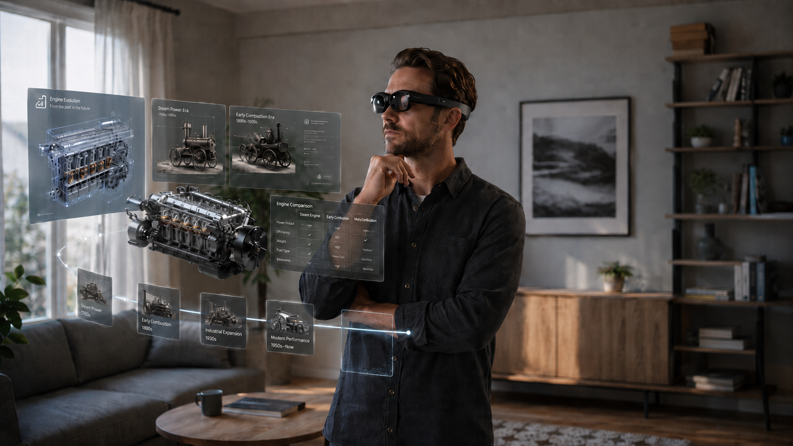

目的は、MRを使ったプレゼンのハードルを下げること。

案の元は、博物館やニュース番組のような、”視点誘導で資料を見せる解説”が一般化できたら面白そうというところから

円状の資料を3Dモデルや3D/2Dの表とともに表示するもの、イメージはこれ

資料開始の始点から、現在見ている角度までしか資料は表示されず、視点を回すか、手でスワイプすることによって資料が回転・スライドする。

博物館や資料館で歩くことによって流動的な説明が見れるように、視点や腕を動かすことによって流動的な説明をできるようにする案。

既存のドキュメントやpdfと3Dモデルを読み込ませたらこれに変換できる機能があったらすごく良い。

円の半径を広げて、資料の量を増やしながら一周回って見れるようにしてもいいし、zoomのテレビ通話のようにプレゼンテイターがついてもいい。

# 2.お手軽展示会

①編集ボックス範囲を設定

②配置・編集・設定を行い、空間を作成

③編集を行うMRまたはPCから表示のみを行うデバイスへデータ転送

④展示開始

この流れでどこでも展示会を開けるようにするサービス。MRデバイスまで入れるとやや割高だが、使いまわせるとすれば割安
